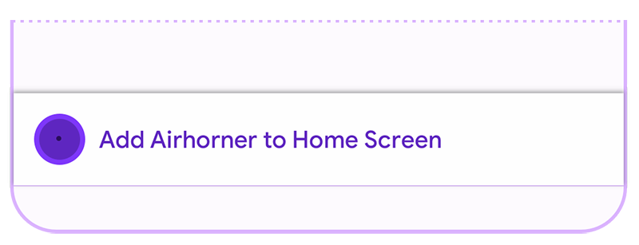

Progressive Web Apps (PWAs) are modern, high quality applications built
using web technology. PWAs offer similar capabilities to iOS/Android/desktop apps, they
are reliable even in unstable network conditions, and are installable making
it easier for users to find and use them.

Most users are familiar with installing applications, and the benefits of an
installed experience. Installed applications appear on operating system
launch surfaces, such as the Applications folder on Mac OS X, the Start menu
on Windows, and the homescreen on Android and iOS. Installed applications
also show up in the activity switcher, device search engines such as
Spotlight and in content sharing sheets.

Most browsers indicate to the user that your Progressive Web App (PWA) is
installable when it meets certain criteria. Example indicators include an
Install button in the address bar, or an Install menu item in the overflow
menu.

  <figure class="w-figure" id="browser-install-promo">
    
    <figcaption class="w-figcaption">
      Browser provided install promotion (desktop)
    </figcaption>
  </figure>
  <figure class="w-figure">
    
    <figcaption class="w-figcaption">
      Browser provided install promotion (mobile)
    </figcaption>
  </figure>

In addition, when the criteria is met, many browsers will fire a
`beforeinstallprompt` event, allowing you to provide a custom in-app UX that
that will trigger the install flow within your app.

## Install criteria {: #criteria }

In Chrome, your Progressive Web App must meet the following criteria before
it will fire the `beforeinstallprompt` event and show the in-browser install
promotion:

* The web app is not already installed
* Meets a user engagement heuristic
* Be served over HTTPS
* Includes a [Web App Manifest][add-manifest] that includes:
  * `short_name` or `name`
  * `icons` - must include a 192px and a 512px icon
  * `start_url`
  * `display` - must be one of `fullscreen`, `standalone`, or `minimal-ui`
  * `prefer_related_applications` must not be present, or be `false`
* Registers a service worker with a `fetch` handler

Other browsers have similar criteria for installation, though there may be
minor differences. Check the respective sites for full details:

* [Edge](https://docs.microsoft.com/en-us/microsoft-edge/progressive-web-apps#requirements)
* [Firefox](https://developer.mozilla.org/en-US/Apps/Progressive/Add_to_home_screen#How_do_you_make_an_app_A2HS-ready)
* [Opera](https://dev.opera.com/articles/installable-web-apps/)
* [Samsung Internet](https://hub.samsunginter.net/docs/ambient-badging/)
* [UC Browser](https://plus.ucweb.com/docs/pwa/docs-en/zvrh56)


On Android, if the web app manifest includes `related_applications` and
`"prefer_related_applications": true`, the user will be directed to the
Google Play store and
[prompted to install the specified Android app](https://developers.google.com/web/fundamentals/app-install-banners/native)
instead.


[add-manifest]: /add-manifest/
[offline-fallback]: /offline-fallback-page/
[new-offline-detection]: https://developer.chrome.com/blog/improved-pwa-offline-detection/
