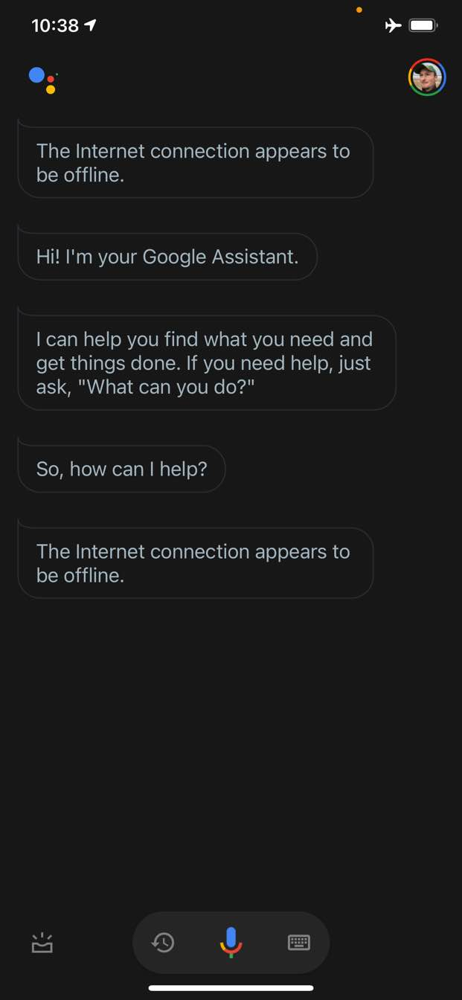
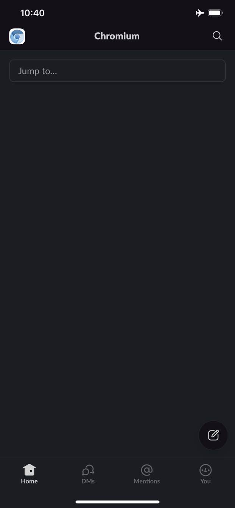
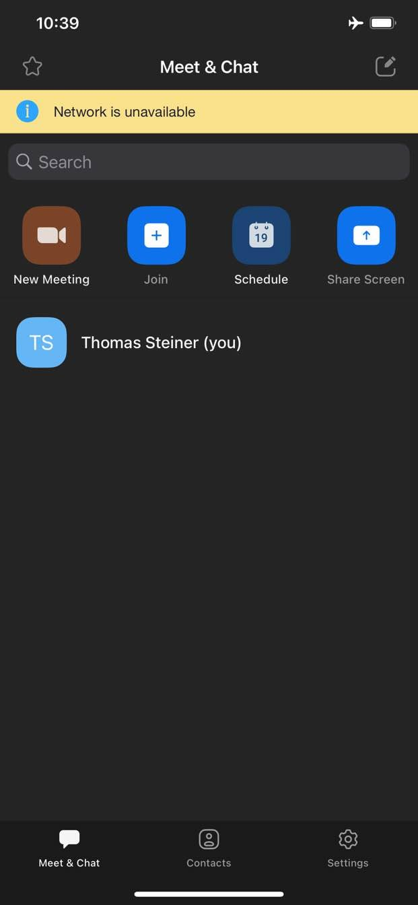
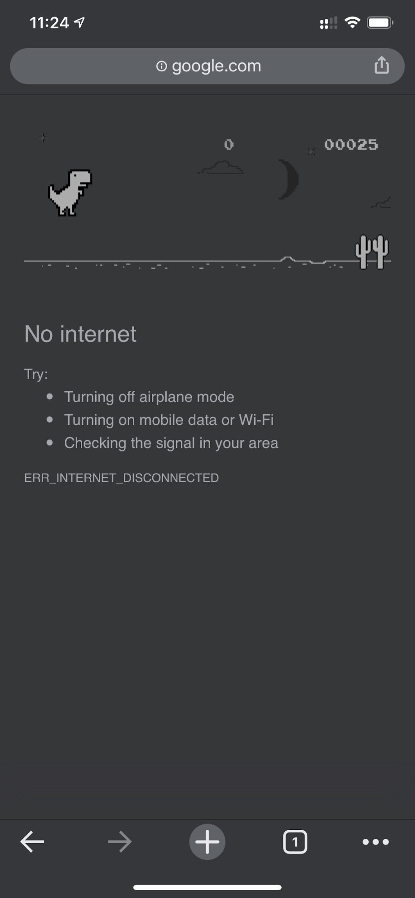
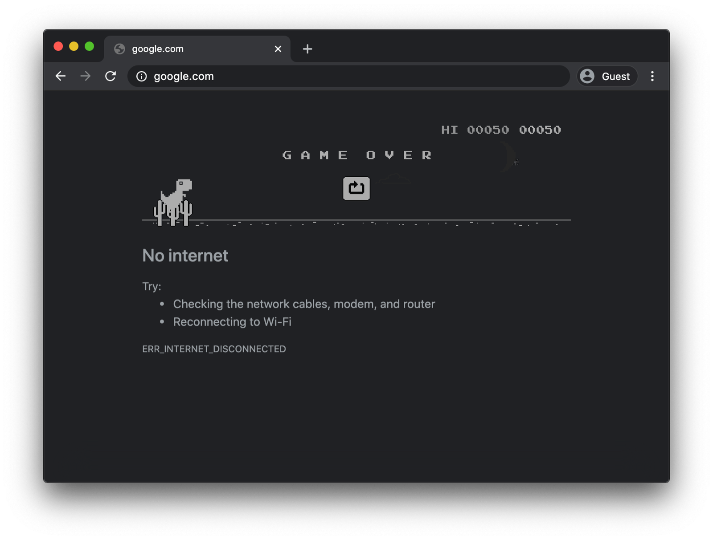
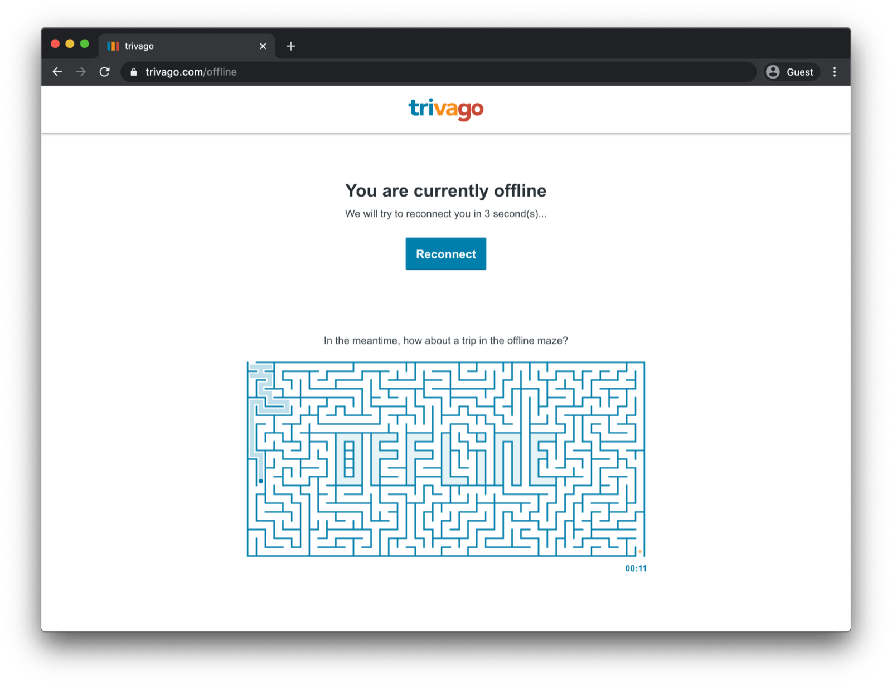

What do the Google Assistant app, the Slack app, the Zoom app, and almost
any other platform-specific app on your phone or computer have in common? Right, they always at least give you *something*.
Even when you do not have a network connection, you can still open the Assistant app, or enter
Slack, or launch Zoom. You might not get anything particularly meaningful or even
be unable to achieve what you wanted to achieve, but at least you get _something_ and the app is in
control.

<figure class="w-figure" role="group" aria-labelledby="fig-apps-wrapper">

  <figure class="w-figure" role="group" aria-labelledby="fig-assistant" style="display: inline-block">
    
    <figcaption class="w-figcaption" id="fig-assistant">
      Google Assistant.
    </figcaption>
  </figure>

  <figure class="w-figure" role="group" aria-labelledby="fig-slack" style="display: inline-block">
    
    <figcaption class="w-figcaption" id="fig-slack">
      Slack.
    </figcaption>
  </figure>

  <figure class="w-figure" role="group" aria-labelledby="fig-zoom" style="display: inline-block">
    
    <figcaption class="w-figcaption" id="fig-zoom">
      Zoom.
    </figcaption>
  </figure>

  <figcaption class="w-figcaption" id="fig-apps-wrapper">
    With platform-specific apps, even when you do not have a network connection, you never get nothing.
  </figcaption>

</figure>

In contrast, on the Web, traditionally you get nothing when you are offline. Chrome gives you
the [offline dino game](https://www.blog.google/products/chrome/chrome-dino/), but that is it.

<figure class="w-figure" role="group" aria-labelledby="fig-offline-wrapper">

  <figure class="w-figure" role="group" aria-labelledby="fig-chrome-ios" style="display: inline-block">
    
    <figcaption class="w-figcaption" id="fig-chrome-ios">
      Google Chrome for iOS.
    </figcaption>
  </figure>

  <figure class="w-figure" role="group" aria-labelledby="fig-chrome" style="display: inline-block">
    
    <figcaption class="w-figcaption" id="fig-chrome">
      Google Chrome for macOS.
    </figcaption>
  </figure>

  <figcaption class="w-figcaption" id="fig-offline-wrapper">
    On the Web, when you do not have a network connection, by default you get nothing.
  </figcaption>

</figure>

## An offline fallback page with a custom service worker

It does not have to be this way, though. Thanks to
[service workers and the Cache Storage API](/service-workers-cache-storage/), you can provide a
customized offline experience for your users. This can be a simple branded page with the information
that the user is currently offline, but it can just as well be a more creative solution, like, for
example, the famous [trivago offline maze game](https://www.trivago.com/offline) with a manual
**Reconnect** button and an automatic reconnection attempt countdown.

<figure class="w-figure">
    
    <figcaption class="w-figcaption">
      The trivago offline maze.
    </figcaption>
  </figure>

### Registering the service worker

The way to make this happen is through a service worker. You can register a service worker
from your main page like in the code sample below. Usually you do this once
your app has loaded.

```js
window.addEventListener("load", () => {
  if ("serviceWorker" in navigator) {
    navigator.serviceWorker.register("service-worker.js");
  }
});
```

### The service worker code

The contents of the actual service worker file may seem a little involved at first sight, but the
comments in the sample below should clear things up. The core idea is to pre-cache a file named
`offline.html` that gets only served on _failing_ navigation requests, and to let the browser handle
all other cases:

```js
/*
Copyright 2015, 2019, 2020, 2021 Google LLC. All Rights Reserved.
 Licensed under the Apache License, Version 2.0 (the "License");
 you may not use this file except in compliance with the License.
 You may obtain a copy of the License at
 http://www.apache.org/licenses/LICENSE-2.0
 Unless required by applicable law or agreed to in writing, software
 distributed under the License is distributed on an "AS IS" BASIS,
 WITHOUT WARRANTIES OR CONDITIONS OF ANY KIND, either express or implied.
 See the License for the specific language governing permissions and
 limitations under the License.
*/

// Incrementing OFFLINE_VERSION will kick off the install event and force
// previously cached resources to be updated from the network.
// This variable is intentionally declared and unused.
// Add a comment for your linter if you want:
// eslint-disable-next-line no-unused-vars
const OFFLINE_VERSION = 1;
const CACHE_NAME = "offline";
// Customize this with a different URL if needed.
const OFFLINE_URL = "offline.html";

self.addEventListener("install", (event) => {
  event.waitUntil(
    (async () => {
      const cache = await caches.open(CACHE_NAME);
      // Setting {cache: 'reload'} in the new request will ensure that the
      // response isn't fulfilled from the HTTP cache; i.e., it will be from
      // the network.
      await cache.add(new Request(OFFLINE_URL, { cache: "reload" }));
    })()
  );
  // Force the waiting service worker to become the active service worker.
  self.skipWaiting();
});

self.addEventListener("activate", (event) => {
  event.waitUntil(
    (async () => {
      // Enable navigation preload if it's supported.
      // See https://developers.google.com/web/updates/2017/02/navigation-preload
      if ("navigationPreload" in self.registration) {
        await self.registration.navigationPreload.enable();
      }
    })()
  );

  // Tell the active service worker to take control of the page immediately.
  self.clients.claim();
});

self.addEventListener("fetch", (event) => {
  // We only want to call event.respondWith() if this is a navigation request
  // for an HTML page.
  if (event.request.mode === "navigate") {
    event.respondWith(
      (async () => {
        try {
          // First, try to use the navigation preload response if it's supported.
          const preloadResponse = await event.preloadResponse;
          if (preloadResponse) {
            return preloadResponse;
          }

          // Always try the network first.
          const networkResponse = await fetch(event.request);
          return networkResponse;
        } catch (error) {
          // catch is only triggered if an exception is thrown, which is likely
          // due to a network error.
          // If fetch() returns a valid HTTP response with a response code in
          // the 4xx or 5xx range, the catch() will NOT be called.
          console.log("Fetch failed; returning offline page instead.", error);

          const cache = await caches.open(CACHE_NAME);
          const cachedResponse = await cache.match(OFFLINE_URL);
          return cachedResponse;
        }
      })()
    );
  }

  // If our if() condition is false, then this fetch handler won't intercept the
  // request. If there are any other fetch handlers registered, they will get a
  // chance to call event.respondWith(). If no fetch handlers call
  // event.respondWith(), the request will be handled by the browser as if there
  // were no service worker involvement.
});
```

### The offline fallback page

The `offline.html` file is where you can get creative and adapt it to your needs and add your
branding. The example below shows the bare minimum of what is possible.
It demonstrates both manual reload based on a button press as well as automatic reload
based on the [`online` event](https://developer.mozilla.org/en-US/docs/Web/API/Window/online_event)
and regular server polling.

 You need to cache all resources required by your offline page. One
way to deal with this is to inline everything, so the offline page is self-contained. This is what I
do in the example below. 

```html
<!DOCTYPE html>
<html lang="en">
  <head>
    <meta charset="utf-8" />
    <meta http-equiv="X-UA-Compatible" content="IE=edge" />
    <meta name="viewport" content="width=device-width, initial-scale=1" />

    <title>You are offline</title>

    <!-- Inline the page's stylesheet. -->
    <style>
      body {
        font-family: helvetica, arial, sans-serif;
        margin: 2em;
      }

      h1 {
        font-style: italic;
        color: #373fff;
      }

      p {
        margin-block: 1rem;
      }

      button {
        display: block;
      }
    </style>
  </head>
  <body>
    <h1>You are offline</h1>

    <p>Click the button below to try reloading.</p>
    <button type="button">⤾ Reload</button>

    <!-- Inline the page's JavaScript file. -->
    <script>
      // Manual reload feature.
      document.querySelector("button").addEventListener("click", () => {
        window.location.reload();
      });
      
      // Listen to changes in the network state, reload when online.
      // This handles the case when the device is completely offline.
      window.addEventListener('online', () => {
        window.location.reload();
      });

      // Check if the server is responding and reload the page if it is.
      // This handles the case when the device is online, but the server
      // is offline or misbehaving.
      async function checkNetworkAndReload() {
        try {
          const response = await fetch('.');
          // Verify we get a valid response from the server
          if (response.status >= 200 && response.status < 500) {
            window.location.reload();
            return;
          }
        } catch {
          // Unable to connect to the server, ignore.
        }
        window.setTimeout(checkNetworkAndReload, 2500);
      }

      checkNetworkAndReload();
    </script>
  </body>
</html>
```

## Demo

You can see the offline fallback page in action in the
[demo](https://offline-fallback-demo.glitch.me/index.html) embedded below. If you are
interested, you can explore the [source code](https://glitch.com/edit/#!/offline-fallback-demo) on
Glitch.

<div class="glitch-embed-wrap" style="height: 420px; width: 100%;">
  <iframe
    src="https://glitch.com/embed/#!/embed/offline-fallback-demo?path=offline.html&previewSize=100"
    title="offline-fallback-demo on Glitch"
    allow="geolocation; microphone; camera; midi; vr; encrypted-media"
    style="height: 100%; width: 100%; border: 0;">
  </iframe>
</div>

### Side note on making your app installable

Now that your site has an offline fallback page, you might wonder about next steps. To make
your app installable, you need to add a [Web App Manifest](/add-manifest/) and optionally come up
with an [install strategy](/define-install-strategy/).

### Side note on serving an offline fallback page with Workbox.js

You may have heard of [Workbox.js](https://developers.google.com/web/tools/workbox).
Workbox.js is a set of JavaScript libraries for adding offline support to web apps. If you prefer to
write less service worker code yourself, you can use the Workbox.js recipe for an
[offline page only](https://developers.google.com/web/tools/workbox/guides/advanced-recipes#offline_page_only).

Up next, learn [how to define an install strategy](/define-install-strategy/) for your app.
