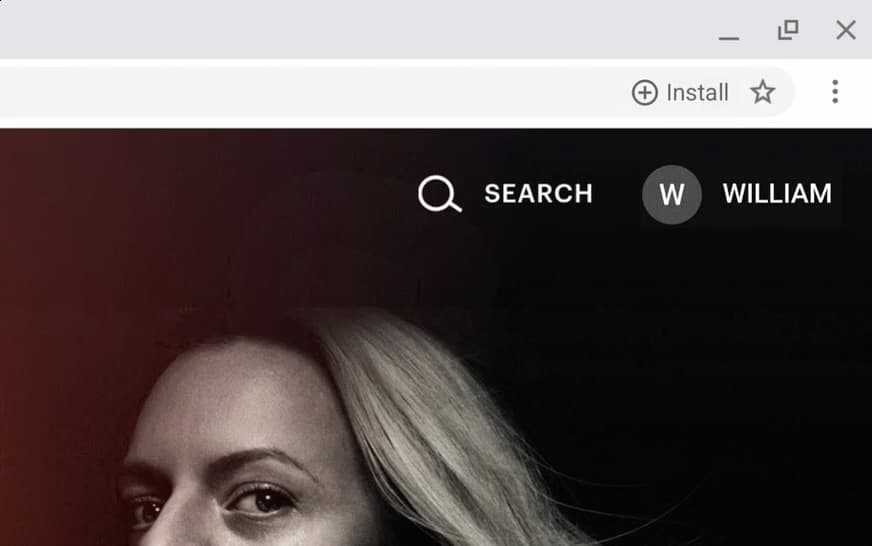
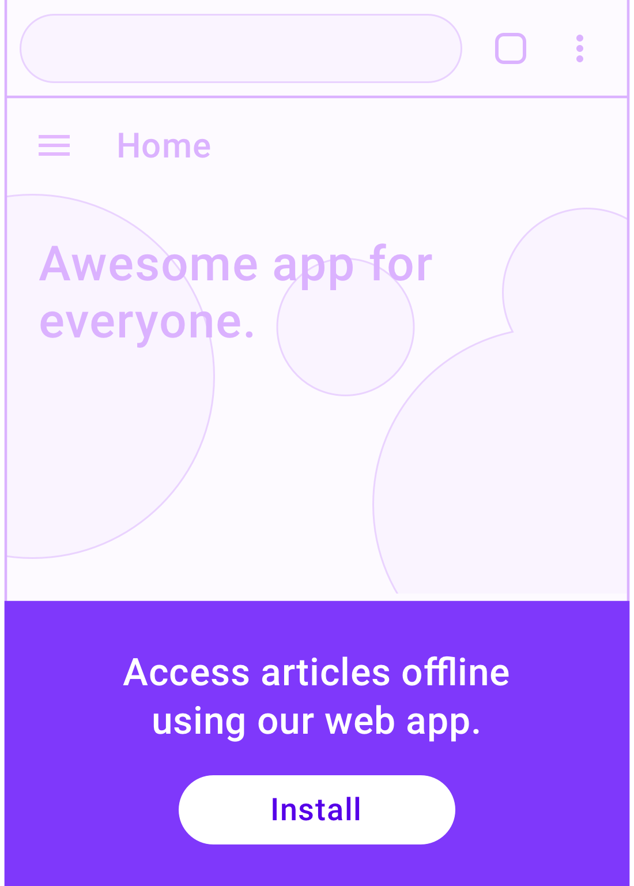
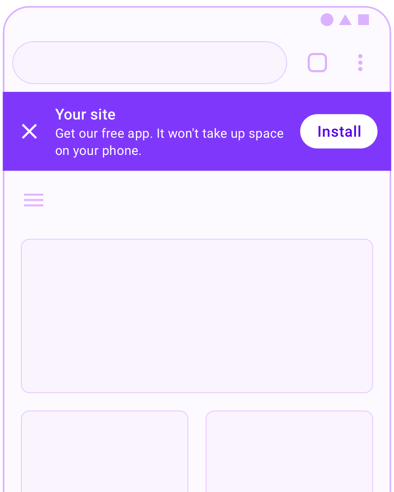
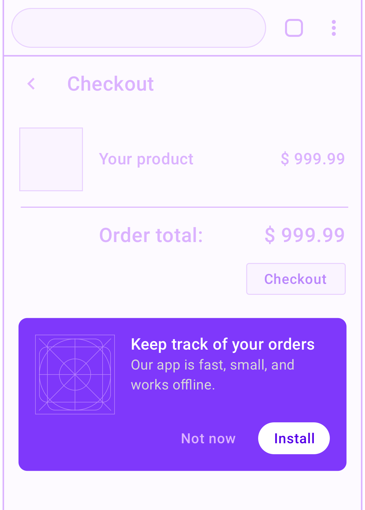
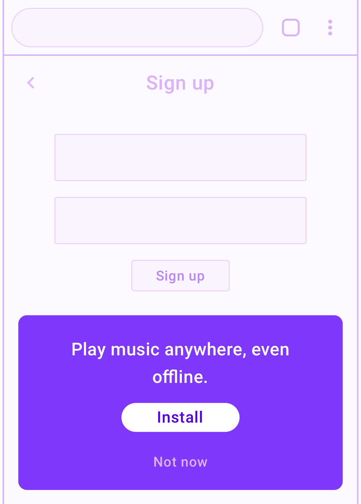
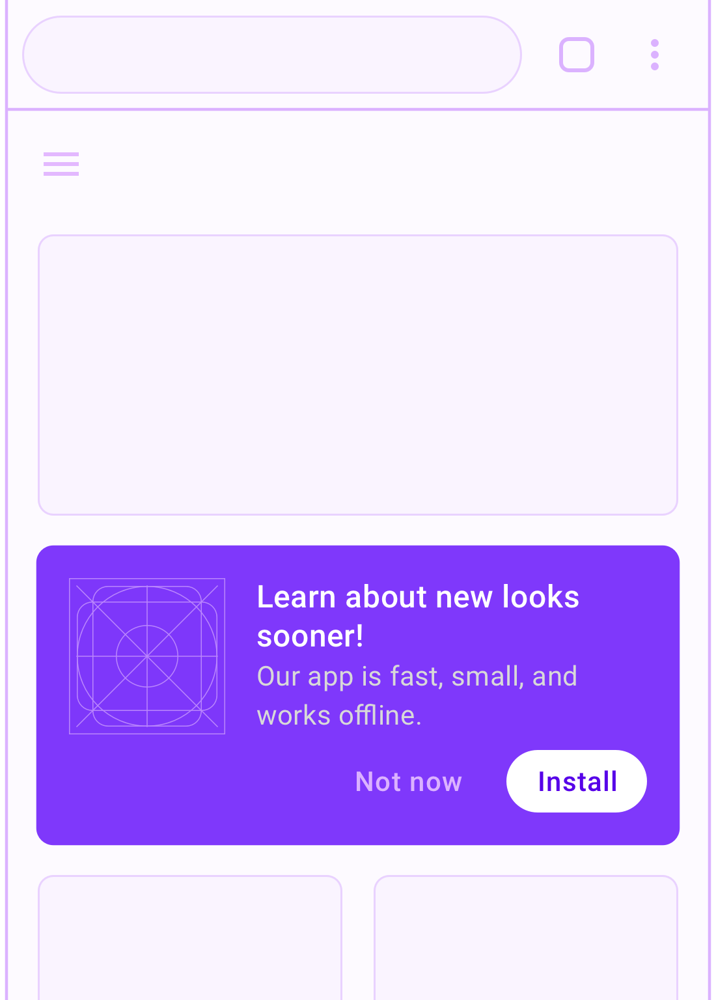

Progressive Web Apps (PWAs) are a pattern for creating app-like, instant
loading, reliable, and installable websites. Why would you want a user to
install your web app? The same reason you'd want a user to install your native
app from any app store.

Users who install are your most engaged users. Users who install
have better engagement metrics than casual visitors, including more repeat
visits, longer time on site and higher conversion rates, often at parity with
native app users on mobile devices.

If your PWA has use cases where it's helpful for a user to install your app,
for example if you have users who use your app more than once a week, you
should be promoting the installation of your PWA within the web UI of your
app.


See [Enabling installed experiences](/customize-install/) for the code required
to implement a PWA installation promotion.


## PWA install promotion best practices {: #best-practices }

Here are some best practices that apply no matter what promotional patterns you're
using on your site.

* Keep promotions outside of the flow of your user journeys. For example,
  in a PWA login page, put the call to action below the login form and submit
  button. Disruptive use of promotional patterns reduces the usability of your
  PWA and negatively impacts your engagement metrics.
* Include the ability to dismiss or decline the promotion. Remember the
  user's preference if they do this and only re-prompt if there's a change
  in the user's relationship with your content such as if they signed in or
  completed a purchase.
* Combine more than one of these techniques in different parts of your PWA,
  but be careful not to overwhelm or annoy your user with install promotion.
* Only show the promotion when you detect that the `beforeinstallprompt`
  event has been fired.

## Automatic browser promotion {: #browser-promotion }

<figure class="w-figure w-figure--inline-right">
  
  <figcaption class="w-figcaption">
    Install button in the omnibox provided by the browser.
  </figcaption>
</figure>

When [certain criteria](/install-criteria/) are met, the browser will
automatically indicate to the user that your Progressive Web App is
installable. For example, desktop Chrome shows an install button in the omnibox.

&nbsp;


Chrome for Android will show a mini-infobar to the user, though this can be
prevented by calling `preventDefault()` on the `beforeinstallprompt` event.
If you do not call `preventDefault()`, the banner will be shown the first time
a user visits your site and it meets the installability criteria on Android,
and then again after approximately 90 days.


## Application UI promotional patterns {: #app-ui-patterns }

Application UI promotional patterns can be used for almost any kind of PWA and
appear in the application UI, such as site navigation and banners. As with
any other type of promotional pattern, it's important to be aware of the
user's context to minimize disruption of the user's journey.

Sites which are thoughtful about when they trigger promotion UI achieve a
larger number of installs and avoid interfering with the journeys of users
who aren't interested in installation.

&nbsp;

### Fixed header {: #header }

<figure class="w-figure w-figure--inline-right">
  
  <figcaption class="w-figcaption">
    Custom install button in header
  </figcaption>
</figure>

This is an install button that is part of the header of your site. Other
header content often includes site branding such as a logo and the hamburger
menu. Headers may be `position:fixed` or not depending on your site's
functionality and user needs.

When used appropriately, promoting PWA installation from the header of your
site is a great way to make it easier for your most loyal customers to
return to your experience. Pixels in your PWA header are precious,
so make sure your installation call to action is appropriately sized, of greater
importance than other possible header content, and unintrusive.

&nbsp;

Make sure you:

* Evaluate the value of your installed use case for your users. Consider
  selective targeting to only present your promotion for users that are
  likely to benefit from it.
* Use precious header space efficiently. Consider what else would be helpful
  to offer your user in the header, and weigh the priority of the install
  promotion relative to other options.

### Navigation menu {: #nav }

<figure class="w-figure w-figure--inline-right">
  
  <figcaption class="w-figcaption">
    Add an install button/promotion in a slide out navigation menu.
  </figcaption>
</figure>

The navigation menu is a great place for promoting the installation of your
app since users who open the menu are signaling engagement with your experience.

Make sure you:

* Avoid disrupting important navigational content. Put the PWA install
  promotion below other menu items.
* Offer a short, relevant pitch for why the user would benefit from
  installing your PWA.

&nbsp;

### Landing page {: #landing }

The purpose of a landing page is to promote your products and services,
so this is one place where it is appropriate to go large with promoting
the benefits of installing your PWA.

<figure class="w-figure w-figure--inline-right">
  
  <figcaption class="w-figcaption">
    Custom install prompt on landing page
  </figcaption>
</figure>

First, explain your site's value proposition, then let visitors know what
they'll get from installation.

Make sure you:

* Appeal to features that matter most to your visitors and emphasize
  keywords that might have brought them to your landing page.
* Make your install promotion and call to action eye catching, but only after
  you've made your value proposition clear. This is your landing page, after
  all.
* Consider adding an install promotion in the part of your app where users spend
  most of their time.

&nbsp;

### Install banner {: #banner }

<figure class="w-figure w-figure--inline-right">
  
  <figcaption class="w-figcaption">
    A dismissible banner at the top of the page.
  </figcaption>
</figure>

Most users have encountered installation banners in mobile experiences and are
familiar with the interactions offered by a banner. Banners should be used
carefully because they can disrupt the user.

Make sure you:

* Wait until the user has demonstrated interest in your site before showing
  a banner. If the user dismisses your banner, don't show it again unless
  the user triggers a conversion event that indicates a higher level of
  engagement with your content such as a purchase on an e-commerce site or
  signing up for an account.
* Provide a brief explanation of the value of installing your PWA in the
  banner. For example, you can differentiate the install of a PWA from a
  native app by mentioning that it uses almost no storage on the user's
  device or that it will install instantly without a store redirect.

&nbsp;

## Inline promotional patterns

Inline promotional techniques interweave promotions with site content. This
is often more subtle than promotion in application UI, which has tradeoffs.
You want your promotion to stand out enough that interested users will notice
it, but not so much that it detracts from the quality of your user experience.

### In-feed {: #in-feed }

An in-feed install promotion appears between news articles or other lists of
information cards in your PWA.

<figure class="w-figure w-figure--inline-right">
  
  <figcaption class="w-figcaption">
    Install promotion within content feed.
  </figcaption>
</figure>

Your goal is to show users how to access the content they're enjoying more
conveniently. Focus on promoting features and functionality that will be
helpful to your users.

Make sure you:

* Limit the frequency of the promotions to avoid annoying users.
* Give your users the ability to dismiss the promotions.
* Remember your user's choice to dismiss.

&nbsp;

### Booking or checkout journey {: #journey }

<figure class="w-figure w-figure--inline-right">
  
  <figcaption class="w-figcaption">
    Install promotion after a user journey.
  </figcaption>
</figure>

Show an install promotion during or after a sequential journey such as those typical of
booking or checkout flows. If you're displaying the promotion after the user
has completed the journey, you can often make it more prominent since the
journey is completed.

Make sure you:

* Include a relevant call to action. Which users will benefit from installing
  your app and why? How is it relevant to the journey they are currently
  undertaking?
* If your brand has unique offers for installed app users, be sure to mention
  them here.
* Keep the promotion out of the way of next steps in your journey or you can
  negatively affect your journey completion rates. In the e-commerce example
  above, notice how the key call to action to checkout is above the
  app install promotion.

&nbsp;

### Sign up, sign in, or sign out flow {: #sign-up}

This promotion is a special case of the [journey](#journey) promotional
pattern where the promotion card can be more prominent.

<figure class="w-figure w-figure--inline-right">
  
  <figcaption class="w-figcaption">
    Custom install button on the sign up page.
  </figcaption>
</figure>

These pages are usually only viewed by engaged users, where the value
proposition of your PWA has already been established. There's also often not
a lot of other useful content to place on these pages. As a result, it's less
disruptive to make a larger call-to-action as long as it's not in the way.

Make sure you:

* Avoid disrupting the user's journey inside the sign up form. If it's a
  multi-step process, you might want to wait until the user has completed the
  journey.
* Promote features most relevant to a signed-up user.
* Consider adding an additional install promotion within the signed-in areas
  of your app.

&nbsp;

## What patterns should I use?

### e-commerce

Many e-commerce brands have a core group of loyal customers. These customers
want push notifications for early access to new collections and to know when
their items have shipped. They want the app on their home screen for quick
access to the catalog and a full screen experience.

Patterns that work well for e-commerce PWAs include:

* [Banner](#banner)
* [Header](#header)
* [Nav](#nav)
* [Landing](#landing)
* [In-feed](#in-feed)
* [Journey](#journey)
* [Sign-up](#sign-up)

#### Product Listing Page (PLP) or Category page {: #plp }

<figure class="w-figure w-figure--inline-right">
  
  <figcaption class="w-figcaption">
    Customized install promotion in a product listing page.
  </figcaption>
</figure>

This is a special case of the [in-feed](#in-feed) install promotional pattern,
where the feed contains products or category listings.

Make sure you:

* Match the look and feel of the rest of your product listing page.
* Don't disrupt the user's product selection process.

&nbsp;

### Rich media and communications

Are you building the next social phenomenon or music streaming app? When new
users visit your PWA for the first time, inviting them to install your PWA
is a great way to bring them back.  With less storage usage than a typical
native app, your users can install your PWA and see whether your product
is right for them.

Patterns that work well for rich media and communications PWAs include:

* [Banner](#banner)
* [Header](#header)
* [Nav](#nav)
* [Landing](#landing)
* [Journey](#journey)
* [Sign-up](#sign-up)

### News

If you work on a content-oriented site, chances are you have regular users
who would be interested in installing your PWA.

Patterns that work well for news and social PWAs include:

* [Banner](#banner)
* [Header](#header)
* [Nav](#nav)
* [Landing](#landing)
* [In-feed](#in-feed)
* [Journey](#journey)
* [Sign-up](#sign-up)

### Games

The modern web is a great distribution platform for games because it has the biggest
reach in the world.

Patterns that work well for PWA games include:

* [Banner](#banner)
* [Header](#header)
* [Nav](#nav)
* [Landing](#landing)
* [In-feed](#in-feed)
* [Journey](#journey)
* [Sign-up](#sign-up)

#### End of game

<figure class="w-figure w-figure--inline-right">
  
  <figcaption class="w-figcaption">
    Custom install promotion at the end of a game.
  </figcaption>
</figure>

This is really just a special case of the [inline journey](#journey) UI pattern.

Most casual and hyper casual games end quickly. If your users are enjoying the
game, this is a great chance to invite them to install.

&nbsp;

