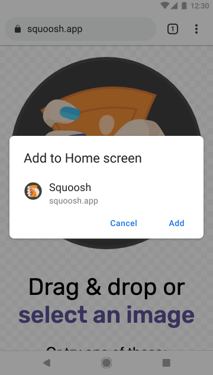
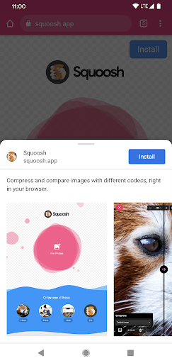
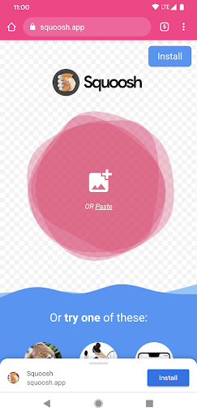
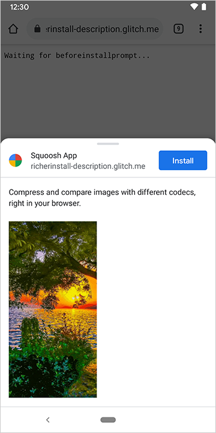
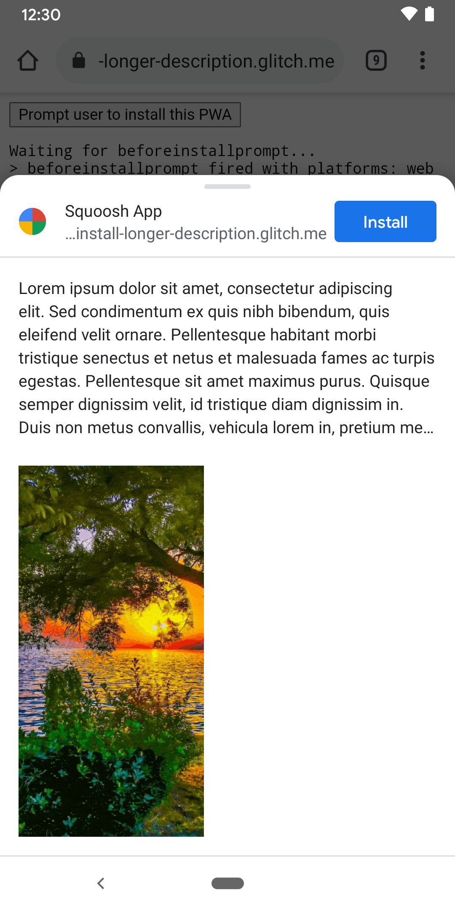


This is experimental UI, and potential could change in the future depending on developer, user and
partner feedback. We are also planning on expanding the UI to consider use cases where we need to
educate the user about  really powerful features like WebSockets. 


## Introduction {: #introduction }

Mobile devices and the introduction of device vendor app stores have changed users' mental model
of how to discover, evaluate and install software. Users are now so familiar with app stores, and
the additional information that is provided through app stores such as context about the app,
social feedback, ratings etc that we see the app store metaphor emerging in Desktop operating
systems including ChromeOS, Mac & Windows. 


## Challenge with today's install surfaces {: #today }

Today, if a user wants to install a PWA, an infobar and modal overlay appears with minimal
information. If they do continue to install, the process is over too quickly without giving
context to the user. This goes against their expectations of installing apps and can leave them
somewhat confused with what has happened.  

<figure class="w-figure">
  
  <figcaption class="w-figcaption">
   An example of PWA install UI.
  </figcaption>
</figure>

To enable and empower developers to provide installed experiences on--par with native experiences
Chrome is introducing a new install surface, Richer Install, that will allow developers to add a
description and screenshots to their manifest file and have it appear in a bottomsheet dialog
within Chrome. 

By doing this we are giving developers the opportunity to create a more enticing install process
that better aligns to user expectations and better context that mimics their existing mental model
of installed experiences. 

<div class="w-columns">
  <figure class="w-figure">
    
    <figcaption class="w-figcaption">
      Richer Install UI Expanded.
    </figcaption>
  </figure>
  <figure class="w-figure">
    
    <figcaption class="w-figcaption">
      Richer Install UI Collapsed.
    </figcaption>
  </figure>
</div>

## Backwards compatibility {: #compatibility }

Websites that do not conform to the above will continue to receive the existing prompts. This may
change in the future depending on uptake of the developer community and users' reaction.  

## Previewing the UI {: #previewing }

This UI works in Chrome Dev & Chrome Canary on Android, with the flag enabled;

`mobile-pwa-install-use-bottom-sheet` 

This feature is enabled on [squoosh.app](https://squoosh.app) and can be previewed there. As an
aside, [#screenshots](https://web.dev/add-manifest/#screenshots) and 
[#description](https://web.dev/add-manifest/#description) fields are already documented; 
you can give it a try behind the flag. 

## Implementation {: #implementation }

In order to enable Richer installs on your site you need to add at least one screenshot to your 
manifest file. Descriptions are not required but are recommended. 

Origins that are too long to fit the UI are truncated, this is also known as eliding and is used
as a [security measure to protect users](https://chromium.googlesource.com/chromium/src/+/master/docs/security/url_display_guidelines/url_display_guidelines.md#eliding-urls). 

Let's take a look at how we can trigger Richer Install UI when installing a PWA. In this example
we are looking at squoosh.app implementation. Let's assume that you have your name and origin
defined.

The manifest should look like this; 

 ```javascript
 {
"name": "Squoosh App",
"icons": [{
"src": "image/icon.png",
      "sizes": "512x512",
      "type": "image/png"
    }],
"start_url": "/?start_url",
"scope": "/",
"display": "standalone",
"background_color": "#fff",
"theme_color": "#fff"
}
 ```

Now let's add the screenshots to the end of the manifest.json file; 

## Screenshots {: #screenshots }

To add screenshots we need to determine the size, source and type, following this 
[criteria](https://web.dev/add-manifest/#screenshots). 

Width and height must be at least 320px and at most 3840px.
The maximum dimension can't be more than 2.3 times as long as the minimum dimension.
Screenshots must have the same aspect ratio.
Only JPEG and PNG image formats are supported.

Currently animated gifs are not supported. We need to include the size and type of the image so it 
is rendered correctly. 
[See this code example](https://glitch.com/edit/#!/richerinstall-screenshot?path=manifest.json%3A14%3A24).

 ```javascript
 "screenshots": [
    {
     "src": "source/image1.gif",
      "sizes": "320x640",
      "type": "image/gif"
    }
]
```
 
 <figure class="w-figure">
  
  <figcaption class="w-figcaption">
   A single screenshot added.
  </figcaption>
</figure>

## Description {: #description }

Descriptions are not compulsory, so there is no minimum requirement. There however is a max which 
kicks in after 7 lines of text (roughly 324 characters). After this an ellipse will appear and 
truncate longer descriptions 
([see example](https://glitch.com/edit/#!/richerinstall-longer-description)). 

In the future we will consider adding other data such as categories and app rating, but this will 
be based on feedback from developers and users. 
[See example code here](https://glitch.com/edit/#!/richerinstall-description?path=manifest.json%3A13%3A29).

Example; 

 ```javascript
"description": "Compress and compare images with 
				different codecs, right in your browser."
 ```

<div class="w-columns">
  <figure class="w-figure">
    
    <figcaption class="w-figcaption">
      Description added.
    </figcaption>
  </figure>
  <figure class="w-figure">
    
    <figcaption class="w-figcaption">
      Longer description added that has been truncated.
    </figcaption>
  </figure>
</div>

## Feedback  
In the coming months we would love to see how developers explore this new UI patterned and we 
would like to get feedback from you. Reachout to us on 
[Twitter](https://twitter.com/ChromiumDev). 
