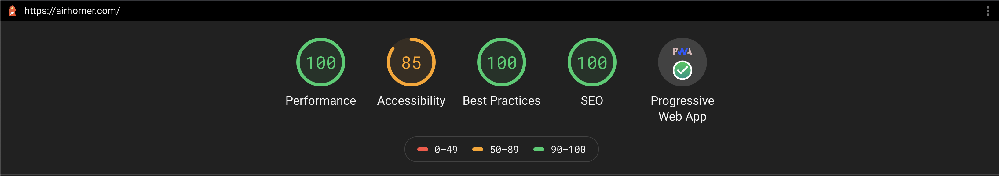

## Start a PWA in an Android app

[Progressive Web Apps][1] (PWA) are web applications that use app-like features to create
high quality experiences that are fast, reliable and engaging.

The web has incredible reach and offers powerful ways for users to discover new experiences. But
users are also used to searching for applications in their operating system store. Those users are,
in many cases, already familiar with the brand or service they're seeking and have a high level of intentionality
that results in higher than average engagement metrics.

The Play Store is a store for Android apps, and developers often want to open their Progressive Web
Apps from their Android apps.

Trusted Web Activity is an open standard that allows browsers to provide a fully web platform
compatible container that renders PWAs inside an Android app. The feature
is available in [Chrome][2], and in development in [Firefox Nightly][3].

### Existing solutions were limited

It has always been possible to include web experiences in an Android app, using technologies like
the [Android WebView][4] or frameworks like [Cordova][5].

The limitation with Android WebView is that it's not intended as a browser replacement. The Android
WebView is a developer tool for using web UI in an Android app and it doesn't provide complete
access to modern web platform features such as [contact picker][6], or [filesystem][7],
[among others][17].

Cordova was designed to augment the shortcomings of WebView, but the APIs are then limited to the
Cordova environment.  That means you need to maintain an additional codebase for using Cordova APIs
for your Android app, separate from your PWA on the open web.

In addition, feature discoverability often doesn't always work as expected and compatibility issues
between Android versions and OEMs can also be a problem. When using one of those solutions,
developers need additional quality assurance processes and incur an extra development cost to
detect and create workarounds.

### Trusted Web Activity is a new container for Web apps on Android

Developers can now use a [Trusted Web Activity][8] as a container to include a PWA as a launch
activity for an Android app. The technology leverages the browser to render the PWA in full screen,
ensuring the Trusted Web Activity has the same compatibility with the Web Platform features and
APIs that the underlying browser does. There are also open source utilities to make implementing
an Android app using a Trusted Web Activity even easier.

Another advantage not available in other solutions is that the container shares storage with the
browser. Login states and users preferences are shared seamlessly across experiences.

#### Browser Compatibility

The feature has been available in Chrome since version 75, with Firefox implementing it in their
nightly version.

### Quality Criteria

Web developers should use a Trusted Web Activity when they want to include web content in an
Android app. Web content in a Trusted Web Activity must meet Lighthouse's PWA install quality
criteria and additional Android-specific criteria such as [policy compliance][9].


  When your app is designed primarily for children under 13, additional
  [Play Family policies](https://play.google.com/about/families/) apply, which may be incompatible
  with using Trusted Web Activity.


<figure class="w-figure w-figure--center">
  
  <figcaption class="w-figcaption w-figcaption--fullbleed">
    The PWA badge and a minimum Lighthouse score of 80 are required.
  </figcaption>
</figure>

## Tooling

Web developers who want to take advantage of Trusted Web Activity don't need to learn new
technologies or APIs to transform their PWA into an Android Application. Together, Bubblewrap and
PWABuilder provide developer tooling in the form of a library, Command Line Interface (CLI) and
Graphical User Interface (GUI).

### Bubblewrap

The [Bubblewrap][10] project generates Android apps in the form of a NodeJS
library and a Command Line Interface (CLI).

Bootstrapping a new project is achieved by running the tool and passing the URL of the Web
Manifest:

```shell
npx @bubblewrap/cli init --manifest=https://pwa-directory.appspot.com/manifest.json
```

The tool can also build the project, and running the command below will output an Android
application ready to be uploaded to the Play Store:

```shell
npx @bubblewrap/cli build
```

After running this command, a file called `app-release-signed.apk` will be available in the root
directory for the project. This is the file that will be [uploaded to the Play Store][11].

### PWABuilder

[PWABuilder][12] helps developers transform existing websites into Progressive Web Apps. It also
integrates with Bubblewrap to provide a GUI interface to wrap those PWAs into an Android app.
The PWABuilder team has put together a [great blog post][13] on how to generate an Android application
using the tool.

## Verifying ownership of the PWA in the Android app

A developer building a great Progressive Web App wouldn't want another developer to build an
Android app with it without their permission. To ensure this doesn't happen, the Android
application must be paired with the Progressive Web App using a tool called
[Digital Asset Links][14].

Bubblewrap and PWABuilder take care of the necessary configuration on the Android application, but
a last step remains, which is adding the `assetlinks.json` file to the PWA.

To generate this file, developers need the SHA-256 signature of the key used to sign the APK that
is being downloaded by the users.

The key can be generated in multiple ways, and the easiest way to find which key that signed the
APK being served to end users is to download it from the Play Store itself.

To avoid showing a broken application to users, deploy the application to a
[closed test channel][11], install it into a test device then use [Peter's Asset Link Tool][15] to
generate the correct `assetlinks.json` file for the app. Make the generated `assetlinks.json` file
available at `/.well-known/assetlinks.json`, in the domain being validated.

## Where to go next

A Progressive Web App is a high quality web experience. Trusted Web Activity is a new way to open
those high quality experiences from an Android app when they meet the minimum quality criteria.

If you are getting started with Progressive Web Apps, read
[our guidance on how to build a great PWA][1]. For developers who already have a PWA, use
[Lighthouse][16] to verify if it meets the quality criteria.

Then, use [Bubblewrap][10] or [PWABuilder][12] to generate the Android application,
[upload the application to a closed test channel on the Play Store][11] and pair it with the PWA
using [Peter's Asset Link Tool][15].

Finally, move your application from the closed test channel to production!

[1]: /progressive-web-apps/
[2]: https://play.google.com/store/apps/details?id=com.android.chrome
[3]: https://play.google.com/store/apps/details?id=org.mozilla.fenix
[4]: https://developer.android.com/reference/android/webkit/WebView
[5]: https://cordova.apache.org/
[6]: /contact-picker/
[7]: /file-system-access/
[8]: https://developers.google.com/web/updates/2019/02/using-twa
[9]: https://play.google.com/about/developer-content-policy/
[10]: https://github.com/GoogleChromeLabs/bubblewrap
[11]: https://support.google.com/googleplay/android-developer/answer/3131213?hl=en-GB
[12]: https://pwabuilder.com/
[13]: https://www.davrous.com/2020/02/07/publishing-your-pwa-in-the-play-store-in-a-couple-of-minutes-using-pwa-builder/
[14]: https://developers.google.com/digital-asset-links/v1/getting-started
[15]: https://play.google.com/store/apps/details?id=dev.conn.assetlinkstool
[16]: https://developers.google.com/web/tools/lighthouse
[17]: /fugu-status/
