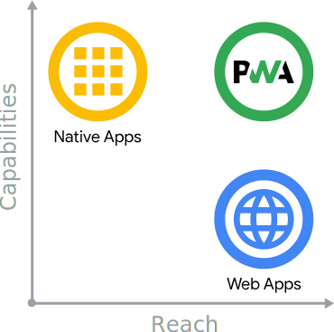

The web is an incredible platform. Its mix of ubiquity across devices and
operating systems, its user-centered security model, and the fact that neither
its specification nor its implementation is controlled by a single company makes
the web a unique platform to develop software on. Combined with its inherent
linkability, it's possible to search it and share what you've found with
anyone, anywhere. Whenever you go to a website, it's up-to-date, and your
experience with that site can be as ephemeral or as permanent as you'd like. Web
applications can reach _anyone, anywhere, on any device_ with a single codebase.

Platform-specific applications, are known for being incredibly rich and reliable. They're
ever-present, on home screens, docks, and taskbars. They work regardless of
network connection. They launch in their own standalone experience. They can
read and write files from the local file system, access hardware connected via
USB, serial or bluetooth, and even interact with data stored on your device,
like contacts and calendar events. In these applications, you can do things
like take pictures, see playing songs listed on the home screen, or control song
playback while in another app. Platform-specific applications feel like _part_ of the
device they run on.

<figure class="w-figure">
  
  <figcaption class="w-figcaption w-figcaption--fullbleed">
    Capabilities vs. reach of platform-specific apps, web app, and progressive web apps.
  </figcaption>
</figure>

If you think about platform-specific apps and web apps in terms of capabilities and reach,
platform-specific apps represent the best of capabilities whereas web apps represent the
best of reach. So where do Progressive Web Apps fit in?

Progressive Web Apps (PWA) are built and enhanced with modern APIs to deliver
enhanced capabilities, reliability, and installability while reaching
_anyone, anywhere, on any device_ with a single codebase.

## The three app pillars

Progressive Web Apps are web applications that have been designed so they are
capable, reliable, and installable. These three pillars transform them into an
experience that feels like a platform-specific application.

### Capable

The web is quite capable in its own right today. For example, you can build a hyper-local
video chat app using WebRTC, geolocation, and push notifications. You can make
that app installable and take those conversations virtual with WebGL and WebVR.
With the introduction of Web Assembly, developers can tap into other ecosystems,
like C, C++, and Rust, and bring decades of work and capabilities to the web
too. [Squoosh.app](https://squoosh.app/), for instance, leverages this for its
advanced image compression.

Until recently, only platform-specific apps could really lay claim to these capabilities.
While some capabilities are still out of the web's reach, new and upcoming APIs
are looking to change that, expanding what the web can do with features like
file system access, media controls, app badging, and full clipboard support. All
of these capabilities are built with the web's secure, user-centric permission
model, ensuring that going to a website is never a scary proposition for users.

Between modern APIs, Web Assembly, and new and upcoming APIs, web applications
are more capable than ever, and those capabilities are only growing.

### Reliable

A reliable Progressive Web App feels fast and dependable regardless of the
network.

Speed is critical for getting users to _use_ your experience. In fact, as page
load times go from 1 second to ten seconds, the probability of a user bouncing
[increases by 123%](https://www.thinkwithgoogle.com/marketing-resources/data-measurement/mobile-page-speed-new-industry-benchmarks/).
Performance doesn't stop after the `onload` event. Users should never wonder whether their
interaction—for example, clicking a button—was registered or not. Scrolling and
animation should feel smooth. Performance affects your entire experience, from
how users perceive your application to how it actually performs.

Finally, reliable applications need to be usable regardless of network
connection. Users expect apps to start up on slow or flaky network connections
or even when offline. They expect the most recent content they've interacted
with, like media tracks or tickets and itineraries, to be available and usable
even if getting a request to your server is hard. When a request isn't possible,
they expect to be told there's trouble instead of silently failing or crashing.

Users love apps that respond to interaction in the blink of an eye, and an
experience they can depend on.

### Installable

Installed Progressive Web Apps run in a standalone window instead of a browser
tab. They're launchable from on the user's home screen, dock, taskbar, or shelf.
It's possible to search for them on a device and jump between them with the app
switcher, making them feel like part of the device they're installed on.

New capabilities open up after a web app is installed. Keyboard shortcuts usually
reserved when running in the browser, become available. Progressive Web
Apps can register to accept content from other applications, or to be the
default application to handle different types of files.

When a Progressive Web App moves out of a tab and into a standalone app window,
it transforms how users think about it and interact with it.

## The best of both worlds

At their heart, Progressive Web Apps are just web applications. Using
progressive enhancement, new capabilities are enabled in modern browsers. Using
service workers and a web app manifest, your web application becomes reliable
and installable. If the new capabilities aren't available, users still get the core experience.

The numbers don't lie! Companies that have launched Progressive Web Apps have
seen impressive results. For example, Twitter saw a 65% increase in pages per
session, 75% more Tweets, and a 20% decrease in bounce rate, all while reducing
the size of their app by over 97%. After switching to a PWA, Nikkei saw 2.3
times more organic traffic, 58% more subscriptions, and 49% more daily active
users. Hulu replaced their platform-specific desktop experience with a Progressive Web App
and saw a 27% increase in return visits.

Progressive Web Apps provide you with a unique opportunity to deliver a web
experience your users will love. Using the latest web features to bring
enhanced capabilities and reliability, Progressive Web Apps allow what you
build to be installed by _anyone, anywhere, on any device_ with a single
codebase.
