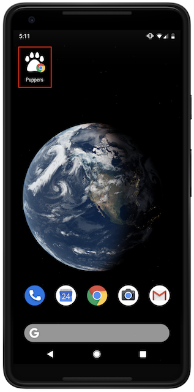


  If you don't know how web app manifest files work, refer to the
  [Add a Web App Manifest](/add-manifest) guide first.


Create React App (CRA) includes a web app manifest by default. Modifying this
file will allow you to change how your application is displayed when installed
on the user's device.

<figure class="w-figure">
  
</figure>

## Why is this useful?

Web app manifest files provide the capability to change how an installed
application will look like on the user's desktop or mobile device. By modifying
properties in the JSON file, you can modify a number of details in your
application, including its:

* Name
* Description
* App icon
* Theme color

The [MDN documentation](https://developer.mozilla.org/en-US/docs/Web/Manifest)
covers all the properties that can be changed in detail.

## Modify the default manifest

In CRA, a default manifest file, `/public/manifest.json` is included automatically when a new app is created:

```json
{
  "short_name": "React App",
  "name": "Create React App Sample",
  "icons": [
    {
      "src": "favicon.ico",
      "sizes": "64x64 32x32 24x24 16x16",
      "type": "image/x-icon"
    },
    {
      "src": "logo192.png",
      "type": "image/png",
      "sizes": "192x192"
    },
    {
      "src": "logo512.png",
      "type": "image/png",
      "sizes": "512x512"
    }
  ],
  "start_url": ".",
  "display": "standalone",
  "theme_color": "#000000",
  "background_color": "#ffffff"
}
```

This allows anybody to install the application on their device and see some
default details of the application. The HTML file, `public/index.html`, also
includes a `<link>` element to load the manifest.

```html
<link rel="manifest" href="%PUBLIC_URL%/manifest.json" />
```

Here is an example of an application built with CRA that has a modified manifest
file:



To find out if all the properties are working correctly in this example:



-  In the **Application** panel, click the **Manifest** tab.


## Conclusion

1. If you're building a site that you think does not need to be installed on a
   device, remove the manifest and the `<link>` element in the HTML file that
   points to it.
2. If you would like users to install the application on their device, modify
   the manifest file (or create one if you are not using CRA) with any
   properties that you like. The
   [MDN documentation](https://developer.mozilla.org/en-US/docs/Web/Manifest)
   explains all the required and optional attributes.
