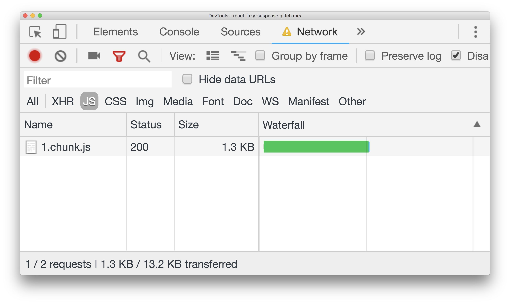


  If you don't yet understand the basic idea behind code splitting, refer to
  [Reduce JavaScript payloads with code splitting](/reduce-javascript-payloads-with-code-splitting)
  guide first.


The **`React.lazy`** method makes it easy to code-split a React application on a
component level using dynamic imports.

```jsx
import React, { lazy } from 'react';

const AvatarComponent = lazy(() => import('./AvatarComponent'));

const DetailsComponent = () => (
  <div>
    <AvatarComponent />
  </div>
)
```

## Why is this useful?

A large React application will usually consist of many components, utility
methods, and third-party libraries. If an effort isn't made to try to load
different parts of an application only when they're needed, a single, large
bundle of JavaScript will be shipped to your users as soon as they load the
first page. This can affect page performance significantly.

The `React.lazy` function provides a built-in way to separate components in an
application into separate chunks of JavaScript with very little legwork. You can
then take care of loading states when you couple it with the `Suspense`
component.

## Suspense

The problem with shipping a large JavaScript payload to users is the length of
time it would take for the page to finish loading, especially on weaker devices
and network connections. This is why code splitting and lazy loading is
extremely useful.

However, there will always be a slight delay that users have to experience when
a code-split component is being fetched over the network, so it's important to
display a useful loading state. Using `React.lazy` with the **`Suspense`**
component helps solve this problem.

```jsx
import React, { lazy, Suspense } from 'react';

const AvatarComponent = lazy(() => import('./AvatarComponent'));

const renderLoader = () => <p>Loading</p>;

const DetailsComponent = () => (
  <Suspense fallback={renderLoader()}>
    <AvatarComponent />
  </Suspense>
)
```

`Suspense` accepts a `fallback` component which allows you to display any React
component as a loading state. The following example shows how this works.
The avatar is only rendered when the button is clicked, where a request is
then made to retrieve the code necessary for the suspended `AvatarComponent`.
In the meantime, the fallback loading component is shown.



In here, the code that makes up `AvatarComponent` is small which is
why the loading spinner only shows for a short amount of time. Larger
components can take much longer to load, especially on
weak network connections.

To better demonstrate how this works:



-  Click the **Throttling** dropdown, which is set to **No throttling** by default. Select **Fast 3G**.
-  Click the **Click Me** button in the app.

The loading indicator will show for longer now. Notice how all the code that
makes up the `AvatarComponent` is fetched as a separate chunk.

<figure class="w-figure">
  
</figure>


 React does not currently support Suspense when components are being server-side
 rendered. If you are rendering on the server, consider using another library
 such as
 [`loadable-components`](https://www.smooth-code.com/open-source/loadable-components/docs/server-side-rendering/)
 which is recommended in the React docs.


## Suspending multiple components

Another feature of `Suspense` is that it allows you to suspend multiple
components from loading, **even if they are all lazy loaded**.

For example:

```jsx
import React, { lazy, Suspense } from 'react';

const AvatarComponent = lazy(() => import('./AvatarComponent'));
const InfoComponent = lazy(() => import('./InfoComponent'));
const MoreInfoComponent = lazy(() => import('./MoreInfoComponent'));

const renderLoader = () => <p>Loading</p>;

const DetailsComponent = () => (
  <Suspense fallback={renderLoader()}>
    <AvatarComponent />
    <InfoComponent />
    <MoreInfoComponent />
  </Suspense>
)
```

This is an extremely useful way to delay rendering of multiple components while
only showing a single loading state. Once all the components have finished
fetching, the user gets to see them all displayed at the same time.

You can see this with the following embed:




  Loading indicator showing a little too quickly?
  Try simulating a throttled connection in DevTools again.


Without this, it's easy to run into the problem of _staggered loading_, or
different parts of a UI loading one after the other with each having their own
loading indicator. This can make the user experience feel more jarring.


 Although using Suspense to split components is already possible and makes it
 easy to trim down bundle sizes, the React team is continuing to work on
 more features that would extend this even further. The
 [React 16.x roadmap](https://reactjs.org/blog/2018/11/27/react-16-roadmap.html)
 explains this in more detail.


## Handle loading failures

`Suspense` allows you to display a temporary loading state while network
requests are made under the hood. But what if those network requests fail for
some reason? You might be offline, or perhaps your web app is attempting to
lazy-load a [versioned URL](/http-cache/#long-lived-caching-for-versioned-urls)
that is out of date, and no longer available following a server redeployment.

React has a standard pattern for gracefully handling these types of loading
failures: using an error boundary. As described [in the documentation](https://reactjs.org/docs/error-boundaries.html),
any React component can serve as an error boundary if it implements either (or
both) of the lifecycle methods `static getDerivedStateFromError()` or
`componentDidCatch()`.

To detect and handle lazy-loading failures, you can wrap your `Suspense`
component with a parent components that serves as an error boundary. Inside the
error boundary's `render()` method, you can render the children as-is if there's
no error, or render a custom error message if something goes wrong:

```js
import React, { lazy, Suspense } from 'react';

const AvatarComponent = lazy(() => import('./AvatarComponent'));
const InfoComponent = lazy(() => import('./InfoComponent'));
const MoreInfoComponent = lazy(() => import('./MoreInfoComponent'));

const renderLoader = () => <p>Loading</p>;

class ErrorBoundary extends React.Component {
  constructor(props) {
    super(props);
    this.state = {hasError: false};
  }

  static getDerivedStateFromError(error) {
    return {hasError: true};
  }

  render() {
    if (this.state.hasError) {
      return <p>Loading failed! Please reload.</p>;
    }

    return this.props.children;
  }
}

const DetailsComponent = () => (
  <ErrorBoundary>
    <Suspense fallback={renderLoader()}>
      <AvatarComponent />
      <InfoComponent />
      <MoreInfoComponent />
    </Suspense>
  </ErrorBoundary>
)
```

## Conclusion

If you are unsure where to begin applying code splitting to your React
application, follow these steps:

1. Begin at the route level. Routes are the simplest way to identify points of
   your application that can be split. The
   [React docs](https://reactjs.org/docs/code-splitting.html#route-based-code-splitting)
   show how `Suspense` can be used along with
   [`react-router`](https://github.com/ReactTraining/react-router).
2. Identify any large components on a page on your site that only render on
   certain user interactions (like clicking a button). Splitting these
   components will minimize your JavaScript payloads.
3. Consider splitting anything else that is offscreen and not critical for the
   user.
