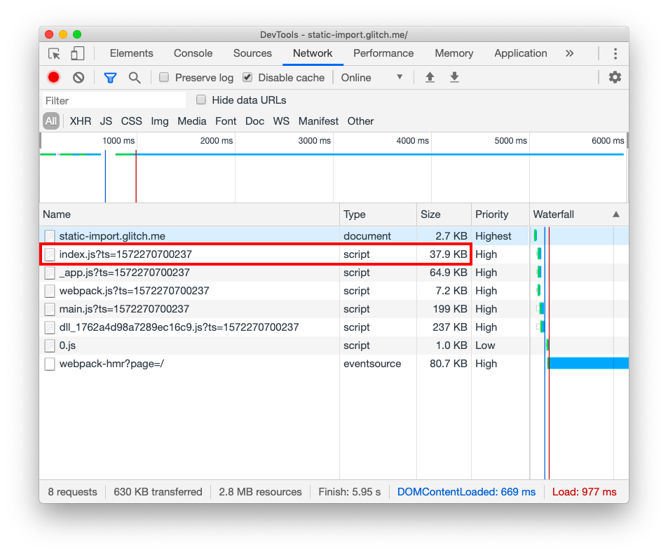
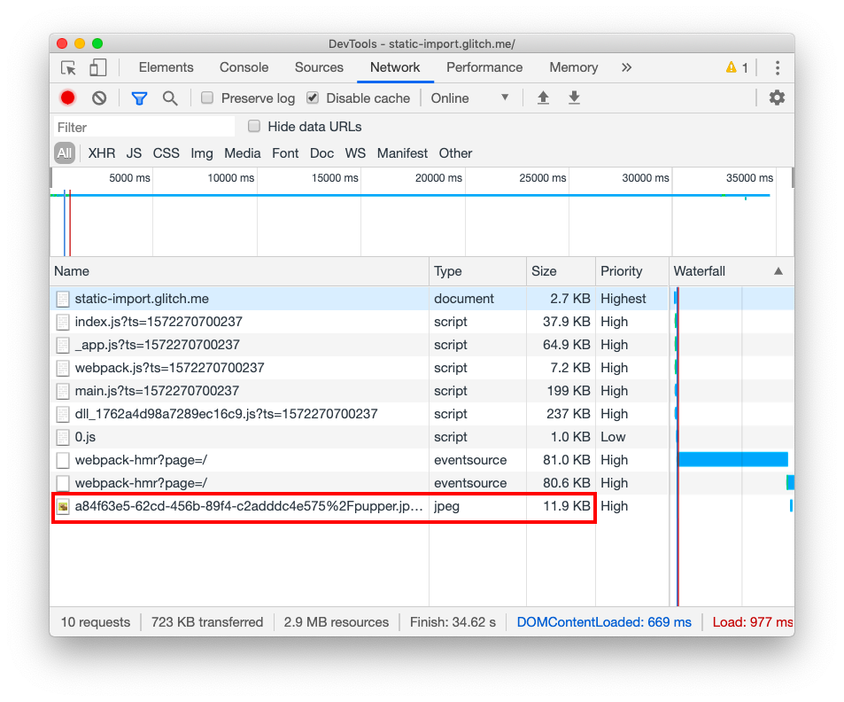
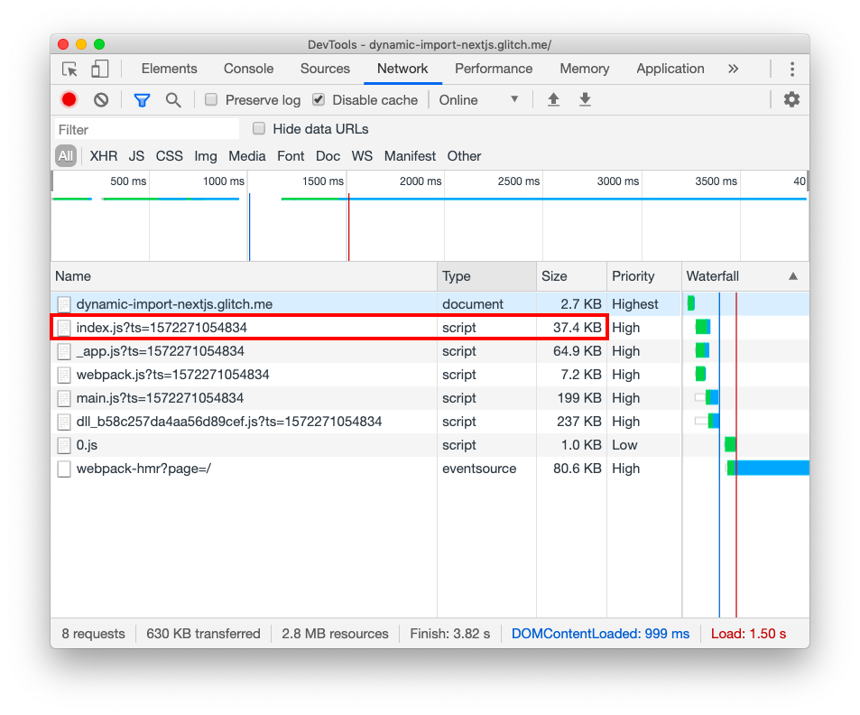
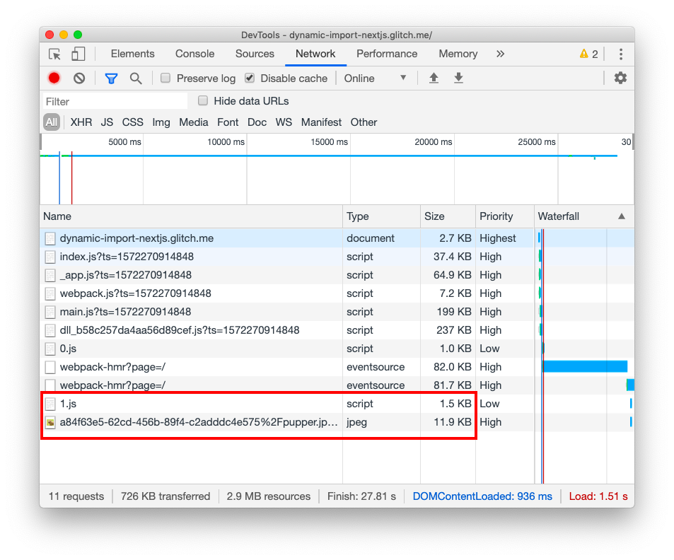
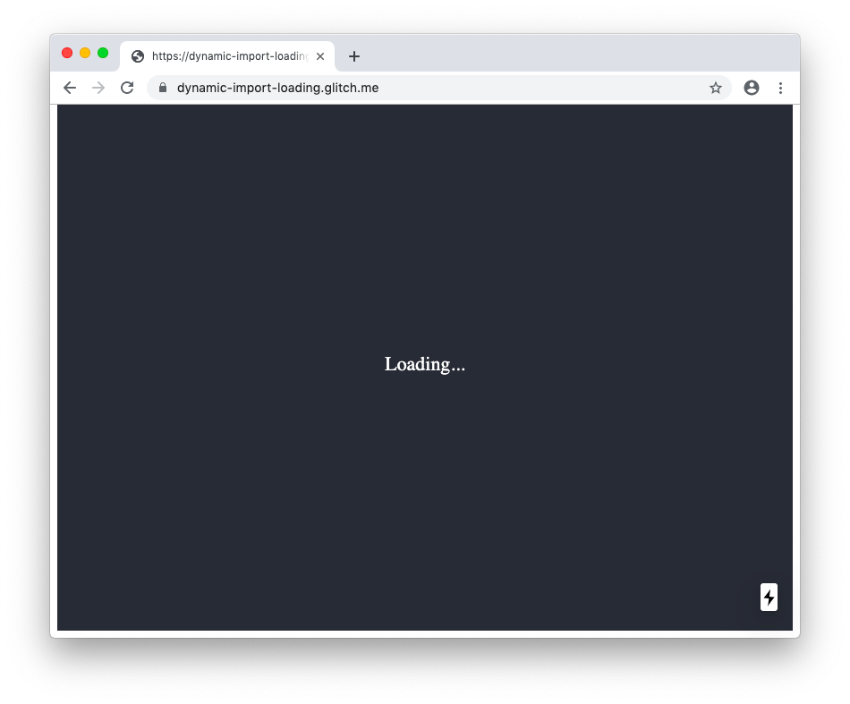

## What will you learn?

This post explains different types of [code
splitting](/reduce-javascript-payloads-with-code-splitting/) and how to use
dynamic imports to speed up your Next.js apps. 

## Route-based and component-based code splitting

By default, Next.js splits your JavaScript into separate chunks for each route.
When users load your application, Next.js only sends the code needed for the
initial route. When users navigate around the application, they fetch the chunks
associated with the other routes. Route-based code splitting minimizes the
amount of script that needs to be parsed and compiled at once, which results in
faster page load times. 

While route-based code splitting is a good default, you can further optimize the
loading process with code splitting on the component level. If you have large
components in your app, it's a great idea to split them into separate chunks.
That way, any large components that are not critical or only render on certain
user interactions (like clicking a button) can be lazy-loaded. 

Next.js supports [dynamic `import()`](https://v8.dev/features/dynamic-import),
which allows you to import JavaScript modules (including React components)
dynamically and load each import as a separate chunk. This gives you
component-level code splitting and enables you to control resource loading so
that users only download the code they need for the part of the site that
they're viewing. In Next.js, these components are [server-side rendered
(SSR)](https://developers.google.com/web/updates/2019/02/rendering-on-the-web)
by default.

## Dynamic imports in action

This post includes several versions of a sample app that consists of a simple
page with one button. When you click the button, you get to see a cute puppy. As
you move through each version of the app, you'll see how dynamic imports are
different from [static
imports](https://developer.mozilla.org/en-US/docs/Web/JavaScript/Reference/Statements/import)
and how to work with them.

In the first version of the app, the puppy lives in `components/Puppy.js`. To
display the puppy on the page, the app imports the `Puppy` component in
`index.js` with a static import statement:

```js
import Puppy from "../components/Puppy";
```



To see how Next.js bundles the app, inspect the network trace in DevTools:









When you load the page, all the necessary code, including the `Puppy.js`
component, is bundled in `index.js`:

<figure class="w-figure">

</figure>

When you press the **Click me** button, only the request for the puppy JPEG is
added to the **Network** tab:

<figure class="w-figure">

</figure>

The downside of this approach is that even if users don't click the button to
see the puppy, they have to load the `Puppy` component because it's included in
`index.js`. In this little example that's not a big deal, but in real-world
applications it's often a huge improvement to load large components only when
necessary.

Now check out a second version of the app, in which the static import is
replaced with a dynamic import. Next.js includes `next/dynamic`, which makes it
possible to use dynamic imports for any components in Next:

```js/1,5/0
import Puppy from "../components/Puppy";
import dynamic from "next/dynamic";

// ...

const Puppy = dynamic(import("../components/Puppy"));
```



Follow the steps from the first example to inspect the network trace.

When you first load the app, only `index.js` is downloaded. This time it's
0.5&nbsp;KB smaller (it went down from 37.9&nbsp;KB to 37.4&nbsp;KB) because it
doesn't include the code for the `Puppy` component:

<figure class="w-figure">

</figure>

The `Puppy` component is now in a separate chunk, `1.js`, which is loaded only
when you press the button:

<figure class="w-figure">

</figure>

 By default, Next.js names these dynamic chunks _number_.js, where
_number_ starts from 1. 

In real-world applications, components are often [much
larger](https://bundlephobia.com/result?p=moment@2.24.0), and lazy-loading them
can trim your initial JavaScript payload by hundreds of kilobytes.

## Dynamic imports with custom loading indicator

When you lazy-load resources, it's good practice to provide a loading indicator
in case there are any delays. In Next.js, you can do that by providing an
additional argument to the `dynamic()` function:

```js
const Puppy = dynamic(() => import("../components/Puppy"), {
  loading: () => <p>Loading...</p>
});
```



To see the loading indictor in action, simulate slow network connection in
DevTools:







5. In the **Throttling** drop-down list, select **Fast 3G**.

6. Press the **Click me** button.

Now when you click the button it takes a while to load the component and the app
displays the "Loading…" message in the meantime.

<figure class="w-figure">

</figure>

## Dynamic imports without SSR

If you need to render a component only on the client side (for example, a chat
widget) you can do that by setting the `ssr` option to `false`:

```js
const Puppy = dynamic(() => import("../components/Puppy"), {
  ssr: false,
});
```



## Conclusion

With support for dynamic imports, Next.js gives you component-level code
splitting, which can minimize your JavaScript payloads and improve application
load time. All components are server-side rendered by default and you can
disable this option whenever necessary.

