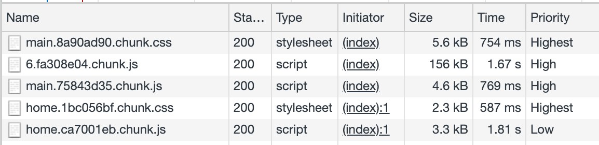
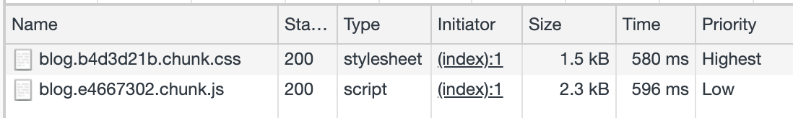
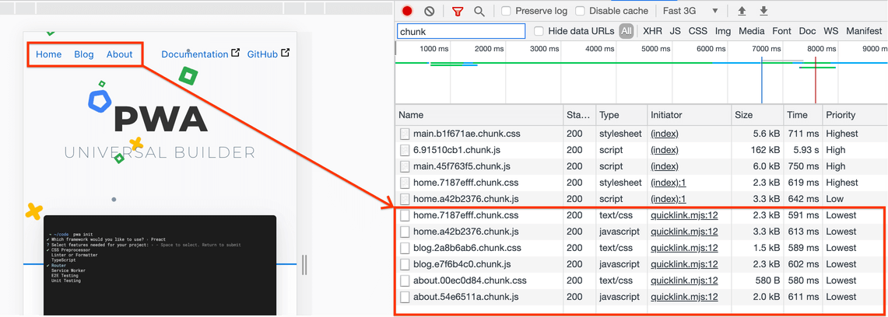
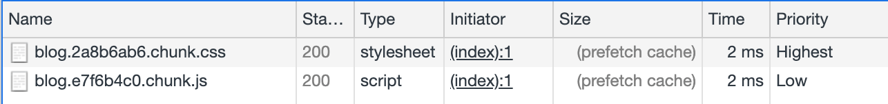


This codelab uses [Chrome DevTools](https://www.google.com/chrome/). Download Chrome if you don't already have it.


This codelab shows you how to implement the [Quicklink](/quicklink) library in a React SPA demo to demonstrate how prefetching speeds up subsequent navigations.

## Measure

Before adding optimizations, it's always a good idea to first analyze the current state of the application.




The website is a simple demo built with [create-react-app](https://reactjs.org/docs/create-a-new-react-app.html).

Complete the following instructions in the new tab that just opened:



1. In the [Throttling drop-down list](https://developers.google.com/web/tools/chrome-devtools/network/reference#throttling), select **Fast 3G** to simulate a slow connection type.

1. Type `chunk` into the [Filter textbox](https://developers.google.com/web/tools/chrome-devtools/network/reference#filter-by-property) to hide any resources that do not include `chunk` in their name.



The site uses [route-based code splitting](/reduce-javascript-payloads-with-code-splitting/), thanks to which only the necessary code is requested at the beginning.

1. [Clear the network requests in DevTools](https://developers.google.com/web/tools/chrome-devtools/network/reference#clear).
1. Within the app, click the **Blog** link to navigate to that page.

The JS and CSS chunks for the new route are loaded to render the page.



Next, you'll implement Quicklink in this site, so that these chunks can be prefetched in the home page, making the navigation faster.

This allows you to combine the best of both techniques:

- Route-based code splitting tells the browser to only load the necessary chunks at a higher priority at page load time.
- Prefetching tells the browser to load the chunks for in-viewport links at the lowest priority, during the browser's idle time.

## Configure `webpack-route-manifest`

The first step is to install and configure [webpack-route-manifest](https://github.com/lukeed/webpack-route-manifest), a webpack plugin that lets you generate a manifest file associating routes with their corresponding chunks.

Usually, you would need to install the library, but we've already done it for you. Here's the command that you would need to run:

```bash
npm install webpack-route-manifest --save-dev
```
`config-overrides.js` is a file placed in your project root directory where you can override existing behaviour of the webpack configuration, without having to [eject the project](https://github.com/facebook/create-react-app/blob/master/packages/cra-template/template/README.md#npm-run-eject).



Open `config-overrides.js` for edit and add the `webpack-route-manifest` dependency at the beginning of the file:

```javascript/1/
const path = require('path');
const RouteManifest = require('webpack-route-manifest');
```

Next, configure the `webpack-route-manifest` plugin by adding the following
code to the bottom of `config-overrides.js`:

```javascript
module.exports = function override(config) {
  config.resolve = {
    ...config.resolve,
    alias: {
      '@assets': `${path.resolve(__dirname, 'src/assets')}`,
      '@pages': `${path.resolve(__dirname, 'src/pages')}`,
      '@components': `${path.resolve(__dirname, 'src/components')}`,
    },
  };

  config.plugins.push(
    new RouteManifest({
      minify: true,
      filename: 'rmanifest.json',
      routes(str) {
        let out = str.replace('@pages', '').toLowerCase();
        if (out === '/article') return '/blog/:title';
        if (out === '/home') return '/';
        return out;
      },
    }),
  );

  return config;
};
```

The new code does the following:

- `config.resolve` declares variables with the internal routes to pages, assets and components.
- `config.plugins.push()` creates a `RouteManifest` object and passes it the configuration so that the `rmanifest.json` file can be generated based on the site's routes and chunks.

The `manifest.json` file will be generated and made available at `https://site_url/rmanifest.json`.

## Configure quicklink

At this point you would need to install the Quicklink library in your project. For simplicity, we already added it to the project. Here's the command that you would need to run:

```bash
npm install --save quicklink
```

Open `src/components/App/index.js` for edit.

First, import the Quicklink higher order component (HOC):

```javascript/6/
import React, { lazy, Suspense } from 'react';
import { Route } from 'react-router-dom';

import Footer from '@components/Footer';
import Hero from '@components/Hero';
import style from './index.module.css';
import { withQuicklink } from 'quicklink/dist/react/hoc.js';

const Home = lazy(() => import(/* webpackChunkName: "home" */ '@pages/Home'));
const About = lazy(() => import(/* webpackChunkName: "about" */ '@pages/About'));
const Article = lazy(() => import(/* webpackChunkName: "article" */ '@pages/Article'));
const Blog = lazy(() => import(/* webpackChunkName: "blog" */ '@pages/Blog'));
```

Next, create an `options` object after the `Blog` variable declaration, to use as an argument when calling `quicklink`:

```javascript/0-2/
const options = {
	origins: []
};
```
Finally, wrap each route with the `withQuicklink()` higher order component, passing it an `options` parameter and the target component for that route:

```javascript/5-11/
const App = () => (
  <div className={style.app}>
    <Hero />
    <main className={style.wrapper}>
      <Suspense fallback={<div>Loading...</div>}>
        <Route path="/" exact component={withQuicklink(Home, options)} />
        <Route path="/blog" exact component={withQuicklink(Blog, options)} />
        <Route
          path="/blog/:title"
          component={withQuicklink(Article, options)}
        />
        <Route path="/about" exact component={withQuicklink(About, options)} />
      </Suspense>
    </main>
    <Footer />
  </div>
);
```
The previous code instructs to prefetch chunks for the routes wrapped with `withQuicklink()`, when the link comes into the view.


If Glitch throws an error at this point about the lack of a dependency,
try opening the Glitch Terminal (**Tools** > **Terminal**), running
`refresh` in the Terminal, then running `npm run build`.


## Measure again

Repeat the first 6 steps from [Measure](#measure). Don't navigate to the blog page yet.

When the home page loads the chunks for that route are loaded. After that, Quicklink prefetches the route's chunks for the in-viewport links:



These chunks are requested at the lowest priority and without blocking the page.

Next:

1. Clear the Network log again.
1. Disable the **Disable cache** checkbox.
1. Click the **Blog** link to navigate to that page.



The **Size** column indicates that these chunks were retrieved from the "prefetch cache", instead of the network. Loading these chunks without a Quicklink took approximately **580ms**. Using the library it now takes **2ms**, which represents a **99% reduction**!
