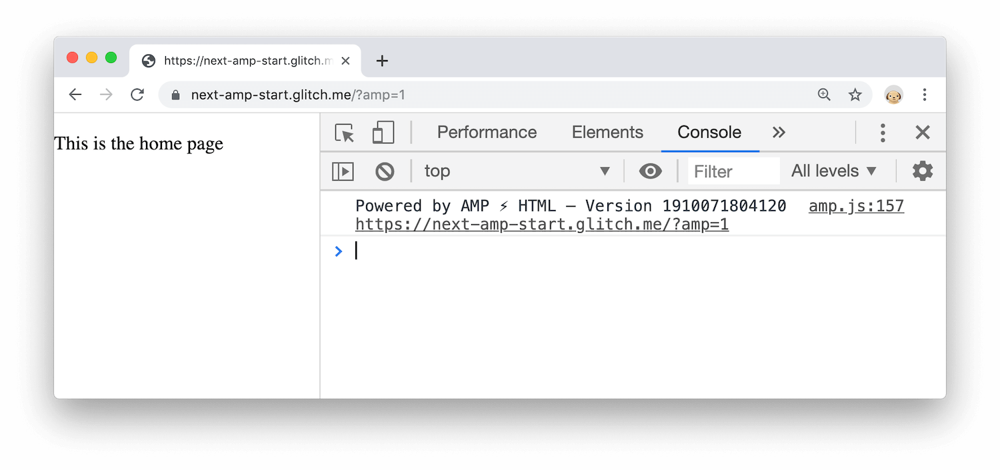
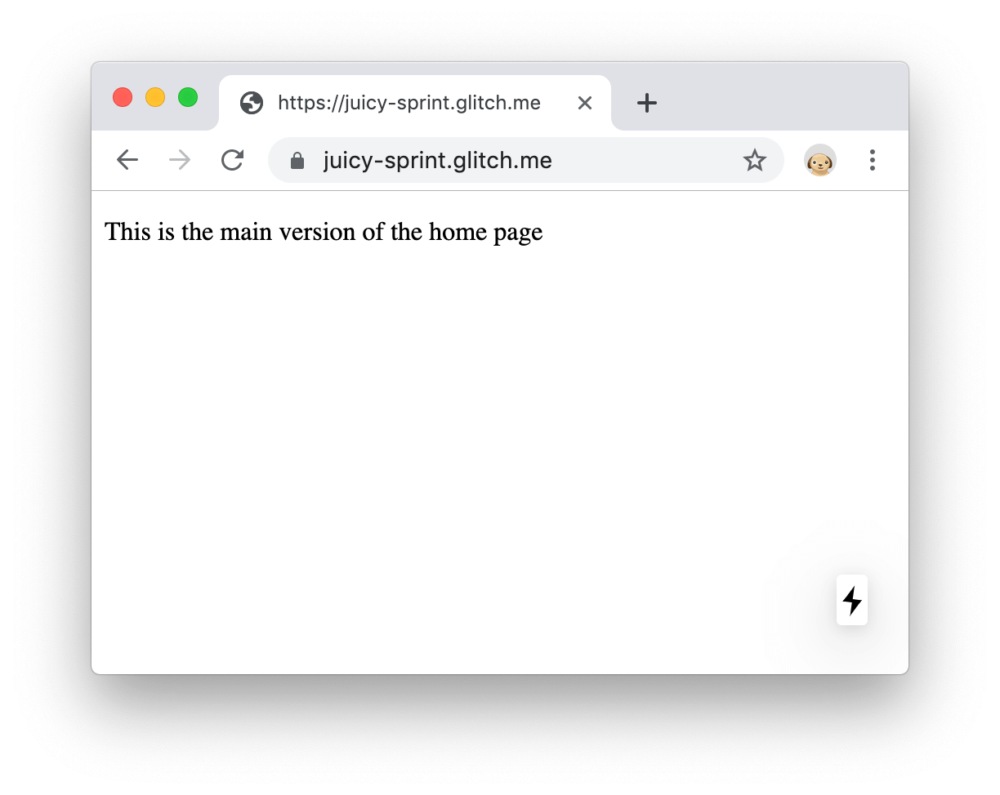

[AMP](https://amp.dev) (Accelerated Mobile Pages) is a web component framework that guarantees
that guarantees fast page loads. [Next.js][intro] has built-in support for AMP.

## What will you learn?

This guide first briefly describes [how AMP guarantees fast page loads](#overview), then lets you
try out [the two ways that you can use AMP in a Next.js app](#strategies), then helps you [decide
which approach is best for you](#guidance).

The intended audience for this guide is a web developer who has decided to use Next.js but is
unsure of whether to support AMP. 


  This guide was not written for web developers who have decided to use AMP but are unsure of what
  framework to use. We will note briefly however that Next.js could be a good choice because it
  supports [AMP server-side rendering](https://amp.dev/documentation/guides-and-tutorials/optimize-and-measure/server-side-rendering/)
  and makes it easy to serve AMP content without introducing a lot of complexity into your codebase.


## How AMP guarantees fast page loads {: #overview }

AMP has two main strategies for guaranteeing fastness:

* **AMP HTML**: A restricted form of HTML that makes certain optimizations mandatory and prohibits
  architectural patterns that lead to slowness. See [How AMP works][how] for a high-level
  overview of the optimizations and restrictions.
* **AMP Cache**: A content cache used by some search engines, such as Google and Bing, that uses
  [prerendering] to speed up page loads. See [Why AMP Caches exist][why] to learn more about the
  benefits and tradeoffs of the caches and [How does my AMP page get cached?][how] to understand
  how your AMP pages get into the caches.

## How you can use AMP in Next.js {: #strategies }

There are two ways to use AMP in Next.js:

* The [**Hybrid AMP** approach](#hybrid) lets you create an accompanying AMP version of any
  Next.js page.
* The [**AMP-only** approach](#amponly) lets you make AMP the only option for a page.


  Whenever you serve AMP pages, you won't be able to run React components client-side because
  React components are not valid AMP components.


### How to create Hybrid AMP pages {: #hybrid }

The **Hybrid AMP** approach creates an accompanying AMP version of any Next.js page. The regular
page can always be accessed by your users but search engines will surface and cache the AMP version
of the page instead.

There are multiple ways to configure how Next.js renders and serves pages. Using a `config`
object allows you to modify these on a per-page basis. In order to serve a specific page as
an AMP page, you need to export the `amp` property in the object:

```jsx
import React from 'react'

export const config = { amp: 'hybrid' };

const Home = () => (
  <p>This is the home page</p>
);
  
export default Home;
```

Try out Hybrid AMP pages with the following Glitch:

<div class="glitch-embed-wrap" style="height: 480px; width: 100%;">
  <iframe src="https://glitch.com/embed/#!/embed/next-amp-start?attributionHidden=true&path=pages/index.js"
          alt="A basic Next.js app on Glitch that supports AMP."
          style="height: 100%; width: 100%; border: 0;"></iframe>
</div>





1. Add `?amp=1` to the end of the URL. The page looks the same, but if you look in the
   Console you'll see that the AMP version of the page is being rendered.

<figure>
  
  <figcaption>
    The AMP version of the page.
  </figcaption>
</figure>

Since the page only has a single `<p>` tag, there's no visible difference between the
main page and its AMP version. The Hybrid AMP approach is useful when you need to render
AMP-specific components only when the AMP page is requested.

#### How to conditionally serve AMP components

AMP pages need to have their own set of valid components in place of many HTML elements. It's
important to make sure that the AMP components are conditionally served only for the AMP page.
Next.js provides a [hook] called `useAmp` to allow you to conditionally serve different elements
depending on which version of the page was requested.

1. Edit `pages/index.js` so that it renders a different paragraph element to the page depending on whether
   the main version or the AMP version was requested:

   ```jsx/1,5-11
   import React from 'react';
   import { useAmp } from 'next/amp';

   export const config = { amp: 'hybrid' };

   const Home = () => (
     useAmp() ? (
       <p>This is the <strong>AMP</strong> version of the home page</p>
     ) : (
       <p>This is the main version of the home page</p>
     )
   );

   export default Home;
   ```

1. Load the main version of the page:

   <figure>
     
     <figcaption>
       The main version of the page.
     </figcaption>
   </figure>

1. Add `?amp=1` to the end of the URL again to load the AMP version of the page:

   <figure>
     
     <figcaption>
       The AMP version of the page.
     </figcaption>
   </figure>

1. Try rendering AMP's replacement of the image tag, `amp-img`:

   {# TODO(kaycebasques): Line highlighting isn't working with this sample. #}

   ```jsx
   import React from 'react';
   import { useAmp } from 'next/amp';

   export const config = { amp: 'hybrid' };

   const imgSrc = 'https://placekitten.com/1000/1000';

   const Image = () => (
     useAmp() ? (
       <amp-img alt="A cute kitten"
         src={imgSrc}
         width="1000"
         height="1000"
         layout="responsive">
       </amp-img>
     ) : (
       
       </img>
     )
   );

   const Home = () => (
     <div>
       <Image />
     </div>
   );

   export default Home;
   ```

   `layout="responsive"` automatically renders a fully responsive image with an aspect ratio
   specified by width and height. Check out [Layout & media queries][layout] to learn more about
   the supported layouts of AMP elements, and [amp-img] to learn more about that element's
   optimizations.
    
1. View the main version of the page again.

   <figure>
     
     <figcaption>
       The main version of the image.
     </figcaption>
   </figure>

1. View the AMP version of the page again.

   <figure>
     
     <figcaption>
       The AMP version of the image.
     </figcaption>
   </figure>

### How to create AMP-only pages {: #amponly }

Next.js also supports AMP-only pages. With this approach, a single AMP page is served and rendered
to users and search engines at all times.

1. To render an AMP-only page, change the value of the `amp` property in the config object to `true`.

   ```jsx
   import React from 'react'

   export const config = { amp: true };

   const Home = () => (
     <p>This is an AMP-only page</p>
   );
     
   export default Home;
   ```

## How to decide whether to use the Hybrid AMP or AMP-only approach {: #guidance }

If you're serious about load performance, an AMP-only page could be a good way to make sure
that your page gets fast and stays fast. But here's the catch: in order to guarantee fastness,
AMP must prohibit certain architectural patterns and HTML elements that often lead to slow pages.
For example, AMP doesn't allow custom synchronous JavaScript because 
[render-blocking resources][blockers] are a common cause of slow page loads.

In order to understand whether an AMP-only approach is right for you, you need to figure out
whether all of your frontend code can be represented in AMP HTML:

* Read [How AMP works](https://amp.dev/about/how-amp-works/) to understand AMP's high-level
  architectural restrictions and mandatory optimizations.
* Read [HTML Tags][tags] to see what HTML tags AMP allows and prohibits, and
  browse the [AMP component catalogue](https://amp.dev/documentation/components/) to see the
  custom components that the AMP community has built to solve common use cases.

Even if an AMP-only approach won't work for your page, it might still be a good idea to
use AMP whenever possible, because of its guaranteed fastness. The Hybrid AMP approach
provides a way to conditionally serve AMP without introducing a lot of complexity
into your codebase.

## Next steps

Check out the rest of the guides in [web.dev's Next.js collection][collection] to discover
other ways that you can optimize your Next.js app.

[intro]: /performance-as-a-default-with-nextjs
[layout]: https://amp.dev/documentation/guides-and-tutorials/develop/style_and_layout/control_layout/
[collection]: /react#nextjs
[hook]: https://reactjs.org/docs/hooks-overview.html
[prerendering]: https://developers.googleblog.com/2019/08/the-speed-benefit-of-amp-prerendering.html
[tags]: https://amp.dev/documentation/guides-and-tutorials/learn/spec/amphtml/#html-tags
[blockers]: /render-blocking-resources
[why]: https://blog.amp.dev/2017/01/13/why-amp-caches-exist/
[how]: https://amp.dev/documentation/guides-and-tutorials/learn/amp-caches-and-cors/how_amp_pages_are_cached/#how-does-my-amp-page-get-cached?
[layout]: https://amp.dev/documentation/guides-and-tutorials/develop/style_and_layout/control_layout/
[amp-img]: https://amp.dev/documentation/examples/components/amp-img/
