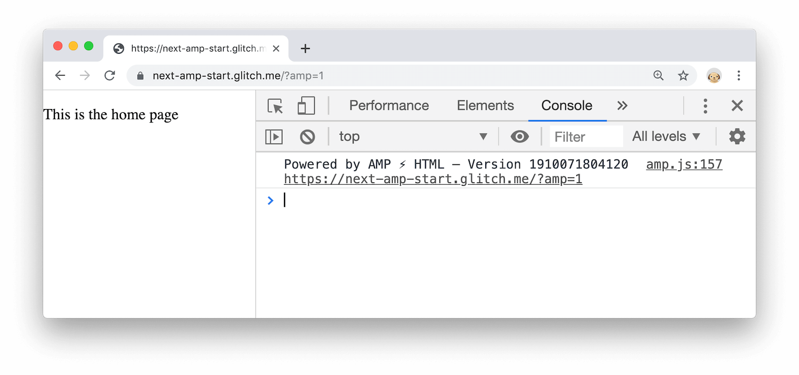

## What will you learn?

This codelab lets you try out the two ways that you can use AMP in a Next.js app.
Check out [How AMP can guarantee fastness in your Next.js app][guidance] to learn why you
might want to add AMP support to your Next.js app.

### How to create Hybrid AMP pages {: #hybrid }


  The [AMP-only approach](#amponly) is the recommended path for using AMP with Next.js. The
  Hybrid AMP approach described in this section has a higher maintenance cost than the AMP-only
  approach because it requires you to maintain two versions of each page. You should only use the
  Hybrid approach if you're certain that the AMP-only approach won't work.


The **Hybrid AMP** approach creates an accompanying AMP version of any Next.js page. The regular
page can always be accessed by your users but search engines will surface and cache the AMP version
of the page instead.

There are multiple ways to configure how Next.js renders and serves pages. Using a `config`
object allows you to modify these on a per-page basis. In order to serve a specific page as
an AMP page, you need to export the `amp` property in the object:

```jsx/2
import React from 'react'

export const config = { amp: 'hybrid' };

const Home = () => (
  <p>This is the home page</p>
);
  
export default Home;
```





1. Add `?amp=1` to the end of the URL. The page looks the same, but if you look in the
   Console you'll see that the AMP version of the page is being rendered.

<figure>
  
  <figcaption>
    The AMP version of the page.
  </figcaption>
</figure>

Since the page only has a single `<p>` tag, there's no visible difference between the
main page and its AMP version. The Hybrid AMP approach is useful when you need to render
AMP-specific components only when the AMP page is requested.

#### How to conditionally serve AMP components

AMP pages need to have their own set of valid components in place of many HTML elements. It's
important to make sure that the AMP components are conditionally served only for the AMP page.
Next.js provides a [hook] called `useAmp` to allow you to conditionally serve different elements
depending on which version of the page was requested.

1. Edit `pages/index.js` so that it renders a different paragraph element to the page depending on whether
   the main version or the AMP version was requested:

   ```jsx/1,5-11
   import React from 'react';
   import { useAmp } from 'next/amp';

   export const config = { amp: 'hybrid' };

   const Home = () => (
     useAmp() ? (
       <p>This is the <strong>AMP</strong> version of the home page</p>
     ) : (
       <p>This is the main version of the home page</p>
     )
   );

   export default Home;
   ```

1. Load the main version of the page:

   <figure>
     
     <figcaption>
       The main version of the page.
     </figcaption>
   </figure>

1. Add `?amp=1` to the end of the URL again to load the AMP version of the page:

   <figure>
     
     <figcaption>
       The AMP version of the page.
     </figcaption>
   </figure>

1. Try rendering AMP's replacement of the image tag, `amp-img`:

   {# TODO(kaycebasques): Line highlighting isn't working with this sample. #}

   ```jsx
   import React from 'react';
   import { useAmp } from 'next/amp';

   export const config = { amp: 'hybrid' };

   const imgSrc = 'https://placekitten.com/1000/1000';

   const Image = () => (
     useAmp() ? (
       <amp-img alt="A cute kitten"
         src={imgSrc}
         width="1000"
         height="1000"
         layout="responsive">
       </amp-img>
     ) : (
       
       </img>
     )
   );

   const Home = () => (
     <div>
       <Image />
     </div>
   );

   export default Home;
   ```

   `layout="responsive"` automatically renders a fully responsive image with an aspect ratio
   specified by width and height. Check out [Layout & media queries][layout] to learn more about
   the supported layouts of AMP elements, and [amp-img] to learn more about that element's
   optimizations.
    
1. View the main version of the page again.

   <figure>
     
     <figcaption>
       The main version of the image.
     </figcaption>
   </figure>

1. View the AMP version of the page again.

   <figure>
     
     <figcaption>
       The AMP version of the image.
     </figcaption>
   </figure>

### How to create AMP-only pages {: #amponly }

Next.js also supports AMP-only pages. With this approach, a single AMP page is served and rendered
to users and search engines at all times.

1. To render an AMP-only page, change the value of the `amp` property in the config object to `true`.

   ```jsx/2
   import React from 'react'

   export const config = { amp: true };

   const Home = () => (
     <p>This is an AMP-only page</p>
   );
     
   export default Home;
   ```

## Next steps

Check out the rest of the guides in [web.dev's Next.js collection][collection] to discover
other ways that you can optimize your Next.js app.

[guidance]: /how-amp-can-guarantee-fastness-in-your-nextjs-app
[layout]: https://amp.dev/documentation/guides-and-tutorials/develop/style_and_layout/control_layout/
[collection]: /react#nextjs
[hook]: https://reactjs.org/docs/hooks-overview.html
[layout]: https://amp.dev/documentation/guides-and-tutorials/develop/style_and_layout/control_layout/
[amp-img]: https://amp.dev/documentation/examples/components/amp-img/