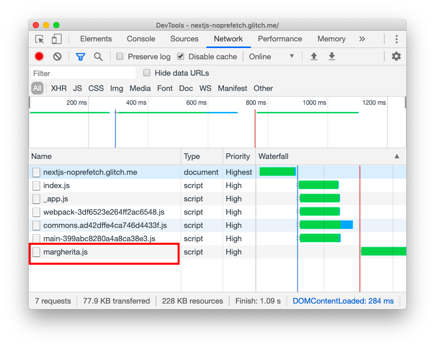
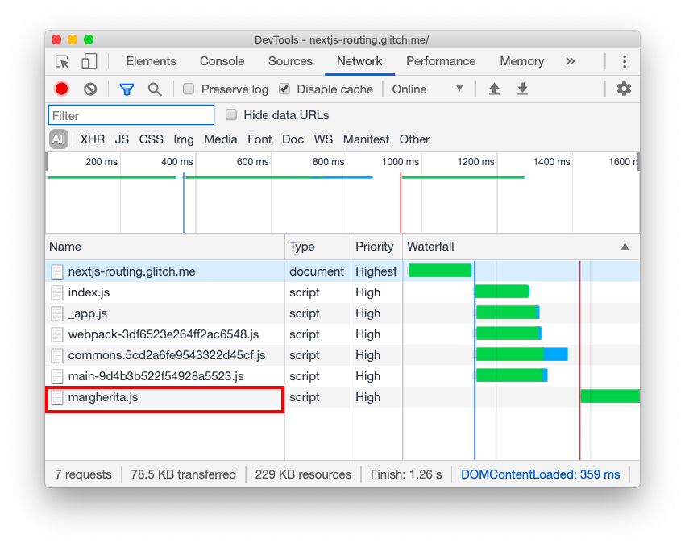
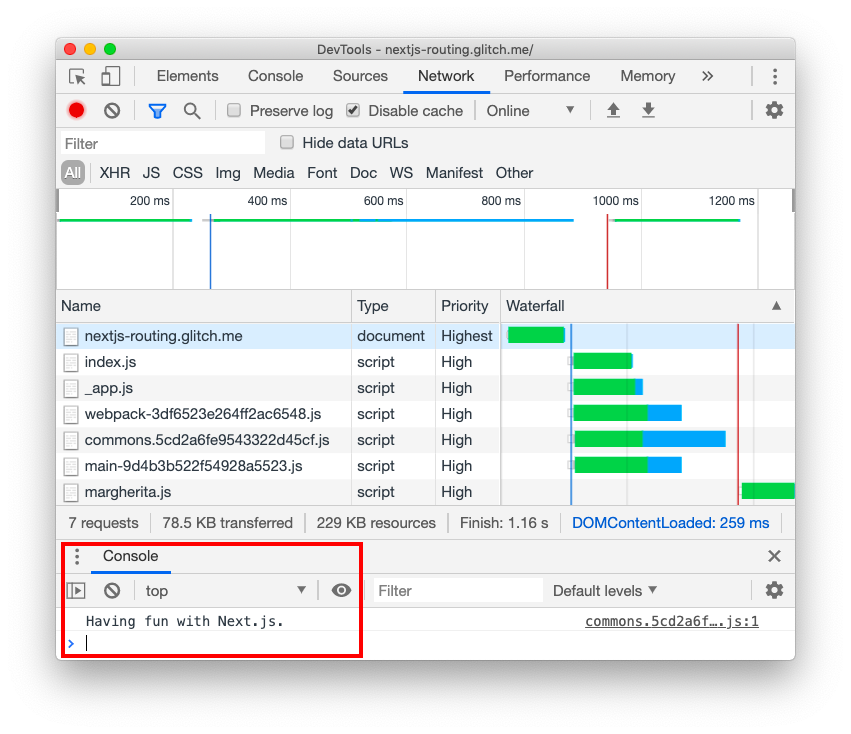

## The `<Link>` component

In [Next.js](https://nextjs.org/), you don't need to set up routing manually. Next.js uses file system based routing where you just create files and folders inside the `./pages/` directory:

<figure class="w-figure--center">

</figure>

To link to different pages, use the [`<Link>`](https://nextjs.org/docs#with-link) component, similarly to how you'd use the good old `<a>` element:

```js
<Link href="/margherita">
  <a>Margherita</a>
</Link>
```

When you use the `<Link>` component for navigation, Next.js does a little bit more for you. Normally, a page is downloaded when you follow a link to it, but [Next.js automatically prefetches](https://nextjs.org/docs#prefetching-pages) the JavaScript needed to render the page.

When you load a page with a few links, the odds are that by the time you follow a link, the component behind it has already been fetched. This improves application responsiveness by making navigations to new pages quicker.

In the example app, the `index.js` page links to `margherita.js` with a `<Link>`.

<div class="glitch-embed-wrap" style="height: 480px; width: 100%;">
<iframe src="https://glitch.com/embed/#!/embed/nextjs-prefetching?path=pages/index.js&attributionHidden=true" 
        alt="A basic Next.js app on Glitch" 
        style="height: 100%; width: 100%; border: 0;"></iframe>
</div>









When you load `index.js`, the **Network** tab shows that `margherita.js` is downloaded too: 


## How it works

Next.js prefetches only links that appear in the viewport and uses [Intersection Observer](https://developer.mozilla.org/en-US/docs/Web/API/Intersection_Observer_API) to detect them. It also disables prefetching when the network connection is slow or when users have [`Save-Data`](https://developer.mozilla.org/en-US/docs/Web/HTTP/Headers/Save-Data) turned on. Based on these checks, Next.js dynamically injects [`<link rel="preload">`](/preload-critical-assets/) tags to download components for subsequent navigations.

Next.js only *fetches* the JavaScript; it doesn't execute it. That way, it's not downloading any additional content that the page might request until you visit the link.


Because prefetching depends on the browsing conditions, it's enabled only in optimized production builds. To switch to development mode, check the `README.md` in Glitch examples.



Because `<link rel="preload">` requests resources with high priority, the browser expects them to be used right away, which triggers **Console** warnings. [Priority hints](https://developers.google.com/web/updates/2019/02/priority-hints) will soon become available in Chrome, which will allow Next.js to indicate lower priority for resources that are not needed immediately with `<link rel="preload" importance="low">`.


## Avoid unnecessary prefetching

To avoid downloading unnecessary content, you can disable prefetching for rarely visited pages by setting the `prefetch` property on `<Link>` to `false`:

```js
<Link href="/pineapple-pizza" prefetch={false}>
  <a>Pineapple pizza</a>
</Link>
```

In the second example app, the `index.js` page has a `<Link>` to `pineapple-pizza.js` with `prefetch` set to `false`. 

<div class="glitch-embed-wrap" style="height: 480px; width: 100%;">
<iframe src="https://glitch.com/embed/#!/embed/nextjs-noprefetch?path=pages/index.js:12:50&attributionHidden=true" 
        alt="A basic Next.js app on Glitch" 
        style="height: 100%; width: 100%; border: 0;"></iframe>
</div>

To inspect the network activity, follow the steps from the first example. When you load `index.js`, the DevTools **Network** tab shows that `margherita.js` is downloaded, but `pineapple-pizza.js` is not:



## Prefetching with custom routing

The `<Link>` component is suitable for most use cases, but you can also build your own component to do routing. Next.js makes this easy for you with the router API available in [`next/router`](https://nextjs.org/docs#userouter). If you want to do something (for example, submit a form) before navigating to a new route, you can define that in your custom routing code. 

When you use custom components for routing, you can add prefetching to them too. To implement prefetching in your routing code, use the `prefetch` method from `useRouter`.

Take a look at `components/MyLink.js` in this example app:

<div class="glitch-embed-wrap" style="height: 480px; width: 100%;">
<iframe src="https://glitch.com/embed/#!/embed/nextjs-routing?path=pages/index.js&attributionHidden=true" 
        alt="A basic Next.js app on Glitch" 
        style="height: 100%; width: 100%; border: 0;"></iframe>
</div>

Prefetching is done inside the [`useEffect`](https://reactjs.org/docs/hooks-effect.html) hook. If the `prefetch` property on a `<MyLink>` is set to `true`, the route specified in the `href` property gets prefetched when that `<MyLink>` is rendered:

```js
  useEffect(() => {
    if (prefetch) router.prefetch(href)
  });
```

When you click the link, the routing is done in `handleClick`. A message gets logged to the console, and the `push` method navigates to the new route specified in `href`:

```js
  const handleClick = e => {
    e.preventDefault();
    console.log("Having fun with Next.js.");
    router.push(href);
  };

```

In this example app, the `index.js` page has a `<MyLink>` to `margherita.js` and `pineapple-pizza.js`. The `prefetch` property is set to `true` on `/margherita` and to `false` on `/pineapple-pizza`. 

```js
<MyLink href="/margherita" title="Margherita" prefetch={true} />
<MyLink href="/pineapple-pizza"  title="Pineapple pizza" prefetch={false} />
```

When you load `index.js`, the **Network** tab shows that `margherita.js` is downloaded and `pineapple-pizza.js` is not:



When you click on either link, the **Console** logs "Having fun with Next.js." and navigates to the new route:



## Conclusion

When you use `<Link>` Next.js automatically prefetches the JavaScript needed to render the linked page, which makes navigating to new pages faster. If you are using custom routing, you can use the Next.js router API to implement prefetching yourself. Be cautious of unecessary content download and disable prefetching for rarely visited pages.