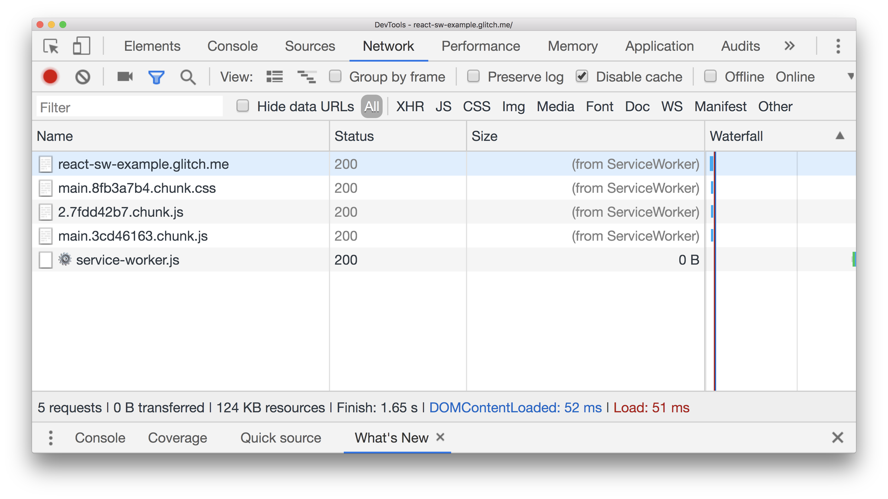


  If you don't yet understand the basic idea behind service workers and
  precaching, read the [Precaching with Workbox](/precache-with-workbox) guide
  first.


[`Workbox`](https://developers.google.com/web/tools/workbox/) is built into
Create React App (CRA) with a default configuration that precaches all the
static assets in your application with every build.

<figure class="w-figure w-figure--inline-right">
  
</figure>

## Why is this useful?

Service workers enable you to store important resources in its cache
(_precaching_) so that when a user loads the web page for a second time, the
browser can retrieve them from the service worker instead of making requests to
the network. This results in faster page loads on repeat visits as well as in the
ability to surface content when the user is offline.

## Workbox in CRA

**Workbox** is a collection of tools that allow you create and maintain service
workers. In CRA, the
[`workbox-webpack-plugin`](https://developers.google.com/web/tools/workbox/modules/workbox-webpack-plugin)
is already included into the production build and only needs to be enabled in
the `src/index.js` file in order to register a new service worker with every
build:

```js/8/7
import React from 'react';
import ReactDOM from 'react-dom';
import './index.css';
import App from './App';
import * as serviceWorker from './serviceWorker';
ReactDOM.render(<App />, document.getElementById('root'));

serviceWorker.unregister();
serviceWorker.register();
```

Here is an example of a React app built with CRA that has a service worker enabled through this file:



To see which assets are being cached:





You'll notice that instead of showing the payload size, the `Size` column shows
a `(from ServiceWorker)` message to indicate that these resources were retrieved
from the service worker.



Since the service worker caches all static assets, try to use the application
while offline:

1.  In the **Network** tab in DevTools, enable the **Offline** checkbox to
   simulate an offline experience.


The application works in exactly the same way, even without a network
connection!

## Modifying caching strategies

The default precaching strategy used by Workbox in CRA is **cache-first**, where
all static assets are fetched from the service worker cache and if that fails
(if the resource is not cached for example), the network request is made. This
is how content can still be served to users even when they are in a complete
offline state.

Although Workbox provides support to define different strategies and approaches
to caching static and dynamic resources, the default configuration in CRA cannot
be modified or overwritten unless you eject entirely. However, there is an
[open proposal](https://github.com/facebook/create-react-app/issues/5359)
to explore adding support for an external `workbox.config.js` file. This
would allow developers to override the default settings by just creating a
single `workbox.config.js` file.


For more details on all the caching strategies that a service worker can use,
take a look at the
[Offline Cookbook](https://developers.google.com/web/fundamentals/instant-and-offline/offline-cookbook/).


## Handling a cache-first strategy

Relying on the service worker cache first and then falling back to the network
is an excellent way to build sites that load faster on subsequent visits and
work offline to some extent. However, there are a few things that need to
be taken into consideration:

+  How can caching behaviors by a service worker be tested?
+  Should there be a message for users to let them know they are looking at
   cached content?

[The CRA
documentation](https://facebook.github.io/create-react-app/docs/making-a-progressive-web-app#offline-first-considerations)
explains these points, and more, in detail.

## Conclusion

Use a service worker to precache important resources in your application to
provide a faster experience for your users as well as offline support.

1. If you are using CRA, enable the pre-configured service worker in
   `src/index.js`.
2. If you are not using CRA to build a React application, include one of the
   many libraries Workbox provides, such as `workbox-webpack-plugin`, into your
   build process.
3. Keep an eye out for when CRA will support a `workbox.config.js` override file
   in this
   [GitHub issue](https://github.com/facebook/create-react-app/issues/5359).
