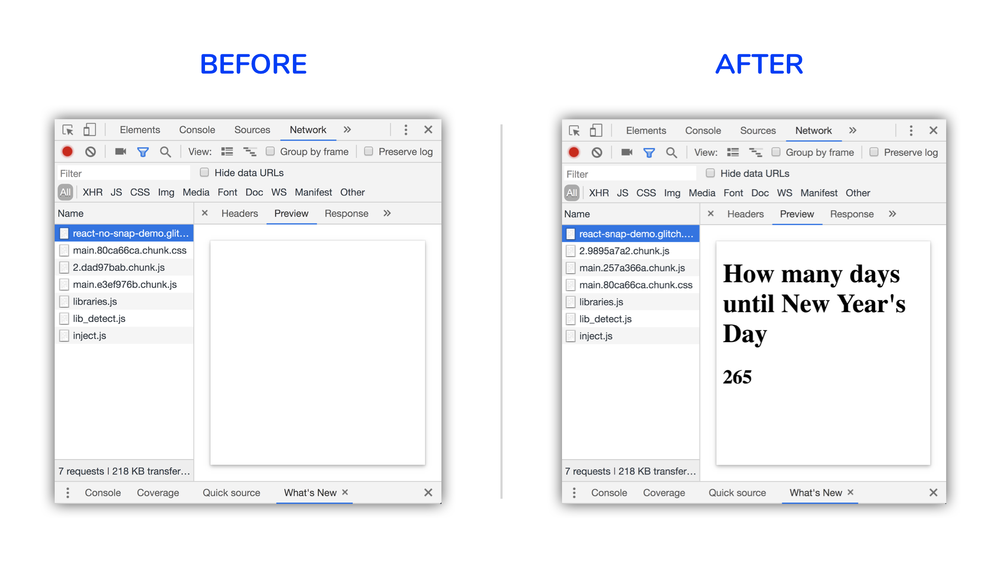
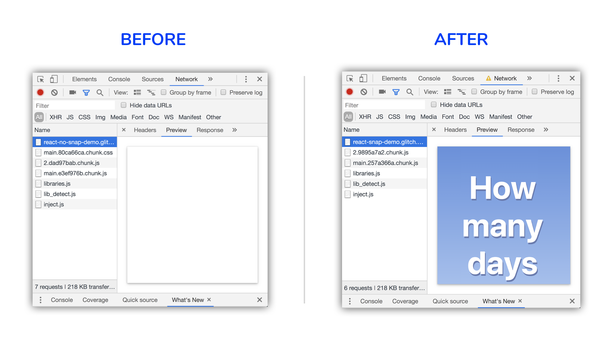

[`react-snap`](https://github.com/stereobooster/react-snap) is a third-party
library that pre-renders pages on your site into static HTML files. This can
improve
[First Paint](https://developers.google.com/web/fundamentals/performance/user-centric-performance-metrics#first_paint_and_first_contentful_paint)
times in your application.

Here's a comparison of the same application with and without pre-rendering
loaded on a simulated 3G connection and mobile device:

<figure class="w-figure">
  
</figure>


  `react-snap` is not the only library that can pre-render static HTML content
  for your React application.
  [`react-snapshot`](https://github.com/geelen/react-snapshot)
  is another alternative.


## Why is this useful?

The main performance problem with large single-page applications is that the
user needs to wait for the JavaScript bundle(s) that make up the site to finish
downloading before they can see any real content. The larger the bundles, the
longer the user will have to wait.

To solve this, many developers take the approach of rendering the application on
the server instead of only booting it up on the browser. With each
page/route transition, the complete HTML is generated on the server and sent to
the browser, which reduces First Paint times but comes at the cost of a slower
Time to First Byte.

**Pre-rendering** is a separate technique that is less complex than server
rendering, but also provides a way to improve First Paint times in your
application. A headless browser, or a browser without a user interface, is used
to generate static HTML files of every route during _build time_. These files
can then be shipped along with the JavaScript bundles that are needed for the
application.

## react-snap

`react-snap` uses [Puppeteer](https://github.com/GoogleChrome/puppeteer) to
create pre-rendered HTML files of different routes in your application. To
begin, install it as a development dependency:

```bash
npm install --save-dev react-snap
```

Then add a `postbuild` script in your `package.json`:

```json
"scripts": {
  //...
  "postbuild": "react-snap"
}
```

This would automatically run the `react-snap` command every time a new build of
the applications made (`npm build`).


  `npm` supports _pre_ and _post_ commands for main and arbitrary scripts which
  will always run directly before or after the original script respectively. You
  can learn more in the
  [npm documentation](https://docs.npmjs.com/misc/scripts).


The last thing you will need to do is change how the application is booted.
Change the `src/index.js` file to the following:

```js/6,8-12/5
import React from 'react';
import ReactDOM from 'react-dom';
import './index.css';
import App from './App';

ReactDOM.render(<App />, document.getElementById('root'));
const rootElement = document.getElementById("root");

if (rootElement.hasChildNodes()) {
  ReactDOM.hydrate(<App />, rootElement);
} else {
  ReactDOM.render(<App />, rootElement);
}
```

Instead of only using `ReactDOM.render` to render the root React element
directly into the DOM, this checks to see if any child nodes are already present
to determine whether HTML contents were pre-rendered (or rendered on the
server). If that's the case, `ReactDOM.hydrate` is used instead to attach event
listeners to the already created HTML instead of creating it anew.

Building the application will now generate static HTML files as payloads for
each route that is crawled. You can take a look at what the HTML payload looks
like by clicking the URL of the HTML request and then clicking the **Previews**
tab within Chrome DevTools.




  `react-snap` can be used for other frameworks than React! This includes Vue
  and Preact. More instructions about this can be found in the
  [`react-snap` README](https://github.com/stereobooster/react-snap).


## Flash of unstyled content

Although static HTML is now rendered almost immediately, it still remains
unstyled by default which may cause the issue of showing a "flash of unstyled
content" (FOUC). This can be especially noticeable if you are using a CSS-in-JS
library to generate selectors since the JavaScript bundle will have to finish
executing before any styles can be applied.

To help prevent this, the **critical** CSS, or the minimum amount of CSS that is
needed for the initial page to render, can be inlined directly to the `<head>`
of the HTML document. `react-snap` uses another third-party library under the
hood, [`minimalcss`](https://github.com/peterbe/minimalcss), to extract any
critical CSS for different routes. You can enable this by specifying the
following in your `package.json` file:

```json
"reactSnap": {
  "inlineCss": true
}
```

Taking a look at the response preview in Chrome DevTools will now show the styled page with critical CSS inlined.




  The `inlineCSS` option is still experimental. It is worth double-checking to
  make sure styles are being applied correctly for your routes.


### Conclusion

If you are not server-side rendering routes in your application, use
`react-snap` to pre-render static HTML to your users.

1. Install it as a development dependency and begin with just the default
   settings.
2. Use the experimental `inlineCss` option to inline critical CSS if it works
   for your site.
3. If you are using code splitting on a component level within any routes, be
   careful not to pre-render a loading state to your users. The
   [`react-snap` README](https://github.com/stereobooster/react-snap#async-components)
   covers this in more detail.
