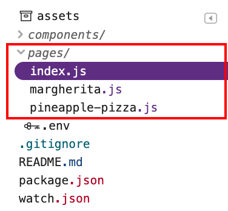

## What will you learn?

In this post you'll learn how routing in Next.js works, how it's optimized for speed, and how to customize it to best fit your needs.

## The `<Link>` component

In [Next.js](https://nextjs.org/), you don't need to set up routing manually.
Next.js uses file-system-based routing, which lets you just create files and folders
inside the `./pages/` directory:

<figure class="w-figure">

</figure>

To link to different pages, use the
[`<Link>`](https://nextjs.org/docs/api-reference/next/link) component, similarly to how you'd
use the good old `<a>` element:

```js
<Link href="/margherita">
  <a>Margherita</a>
</Link>
```

When you use the `<Link>` component for navigation, Next.js does a little bit
more for you. Normally, a page is downloaded when you follow a link to it, but
Next.js automatically prefetches the JavaScript needed to render the page.

When you load a page with a few links, odds are that by the time you follow
a link, the component behind it has already been fetched. This improves
application responsiveness by making navigations to new pages quicker.

In the example app below, the `index.js` page links to `margherita.js` with a
`<Link>`:



Use Chrome DevTools to verify that `margherita.js` is prefetched:








When you load `index.js`, the **Network** tab shows that `margherita.js` is
downloaded too:



## How automatic prefetching works

Next.js prefetches only links that appear in the viewport and uses the [Intersection
Observer API](https://developer.mozilla.org/en-US/docs/Web/API/Intersection_Observer_API)
to detect them. It also disables prefetching when the network connection is slow
or when users have
[`Save-Data`](https://developer.mozilla.org/en-US/docs/Web/HTTP/Headers/Save-Data)
turned on. Based on these checks, Next.js dynamically injects [`<link
rel="preload">`](/preload-critical-assets/) tags to download components for
subsequent navigations.

Next.js only *fetches* the JavaScript; it doesn't execute it. That way, it's not
downloading any additional content that the prefetched page might request until you visit
the link.

 Glitch examples are running in production mode because prefetching depends on the browsing conditions and it's enabled only in optimized production builds. To switch to development mode,
check the `README.md` in Glitch examples. 

 Because `<link rel="preload">` requests resources with high
priority, the browser expects them to be used right away, which triggers
Console warnings. [Priority
hints](https://developers.google.com/web/updates/2019/02/priority-hints) will
soon become available in Chrome, which will allow Next.js to indicate lower
priority for resources that are not needed immediately with `<link rel="preload"
importance="low">`. 

## Avoid unnecessary prefetching

To avoid downloading unnecessary content, you can disable prefetching for rarely
visited pages by setting the `prefetch` property on `<Link>` to `false`:

```js
<Link href="/pineapple-pizza" prefetch={false}>
  <a>Pineapple pizza</a>
</Link>
```

In this second example app, the `index.js` page has a `<Link>` to
`pineapple-pizza.js` with `prefetch` set to `false`:



To inspect the network activity, follow the steps from the first example. When
you load `index.js`, the DevTools **Network** tab shows that `margherita.js` is
downloaded, but `pineapple-pizza.js` is not:



## Prefetching with custom routing

The `<Link>` component is suitable for most use cases, but you can also build
your own component to do routing. Next.js makes this easy for you with the
router API available in [`next/router`](https://nextjs.org/docs/api-reference/next/router#userouter). 
If you want to do something (for example, submit a form) before navigating to a new
route, you can define that in your custom routing code.

When you use custom components for routing, you can add prefetching to them too.
To implement prefetching in your routing code, use the `prefetch` method from
`useRouter`.

Take a look at `components/MyLink.js` in this example app:



Prefetching is done inside the
[`useEffect`](https://reactjs.org/docs/hooks-effect.html) hook. If the
`prefetch` property on a `<MyLink>` is set to `true`, the route specified in the
`href` property gets prefetched when that `<MyLink>` is rendered:

```js
useEffect(() => {
    if (prefetch) router.prefetch(href)
});
```

When you click the link, the routing is done in `handleClick`. A message gets
logged to the console, and the `push` method navigates to the new route
specified in `href`:

```js
const handleClick = e => {
    e.preventDefault();
    console.log("Having fun with Next.js.");
    router.push(href);
};

```

In this example app, the `index.js` page has a `<MyLink>` to `margherita.js` and
`pineapple-pizza.js`. The `prefetch` property is set to `true` on `/margherita`
and to `false` on `/pineapple-pizza`.

```js
<MyLink href="/margherita" title="Margherita" prefetch={true} />
<MyLink href="/pineapple-pizza"  title="Pineapple pizza" prefetch={false} />
```

When you load `index.js`, the **Network** tab shows that `margherita.js` is
downloaded and `pineapple-pizza.js` is not:



When you click on either link, the **Console** logs "Having fun with Next.js."
and navigates to the new route:


## Conclusion

When you use `<Link>`, Next.js automatically prefetches the JavaScript needed to
render the linked page, which makes navigating to new pages faster. If you are
using custom routing, you can use the Next.js router API to implement
prefetching yourself. Avoid downloading content unnecessarily by disabling
prefetching for rarely visited pages.
