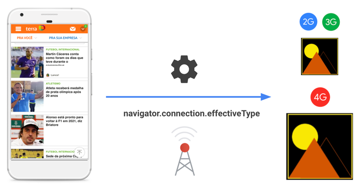
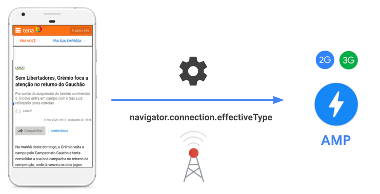



Users access websites through a wide variety of devices and network connections. Even in major cities, where mobile networks are fast and reliable, one can end up experiencing slower load times, for example, when commuting in the subway, in a car, or just when moving around.
In regions like emerging markets, this phenomenon is even more common, not only due to unreliable networks, but also because devices tend to have less memory and CPU processing power.

[Adaptive loading](/adaptive-loading-cds-2019/) is a web performance pattern that lets you adapt your site based on the user's network and device conditions.

The adaptive loading pattern is made possible by [service workers](/service-workers-cache-storage/), the [Network Information API](https://developer.mozilla.org/en-US/docs/Web/API/Network_Information_API), the [Hardware Concurrency API](https://developer.mozilla.org/en-US/docs/Web/API/NavigatorConcurrentHardware/hardwareConcurrency), and the [Device Memory API](https://developer.mozilla.org/en-US/docs/Web/API/Navigator/deviceMemory). In this guide we explore how you can use service workers and the Network Information API to achieve an adaptive loading strategy.

## Production case

[Terra](https://www.terra.com.br/) is one of the biggest media companies in Brazil. It has a large user base, coming from a wide variety of devices and networks.

To provide a more reliable experience to all their users, Terra combines service workers and the [Network Information API](https://developer.mozilla.org/en-US/docs/Web/API/Network_Information_API) to deliver lower quality images to users on 2G or 3G connections.

<figure class="w-figure">
  
</figure>

The company also found that the scripts and assets (like banners) loaded by ad networks were especially detrimental to users navigating in 3G or slower connections.

As is the case with many publishers, Terra serves [AMP](https://amp.dev/) versions of their pages to users coming from search engines and other link sharing platforms. AMP pages are usually lightweight and help mitigate the impact of ads in performance by deprioritizing their load with respect to the main content of the page.

Taking that into consideration, Terra decided to start serving AMP versions of their pages not only to users coming from search engines, but also to those navigating their site in 3G connections or slower.

To achieve that, they use the [Network Information API](https://developer.mozilla.org/en-US/docs/Web/API/Network_Information_API) in the service worker to detect if the request comes from 3G or slower. If that's the case, they change the URL of the page to request the AMP version of the page instead.

<figure class="w-figure">
  
</figure>

Thanks to this technique, they send **70% less bytes** to users on slower connections. The **time spent** in AMP pages is higher for 3G users and ads in AMP pages have a better **CTR (click-through-rate)** for that group.

## Implement adaptive loading with Workbox

In this section we'll explore how [Workbox](/workbox/) can be used to implement adaptive loading strategies.

Workbox provides several [runtime caching strategies](/runtime-caching-with-workbox/) out of the box. They are used to indicate how the service worker generates a response after receiving a `fetch` event.

For example, in a [Cache First](https://developers.google.com/web/tools/workbox/modules/workbox-strategies#cache_first_cache_falling_back_to_network) strategy the [`Request`](https://developer.mozilla.org/en-US/docs/Web/API/Request) will be fulfilled using the cached response (if available). If there isn't a cached response, the `Request` will be fulfilled by a network request and the response will be cached.

```javascript
import {registerRoute} from 'workbox-routing';
import {CacheFirst} from 'workbox-strategies';

registerRoute(
  new RegExp('/img/'),
  new CacheFirst()
);
```

Caching strategies can be customized with [Workbox plugins](https://developers.google.com/web/tools/workbox/guides/using-plugins). These allow you to add additional behaviors by manipulating requests and responses during the lifecycle of a request. Workbox has several built-in plugins for common cases and APIs, but you can also define a [custom plugin](https://developers.google.com/web/tools/workbox/guides/using-plugins#custom_plugins), and introduce some custom logic of your choice.

To achieve adapting loading, define a custom plugin, called, for example, `adaptiveLoadingPlugin`:

```javascript
const adaptiveLoadingPlugin = {
  requestWillFetch: async ({request}) => {
    const urlParts = request.url.split('/');
    let imageQuality;

    switch (
      navigator && navigator.connection
        ? navigator.connection.effectiveType
        : ''
    ) {
      //...
      case '3g':
        imageQuality = 'q_30';
        break;
      //...
    }

    const newUrl = urlParts
      .splice(urlParts.length - 1, 0, imageQuality)
      .join('/')
      .replace('.jpg', '.png');
    const newRequest = new Request(newUrl.href, {headers: request.headers});

    return newRequest;
  },
};
```

The previous code does the following:

- Implements a `requestWillFetch()` callback: This is called whenever a network request is about to be made, so you can alter the `Request`.
- Checks the connection type, by using the [Network Information API](https://developer.mozilla.org/en-US/docs/Web/API/NavigatorConcurrentHardware/hardwareConcurrency). Based on the status of the network, it creates a new URL part, indicating the quality of the image to fetch (e.g. `q_30` for 3G users).
- Creates a new URL based on the dynamic `newPart` value, and returns the new `Request` to be made, based on that URL.

Next, pass the plugin to a `cacheFirst` strategy containing a regular expression to match image URLs (e.g. `/img/`):

```javascript/5
workbox.routing.registerRoute(
  new RegExp('/img/'),
  workbox.strategies.cacheFirst({
    cacheName: 'images',
    plugins: [
      adaptiveLoadingPlugin,
      workbox.expiration.Plugin({
        maxEntries: 50,
        purgeOnQuotaError: true,
      }),
    ],
  }),
);
```

As a result, when requests for images are intercepted, the runtime caching strategy will try to fulfill the request from the cache. If it's not available, it will run the logic in the plugin, to decide which image quality to fetch from the network.

Finally the response will be persisted in the cache, and sent back to the page.

## Cloudinary Workbox Plugin

Cloudinary, a video and image hosting service, has a [Workbox Plugin](https://www.npmjs.com/package/cloudinary-workbox-plugin) that encapsulates the functionality explained in the previous section, making it even easier to implement.

<figure class="w-figure">
  
</figure>

The plugin is designed to work with the [Workbox webpack plugin](https://developers.google.com/web/tools/workbox/modules/workbox-webpack-plugin). To implement it, use the [`GenerateSW()`](https://developers.google.com/web/tools/workbox/reference-docs/latest/module-workbox-webpack-plugin.GenerateSW) class:

```javascript
new workboxPlugin.GenerateSW({
  swDest: 'sw.js',
  importScripts: ['./cloudinaryPlugin.js'],
  runtimeCaching: [
    {
      urlPattern: new RegExp('^https://res.cloudinary.com/.*/image/upload/'),
      handler: 'CacheFirst',
      options: {
        cacheName: 'cloudinary-images',
        plugins: [
          {
            requestWillFetch: async ({request}) =>
              cloudinaryPlugin.requestWillFetch(request),
          },
        ],
      },
    },
  ],
});
```

The previous code does the following:

- Uses the `GenerateSW()` class to configure webpack to generate a service worker in the destination indicated in `swDest`.
- Imports the cloudinary plugin script.
- Defines a Cache First runtime caching strategy for requests for images to the Cloudinary CDN.
- Passes the [Cloudinary Workbox Plugin](https://www.npmjs.com/package/cloudinary-workbox-plugin) to adjust the image quality according to the network conditions.

## Explore more adaptive loading strategies

You can go beyond this, by mapping device signals, like [hardware concurrency](https://developer.mozilla.org/en-US/docs/Web/API/NavigatorConcurrentHardware/hardwareConcurrency) and [device memory](https://developer.mozilla.org/en-US/docs/Web/API/Navigator/deviceMemory) to device categories and then serving different assets depending on the device type (low-, mid- or high-end).
