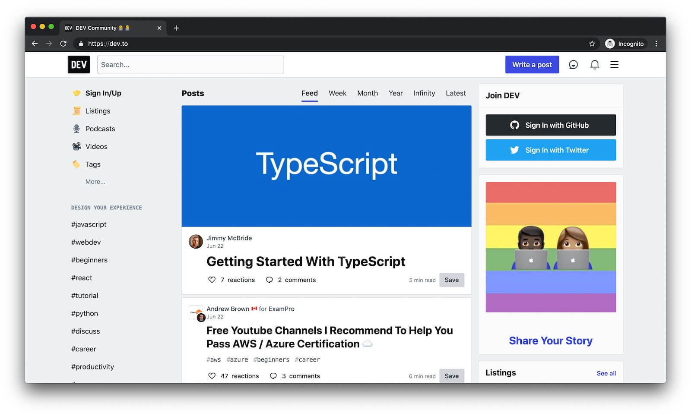



[Single-page app (SPA)](https://en.wikipedia.org/wiki/Single-page_application) is an architectural pattern in which the browser runs JavaScript code to update the existing page when the user visits a different section of the site, as opposed to loading an entire new page.

This means that the web app doesn't perform an actual page reload. The [History API](https://developer.mozilla.org/en-US/docs/Web/API/History_API) is used instead to navigate back and forth through the user's history and manipulate the contents of the history stack.

Using this type of architecture can provide an [app shell UX](https://developers.google.com/web/fundamentals/architecture/app-shell) that's fast, reliable, and usually consumes less data when navigating.

In multi-page apps (MPAs) each time a user navigates to a new URL, the browser progressively renders HTML specific to that page. This means a full page refresh every time you visit a new page.

While both are equally valid models to use, you might want to bring some of the benefits of the app shell UX of SPAs to your existing MPA site.
In this article we'll analyze how you can achieve an SPA-like architecture in multi-page apps by combining partials, service workers, and streams.

## Production case

[DEV](https://dev.to/) is a community where software developers write articles, take part in discussions, and build their professional profiles.

<figure class="w-figure">
  
</figure>

Their architecture is a multi-page app based on traditional backend templating through Ruby on Rails. Their team was interested in some of the benefits of an app shell model, but didn't want to undertake a major architectural change or move away from their original tech stack.

Here's how their solution works:

1. First, they create partials of their home page for the header and the footer (`shell_top.html` and `shell_bottom.html`) and deliver them as standalone HTML snippets with an endpoint. These assets are added to the cache at the service worker `install` event (what's commonly referred to as [precaching](/precache-with-workbox/)).
1. When a navigation request is intercepted by the service worker, they create a [streamed response](https://developer.mozilla.org/en-US/docs/Web/API/ReadableStream) by combining the cached header and footer with the main page content that just came from the server. The body is the only actual part of the page that requires fetching data from the network.

<figure class="w-figure">
  
</figure>

The key element of this solution is the usage of [streams](https://developers.google.com/web/updates/2016/06/sw-readablestreams), which enables [incremental creations and updates](https://streams.spec.whatwg.org/#intro) of data sources. The Streams API also provides an interface for reading or writing asynchronous chunks of data, only a subset of which might be available in memory at any given time.
This way, the header of the page can be rendered as soon as it's picked from the cache, while the rest of the content is being fetched from the network. As a result, the navigation experience is so fast that users don't perceive an actual page refresh, only the new content (the body) being updated.

The resulting UX is similar to the app shell UX pattern of SPAs, implemented on a MPA site.


The previous section contains a quick summary of DEV's solution. For a more detailed explanation check out their [blog post](https://dev.to/devteam/instant-webpages-and-terabytes-of-data-savings-through-the-magic-of-service-workers-1mkc) on this topic.


## Implement an app shell UX architecture in MPAs with Workbox

In this section we'll cover a summary of the different parts involved in implementing an app shell UX architecture in MPAs.
For a more detailed post on how to implement this on a real site, check out [Beyond SPAs: alternative architectures for your PWA](https://developers.google.com/web/updates/2018/05/beyond-spa).

### The server

#### Partials

The first step is to adopt a site structure based on HTML partials. These are just modular pieces of your pages that can be reused across your site and also delivered as standalone HTML snippets.

The **head partial** can contain all the logic needed to style and render the header of the page. The **navbar partial** can contain the logic for the navigation bar, the **footer partial** the code that needs to execute there, and so forth.

The first time the user visits the site, your server generates a response by assembling the different parts of the page:

```javascript
app.get(routes.get('index'), async (req, res) => {
  res.write(headPartial + navbarPartial);
  const tag = req.query.tag || DEFAULT_TAG;
  const data = await requestData(…);
  res.write(templates.index(tag, data.items));
  res.write(footPartial);
  res.end();
});
```

By using the `res` (response) object's [write() method](https://nodejs.org/api/http.html#http_response_write_chunk_encoding_callback), and referencing locally stored partial templates, the response can be [streamed](https://github.com/substack/stream-handbook) immediately, without getting blocked by any external data source. The browser takes this initial HTML and renders a meaningful interface and loading message right away.

The next portion of the page uses API data, which involves a network request. The web app can't render anything else until it gets a response back and processes it, but at least users aren't staring at a blank screen while they wait.

### The service worker

The first time a user visits a site, the header of the page will be rendered faster, without having to wait for the body of the page. The browser still needs to go to the network to fetch the rest of the page.

After the first page load, the service worker is registered, allowing you to fetch the partials for the different static parts of the page (header, navbar, footer, etc.) from the cache.

#### Precaching static assets

The first step is to cache the partial HTML templates, so they are immediately available.
With [Workbox precaching](https://developers.google.com/web/tools/workbox/modules/workbox-precaching) you can store these files at the `install` event of the service worker and keep them up to date when changes are deployed to the web app.

Depending on the build process, Workbox has different solutions to generate a service worker and indicate the list of files to precache, including [webpack](https://developers.google.com/web/tools/workbox/modules/workbox-webpack-plugin) and [gulp](https://developers.google.com/web/tools/workbox/guides/codelabs/gulp) plugins, a [generic node module](https://developers.google.com/web/tools/workbox/modules/workbox-build) and a [command line interface](https://developers.google.com/web/tools/workbox/modules/workbox-cli).

For a partials configuration like the one described earlier, the resulting service worker file should contain something similar to the following:

```javascript
workbox.precaching.precacheAndRoute([
  {
    url: 'partials/about.html',
    revision: '518747aad9d7e',
  },
  {
    url: 'partials/foot.html',
    revision: '69bf746a9ecc6',
  },
  // etc.
]);
```

#### Streaming

Next, add the service worker logic so that the precached partial HTML can be sent back to the web app immediately. This is a crucial part of being reliably fast. Using the [Streams API](https://developer.mozilla.org/en-US/docs/Web/API/Streams_API) within our service worker makes that possible.
[Workbox Streams](https://developers.google.com/web/tools/workbox/reference-docs/latest/module-workbox-streams) abstracts the details of how streaming works. The package lets you pass to the library a mix of streaming sources, both from caches and runtime data that might come from the network. Workbox takes care of coordinating the individual sources and stitching them together into a single, streaming response.

First, set up the strategies in Workbox to handle the different sources that will make up the streaming response.

```javascript
const cacheStrategy = workbox.strategies.cacheFirst({
  cacheName: workbox.core.cacheNames.precache,
});

const apiStrategy = workbox.strategies.staleWhileRevalidate({
  cacheName: API_CACHE_NAME,
  plugins: [
    new workbox.expiration.Plugin({maxEntries: 50}),
  ],
});
```

- The first strategy reads data that's been precached, like the partial HTML templates.
- The second strategy implements the [stale-while-revalidate](https://developers.google.com/web/tools/workbox/modules/workbox-strategies#stale-while-revalidate) caching logic, along with [least-recently-used cache expiration](https://developers.google.com/web/tools/workbox/modules/workbox-expiration#restrict_the_number_of_cache_entries) logic once we reach 50 entries.

Next, tell Workbox how to use the strategies to construct a complete, streaming response, by passing in an array of sources as functions to execute immediately:

```javascript
workbox.streams.strategy([
  () => cacheStrategy.handle({
      request: new Request(getCacheKeyForURL("/head.html")),
    }),
  () => cacheStrategy.handle({
      request: new Request(getCacheKeyForURL("/navbar.html")),
    }),
  async ({event, url}) => {
    const tag = url.searchParams.get('tag') || DEFAULT_TAG;
    const listResponse = await apiStrategy.handle(…);
    const data = await listResponse.json();
    return templates.index(tag, data.items);
  },
  () => cacheStrategy.handle({
      request: new Request(getCacheKeyForURL("/foot.html")),
    }),
]);
```

- The first two sources are precached partial templates read directly from the service worker's cache, so they'll always be available immediately.
- The next source function fetches data from the network, and processes the response into the HTML that the web app expects.
- Finally, a cached copy of the footer and closing HTML tags is streamed to complete the response.

Workbox takes the result from each source and streams it to the web app, in sequence, only delaying if the next function in the array hasn't completed yet.
As a result, the user immediately sees the page being painted. The experience is so fast that when navigating the header stays in its position without making the user perceive the full page refresh. This is very similar to the UX that the app shell SPA model provides.
