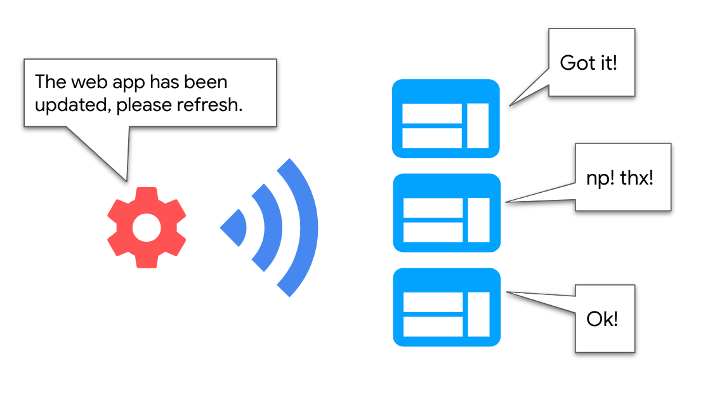
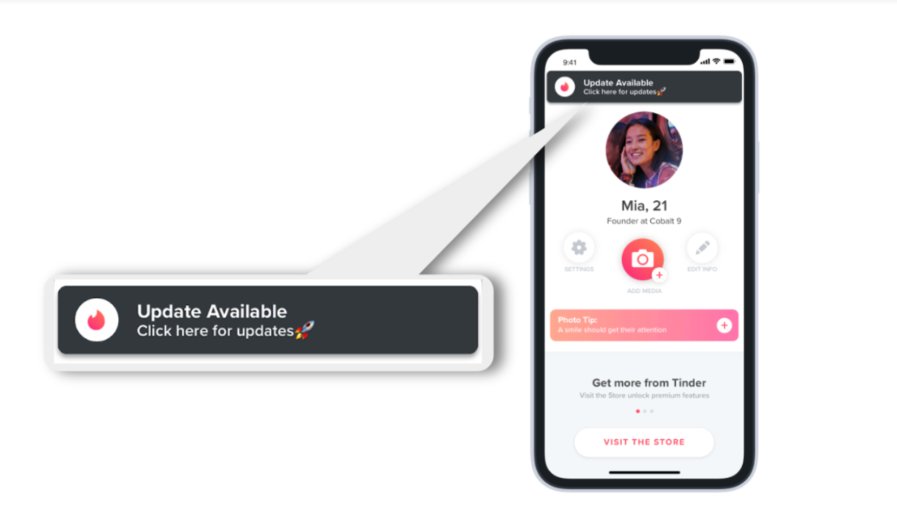
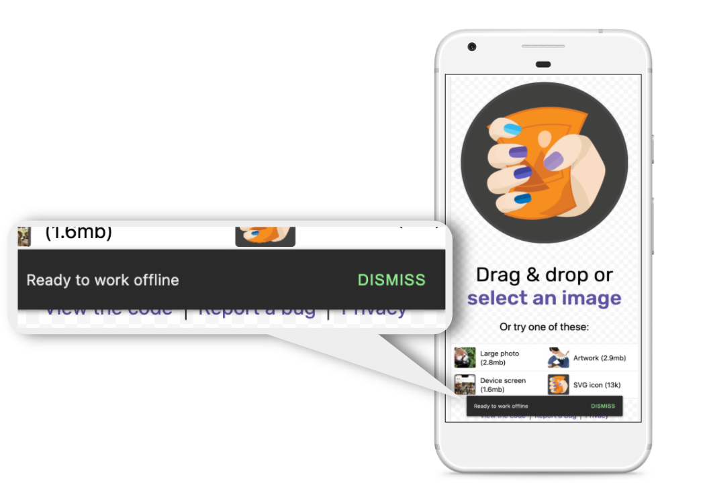

In some scenarios the service worker might need to proactively communicate with any of the active
tabs it controls to inform of a certain event. Examples include:

- Informing the page when a new version of the service worker has been installed, so that the page
  can show an **"Update to refresh"** button to the user to access the new functionality
  immediately.
- Letting the user know about a change on cached data that took place on the service worker side, by
  showing an indication, like: **"The app is now ready to work offline"**, or **"New version of the
  content available"**.

<figure class="w-figure">
  
</figure>

We'll call these types of use cases where the service worker doesn't need to receive a message from
the page to start a communication **"broadcast updates"**. In this guide we'll review different
ways of implementing this type of communication between pages and service workers, by using standard
browser APIs and the [Workbox library](https://developers.google.com/web/tools/workbox).


  Check out [Workers overview](/workers-overview/) for a high-level explanation
  of when to use web workers versus service workers and the rest of the
  [Communicate with workers](/reliable/#communicate-with-workers) series
  for guides on other common use cases.


## Production cases {: #production-cases }

### Tinder {: #tinder }

Tinder PWA uses [`workbox-window`](https://developers.google.com/web/tools/workbox/modules/workbox-window) to listen to
important service worker lifecycle moments from the page ("installed", "controlled" and
"activated"). That way when a new service worker comes into play, it shows an **"Update Available"**
banner, so that they can refresh the PWA and access the latest features:

<figure class="w-figure">
  
  <figcaption class="w-figcaption">In the Tinder PWA, the service worker tells the page that a new version is ready, and the page shows users a "Update Available" banner.</figcaption>
</figure>

### Squoosh {: #squoosh }

In the [Squoosh PWA](https://squoosh.app/), when the service worker has cached all of the necessary
assets to make it work offline, it sends a message to the page to show a "Ready to work offline"
toast, letting the user know about the feature:

<figure class="w-figure">
  
  <figcaption class="w-figcaption">In the Squoosh PWA the service worker broadcasts an update to the page when cache is ready, and the page displays "Ready to work offline" toast.
</figcaption>
</figure>

## Using Workbox {: #using-workbox }

### Listen to service worker lifecycle events {: #listen-to-service-worker-lifecycle-events }

`workbox-window` provides a straightforward interface to listen to [important service worker lifecycle
events](https://developers.google.com/web/tools/workbox/modules/workbox-window#important_service_worker_lifecycle_moments).
Under the hood, the library uses client-side APIs like
[`updatefound`](https://developer.mozilla.org/en-US/docs/Web/API/ServiceWorkerRegistration/onupdatefound)
and [statechange](https://developer.mozilla.org/en-US/docs/Web/API/ServiceWorker/onstatechange)
and provides higher level event listeners in the `workbox-window` object, making it easier for the
user to consume these events.

The following page code lets you detect every time a new version of the service worker is installed,
so you can communicate it to the user:

```javascript
const wb = new Workbox('/sw.js');

wb.addEventListener('installed', (event) => {
  if (event.isUpdate) {
    // Show "Update App" banner
  }
});

wb.register();
```

### Inform the page of changes in cache data {: #inform-the-page-of-changes-in-cache-data }

The Workbox package
[`workbox-broadcast-update`](https://developers.google.com/web/tools/workbox/modules/workbox-broadcast-update)
provides a standard way of notifying window clients that a cached response has been updated. This is
most commonly used along with the [StaleWhileRevalidate
strategy](https://developers.google.com/web/tools/workbox/modules/workbox-strategies#stale-while-revalidate).

To broadcast updates add a `broadcastUpdate.BroadcastUpdatePlugin` to your strategy options in the
service worker side:

```javascript
import {registerRoute} from 'workbox-routing';
import {StaleWhileRevalidate} from 'workbox-strategies';
import {BroadcastUpdatePlugin} from 'workbox-broadcast-update';

registerRoute(
  ({url}) => url.pathname.startsWith('/api/'),
  new StaleWhileRevalidate({
    plugins: [
      new BroadcastUpdatePlugin(),
    ],
  })
);
```

In your web app, you can listen for these events like so:

```javascript
navigator.serviceWorker.addEventListener('message', async (event) => {
  // Optional: ensure the message came from workbox-broadcast-update
  if (event.data.meta === 'workbox-broadcast-update') {
    const {cacheName, updatedUrl} = event.data.payload;

    // Do something with cacheName and updatedUrl.
    // For example, get the cached content and update
    // the content on the page.
    const cache = await caches.open(cacheName);
    const updatedResponse = await cache.match(updatedUrl);
    const updatedText = await updatedResponse.text();
  }
});
```

## Using browser APIs {: #using-browser-apis }

If the functionality that Workbox provides is not enough for your needs, use the following browser
APIs to implement **"broadcast updates"**:

### Broadcast Channel API {: #broadcast-channel-api }

The service worker creates a [BroadcastChannel
object](https://developer.mozilla.org/en-US/docs/Web/API/BroadcastChannel) and starts sending
messages to it. Any context (e.g. page) interested in receiving these messages can instantiate a
`BroadcastChannel` object and implement a message handler to receive messages.

To inform the page when a new service worker is installed, use the following code:

```javascript
// Create Broadcast Channel to send messages to the page
const broadcast = new BroadcastChannel('sw-update-channel');

self.addEventListener('install', function (event) {
  // Inform the page every time a new service worker is installed
  broadcast.postMessage({type: 'CRITICAL_SW_UPDATE'});
});
```

The page listens to these events by subscribing to the `sw-update-channel`:

```javascript
// Create Broadcast Channel and listen to messages sent to it
const broadcast = new BroadcastChannel('sw-update-channel');

broadcast.onmessage = (event) => {
  if (event.data && event.data.type === 'CRITICAL_SW_UPDATE') {
    // Show "update to refresh" banner to the user.
  }
};
```

This is a simple technique, but its limitation is browser support: at the moment of this writing,
[Safari doesn't support this API](https://caniuse.com/?search=Broadcastchannel).

### Client API {: #client-api }

The [Client API](https://developer.mozilla.org/en-US/docs/Web/API/Client) provides a straightforward
way of communicating with multiple clients from the service worker by iterating over an array of
[`Client`](https://developer.mozilla.org/en-US/docs/Web/API/Client) objects.

Use the following service worker code to send a message to the last focused tab:

```javascript
// Obtain an array of Window client objects
self.clients.matchAll(options).then(function (clients) {
  if (clients && clients.length) {
    // Respond to last focused tab
    clients[0].postMessage({type: 'MSG_ID'});
  }
});
```

The page implements a message handler to intercept these messages:

```javascript
// Listen to messages
navigator.serviceWorker.onmessage = (event) => {
     if (event.data && event.data.type === 'MSG_ID') { 
         // Process response
   } 
};
```

Client API is a great option for cases like broadcasting information to multiple active tabs. The
API is supported by all major browsers, but not all of its methods are. Check browser support before
using it.

### Message Channel {: #message-channel }

[Message Channel](https://developer.mozilla.org/en-US/docs/Web/API/Channel_Messaging_API) requires
an initial configuration step, by passing a port from the page to the service worker, to establish a
communication channel between them. The page instantiates a `MessageChannel` object and passes a
port to the service worker, via the `postMessage()` interface:

```javascript
const messageChannel = new MessageChannel();

// Init port
navigator.serviceWorker.controller.postMessage({type: 'PORT_INITIALIZATION'}, [
  messageChannel.port2,
]);
```

The page listens to messages by implementing an "onmessage" handler on that port:

```javascript
// Listen to messages
messageChannel.port1.onmessage = (event) => {
  // Process message
};
```

The service worker receives the port and saves a reference to it:

```javascript
// Initialize
let communicationPort;

self.addEventListener('message', (event) => {
  if (event.data && event.data.type === 'PORT_INITIALIZATION') {
    communicationPort = event.ports[0];
  }
});
```

From that point it can send messages to the page, by calling `postMessage()` in the reference to the
port:

```javascript
// Communicate
communicationPort.postMessage({type: 'MSG_ID' });
```

`MessageChannel` might be more complex to implement, due to the need of initializing ports, but it's
supported by [all major browsers](https://caniuse.com/?search=channel%20messaging).

## Next steps {: #next-steps }

In this guide we explored one particular case of Window to service worker communication:
**"broadcast updates"**. The examples explored include listening to important service worker
lifecycle events, and communicating to the page about changes in content or cached data. You can think
of more interesting use cases where the service worker proactively communicates with the page,
without receiving any message previously.

For more patterns of Window and service worker communication check out:

- [Imperative caching guide](/imperative-caching-guide): Calling a service worker from the page to
  cache resources in advance (e.g. in prefetching scenarios).
- [Two-way communication](/two-way-communication-guide): Delegating a task to a service worker (e.g.
  a heavy download), and keeping the page informed on the progress.

## Additional resources {: #additional-resources }

- [workbox-window](https://developers.google.com/web/tools/workbox/modules/workbox-window)
- [workbox-broadcast-update](https://developers.google.com/web/tools/workbox/modules/workbox-broadcast-update)
- [Workbox 4: Implementing refresh-to-update-version flow using the workbox-window
  module](https://medium.com/google-developer-experts/workbox-4-implementing-refresh-to-update-version-flow-using-the-workbox-window-module-41284967e79c)
