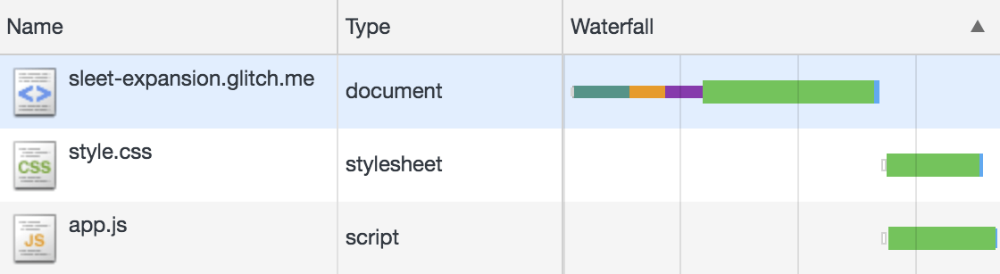
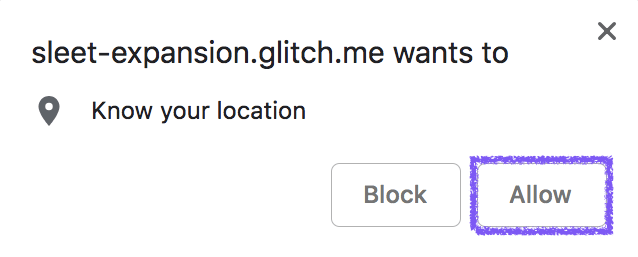



This codelab walks you through the process of interpreting all of the network
traffic for a somewhat complex sample application. At the end of the exercise,
you'll have the skills you need to figure out _what_ your own web application is
loading and _when_ it's making each request.


The screenshots and instructions in this codelab assume that you're using
Chrome. Each browser has its own DevTools experience, which might not match what
you see in this codelab.


## Navigate to the Network Panel

Navigate to the Network panel to see the network traffic for the demo
application.




1. Reload the page to see the network traffic.

The Network panel shows all the assets loaded because of your initial
navigation:


The actual columns you see in the Network panel may be different; the
screenshot shows a simplified view with everything but the **Name**, **Type**, and
**Waterfall** columns hidden.


## How to interpret the entries

Each row of recorded network traffic represents a single request and response
pair.

The first row, with type `document`, is the initial navigation request for the
web app's HTML. This is the source for the waterfall; each of the subsequent
requests for additional assets (known as subresources of the main document) flow
from this original source.

The second and third rows, showing a CSS `stylesheet` and a `script` subresource
being loaded, are dependent requests that were initiated by the main document.

Looking at _when_ those requests are made, the waterfall diagram shows that
they're not started until very late in the process of responding to the
navigation request.

Taken together, the requests for the HTML document, CSS, and
JavaScript are needed to display the full page during the
initial navigation.

## Create some additional runtime requests

With the **Network** panel still open and recording, it's time to simulate something
common for a lot of web apps: additional API requests used to add more data to
the page after the initial navigation is complete.

Trigger these additional requests by clicking **Find Me** in the app and then
**Allow** in the popup that appears.
This will allow the site to access your current location:


You could also deny geolocation permission, in which case the web app
will fall back to a default location.


Once the web app has a location to work with, clicking **Find Nearby
Wikipedia Entries** results in several additional network requests. You
should see something like this:



## Interpret the new entries

As before, each row of recorded network traffic represents a single request
and response pair.

The first row of the new entries represents a request with a type of `fetch`,
which corresponds to the
[way the web app requests data](https://developer.mozilla.org/en-US/docs/Web/API/Fetch_API)
from the Wikipedia API.

The following rows all are images (`png` or `jpeg`) associated with the
Wikipedia entries. Although it's a little hard to see from the screenshot, their
entries in the Waterfall column directly flow from the API response.

For all of these additional requests, the _when_ is going to vary based on how
long you've had the page open before you click on **Find Nearby Wikipedia
Entries**. Most important here is that the _when_ is disconnected from the
initial navigation request. You can tell this from the large gap that exists in
the Waterfall display, representing a period of time that passed in between the
initial loading and when the Wikipedia API request is made.

Requests made after a gap of time following a navigation fall into the category
of "runtime requests," as opposed to the initial set of requests used to display
the page when you first navigated to it.

## Summing things up

Having gone through the steps in this codelab, you're now familiar with the
tools you can use to analyze what _any_ web application loads.

The Network panel helps you answer the question of _what_'s being loaded, via
the URLs in the Name column and the data in the Type column, along with _when_
it's being loaded, via the waterfall display.

You've also seen that requests made by a web page can (usually) be grouped into
one of two categories:

1. Initial requests, made right after navigating to a new page, for the
    HTML, JavaScript, CSS (and potentially other assets).
1. Runtime requests made as a result of user interaction with the page. This
    can often start with a request to an API, and then flow into several
    follow-up requests based on the API data retrieved.
