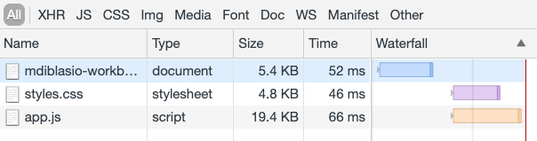
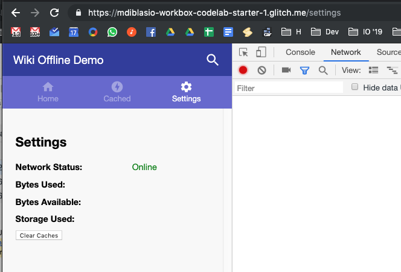
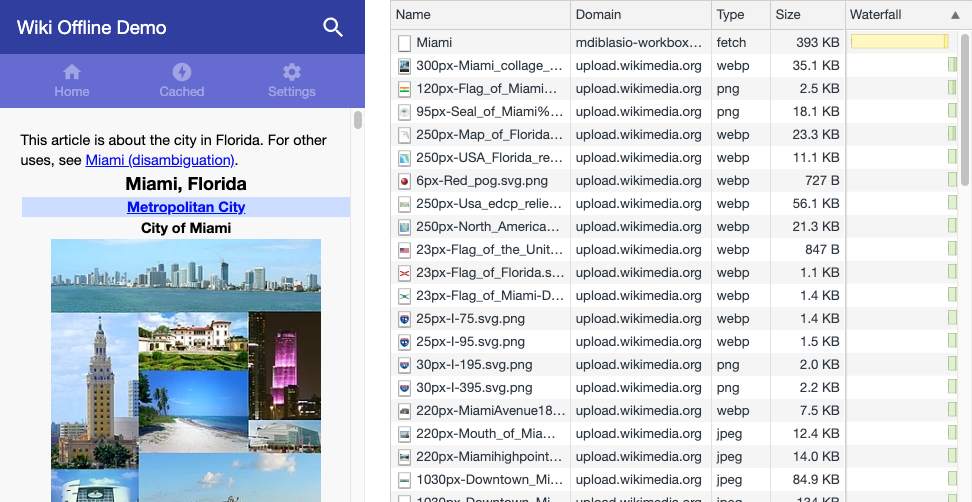

In this project you'll learn several techniques for making web applications
more resilient. As you move through the sections of the project, you'll add a
service worker to an existing sample application that lets users download
Wikipedia articles. The service worker will improve the experience when the
user is offline or has limited connectivity. The sample app has three sections
(or views):
1.  __Home:__ displays a welcome message.
1.  __Cached:__ displays a list of cached Wikipedia articles available for
offline viewing. (You'll implement this later.)
1.  __Settings:__ displays information about the app (e.g., storage usage,
  network status) and allows users to clear storage. (You'll implement this
  later.)

There's also a search feature that lets users query the
[Wikimedia REST API](https://en.wikipedia.org/api/rest_v1/). (You'll
implement this too.)

The sample app is built as a
[single-page application](https://en.wikipedia.org/wiki/Single-page_application)
using an [application shell](https://developers.google.com/web/fundamentals/architecture/app-shell)
architecture. (The application shell is the HTML, CSS, and JavaScript that
powers the user interface.) Most of the app has been written for you, except
for the service worker and a few methods in `app.js` that you'll write as you
move through the project.

## Relevant files

Client
+  `public/index.html` is the static app shell HTML. It contains several
   `section` elements that act as content placeholders.
+  `public/app.js` populates the placeholder elements in the HTML with content
   from Wikipedia and toggles the visibility of different sections based on
   user actions.
+  `public/styles.css` contains all of the CSS needed to style the app.
+  `public/offline.partial.html` is a partial view that will be used as a
   fallback when the network is unavailable. (More about this in
   [Create an offline fallback](../codelab-reliability-offline-fallback/).)
+  `src/service-worker.js` starts empty but will contain the service worker
   code you'll write for this project.

Server
+  `server.js` contains logic that serves static files from the `public` and
   `dist` directories and calls the Wikimedia REST API to fetch and return rendered
   Wikipedia articles to the client.
+  `workbox-config.js` starts empty but will contain the configuration options
   to use the [Workbox CLI](https://developers.google.com/web/tools/workbox/modules/workbox-cli)
   to inject a [precache manifest](https://developers.google.com/web/tools/workbox/modules/workbox-precaching#explanation_of_the_precache_list)
   into your service worker file. (More about this in
   [Implementing precaching](../codelab-reliability-precaching/).)

## The app in action

Make sure to [set up Glitch and DevTools](../codelab-reliability-setup/) if you
haven't already.


You can use Chrome DevTools to see how the app shell architecture affects
requests:
+  Open Chrome DevTools by pressing `Control+Shift+I`  (or `Command+Option+I`
   on Mac).
+  Click the __Network__ tab and reload the page.

You should see the app shell assets load:

<figure class="w-figure w-figure--center">
  
</figure>

Two things to notice as you navigate between sections in the sample app:
+  No further requests are made to the network; since this is a single page
  application, JavaScript is updating the UI without making requests for
  additional pages.
+  The URL pathname is updated using the
   [Window History API](https://developer.mozilla.org/en-US/docs/Web/API/Window/history).
   This is handled by `app.js`, which contains logic to render the view that
   corresponds to the current pathname.

For example, if you click the __Settings__ tab, `app.js` will toggle the
visibility of the "Settings" section and update the location bar's pathname
to `/settings`:

<figure class="w-figure w-figure--center">
  
</figure>

Now try out the search functionality by clicking __Search__

and entering a search term (e.g., "Miami"). You'll see that the page is
populated with content from Wikipedia. To make that work, the following events
take place between the browser and server:

1. The app makes a
[`fetch()`](https://developer.mozilla.org/en-US/docs/Web/API/Fetch_API) request
to the server for the article, using a request URL in the format
`/api/wiki/pageTitle`, where `pageTitle` is replaced with the search term (in
  this case `/api/wiki/Miami`). Any spaces in the title will be replaced with
  underscores (e.g., "New York" → `/api/wiki/New_York`)

1. The server responds to the API call by fetching the relevant Wikipedia page
using the Wikimedia REST API. Before returning the rendered HTML to the client,
`server.js` makes a few modifications to the article, as discussed later in the
project. That's why requests to the Wikimedia REST API are processed
server-side instead of contacting the Wikimedia REST API directly from the
client page.

1. The client receives the HTML text response and populates the `articleContainer`
element:

    ```js/3-6
    // fetch Wikipedia page by title
    async function fetchWikiPage(title) {
      // ...
      const response = await fetch(encodeURI(`/api/wiki/${title}`));
      const html = await response.text();
      // ...
      articleContainer.innerHTML = html;
      // ...
    }
    ```

1.  Most Wikipedia articles contain images, which will show up as additional
network requests:

<figure class="w-figure w-figure--center">
  
</figure>

## What's next
[Register a service worker using Workbox](../codelab-reliability-register-service-worker/)
