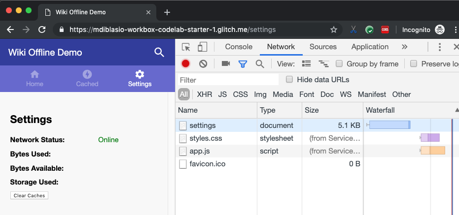
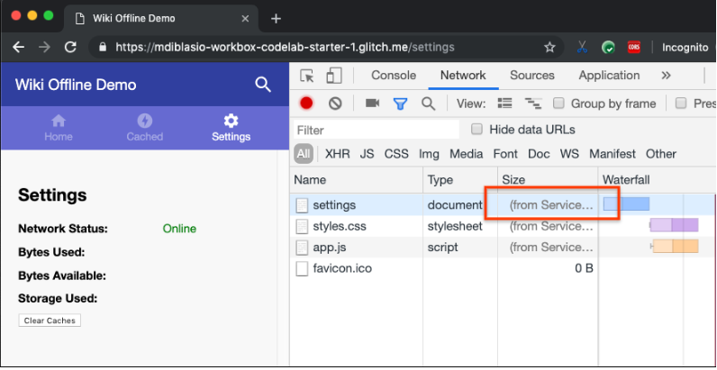

If you've been following along with this project, you've created a sample app
with a [Workbox-based service worker](../codelab-reliability-register-service-worker/)
that [precaches essential app assets](../codelab-reliability-precaching/).
You've also [added Workbox to the build process](../codelab-reliability-integrate-workbox/)
so the list of project assets to be precached is updated whenever you change
your code. In this section you'll learn how to implement logic in a service
worker to handle navigation requests.


If you've finished previous sections of this project in your own Glitch, you
can continue working in it. Otherwise, you can use the Glitch provided here.



Make sure to [set up Glitch and DevTools](../codelab-reliability-setup/) if you
haven't already.


Recall that the server responds to all navigation requests with `index.html`
because the sample app for this project uses a
[single-page application](https://en.wikipedia.org/wiki/Single-page_application)
architecture. Your service worker should follow the same logic when it handles
navigation requests—except that it will need to respond with the cached copy of
`index.html`.

The service worker implemented in the "[Implement precaching](../codelab-reliability-precaching/)"
section only responds to navigation requests for `index.html`. For example,
navigate to the __Settings__ tab in the sample app and refresh the page. Notice
that the service worker doesn't respond to the navigation request made to
`/settings`:

<figure class="w-figure w-figure--center">
  
</figure>

To address this issue, Workbox can be configured to return a specified response
to all navigation requests. To implement navigation request handling in the
sample app, add the following code to `src/service-worker.js`:

```js
// navigation route will return the app shell 'index.html' to all
// navigation requests
workbox.routing.registerNavigationRoute(
  workbox.precaching.getCacheKeyForURL('/index.html')
);
```

To break this code down:
+  The `registerNavigationRoute()` method defines the route to be used for
   browser navigation requests.
+  The `getCacheKeyForURL(url)` method returns the cache key used for storing a
   given URL. Whenever a user navigates to your site in the browser, the browser
   will be served the specified precached page (in this case `/index.html`).

Verify that the service worker now responds to all navigation requests by
updating the service worker and refreshing the sample app's __Settings__ page:

<figure class="w-figure w-figure--center">
  
</figure>


## What's next
[Implement runtime caching](../codelab-reliability-runtime-caching/)
