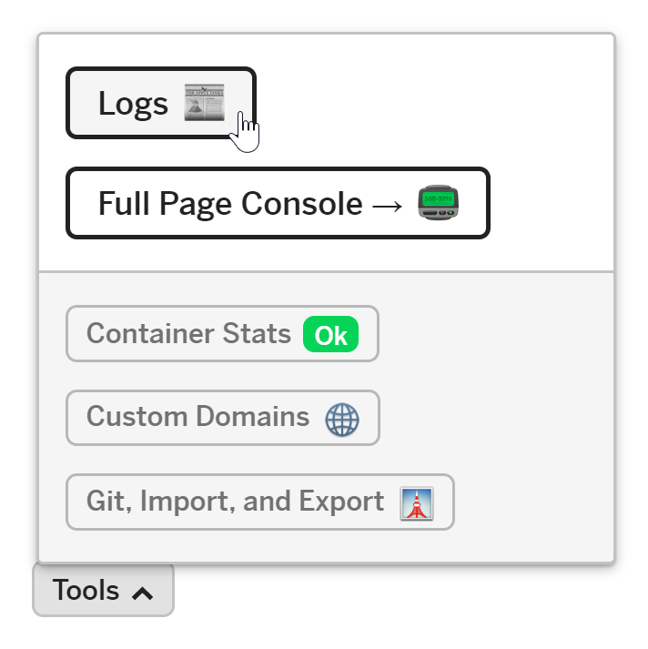
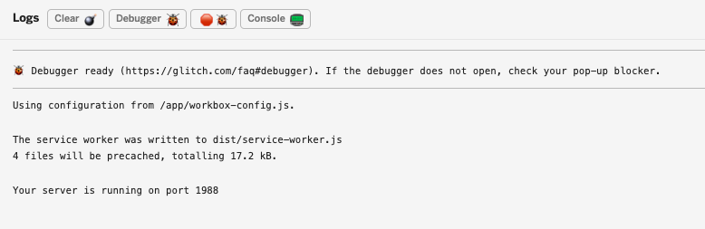

In the previous sections you learned how to
[use Workbox](../codelab-reliability-register-service-worker/) to
[add precaching](../codelab-reliability-precaching/) to a sample app. In this
section you'll learn how to incorporate Workbox into the build process so that
it updates the list of project assets to be precached each time you change your
code.


If you've finished previous sections of this project in your own Glitch, you
can continue working in it. Otherwise, you can use the Glitch provided here.



Make sure to [set up Glitch and DevTools](../codelab-reliability-setup/) if you
haven't already.


To add Workbox to the build process, modify the `start` script in `package.json` so `workbox
injectManifest` is run each time files are updated:

```js/3
{
  // ...
  "scripts": {
    "start": "workbox injectManifest && node server.js"
  },
  // ...
}
```

Open the logs console by clicking __Tools > Logs__:

<figure class="w-figure w-figure--center">
  
</figure>

Make an update to any file in the `public/` directory and verify in the logs
console that Workbox has run:

<figure class="w-figure w-figure--center">
  
</figure>

Now refresh the page to verify that the service worker updated the precache with
the modified file.

## What's next
[Handle navigation requests from a service worker](../codelab-reliability-handle-nav-requests/)
