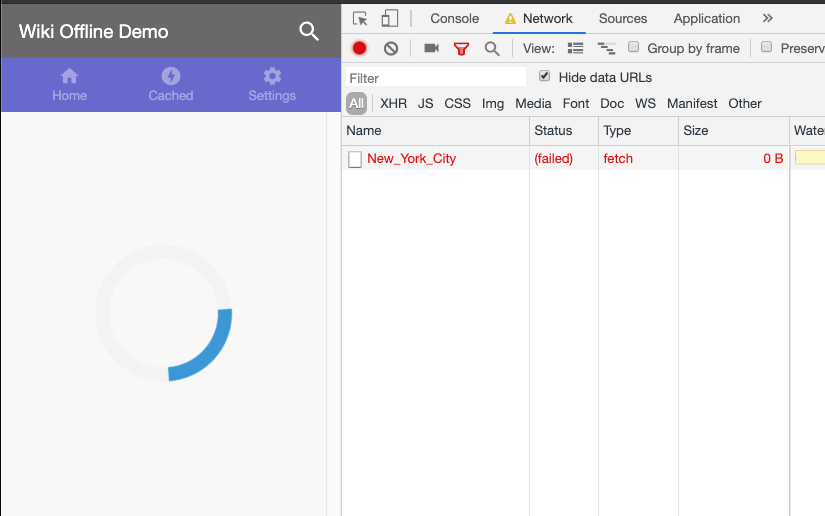

In [previous sections](../codelab-reliability-overview/) you learned how to set
up caching of Wikipedia articles in a sample app so users can access previously
viewed articles when they're offline. But what happens if the user is offline
and searches for a Wikipedia article they haven't seen yet?

In this section you'll learn how to implement an offline fallback so that users
get feedback if an article isn't already cached when the network is unavailable.


If you've finished previous sections of this project in your own Glitch, you
can continue working in it. Otherwise, you can use the Glitch provided here.



Make sure to [set up Glitch and DevTools](../codelab-reliability-setup/) if you
haven't already.


To see what users experience when they search for an uncached article while
offline, select the __Offline__ checkbox in the DevTools __Network__ tab and
run a new search in the sample app. As you'll see, the request fails, and an
infinite loading spinner appears:

<figure class="w-figure w-figure--center">
  
</figure>

You can improve this experience by returning an offline fallback response if the
network isn't available. This approach lets you to give your users
some content to tell them what's happening. To do that, use the Workbox routing
module's `setCatchHandler()` method to return the offline partial page
`offline.partial.html` in response to article requests when the Wikimedia REST API
runtime route fails.

Add the following code to the end of `service-worker.js`:

```js
// This "catch" handler is triggered when any of the other routes fail to
// generate a response. The handler is used to return the offline partial page
// in response to Wikimedia REST API requests if the Wikimedia REST API route
// above fails (i.e., cannot reach the network).
workbox.routing.setCatchHandler(({ event }) => {
  if (event.request.url.match(/api\/wiki/)) {
    const key = workbox.precaching.getCacheKeyForURL('offline.partial.html');
    return caches.match(key);
  }
  return Response.error();
});

```

Update the service worker by refreshing the page. While offline, verify that the
offline fallback page is returned in response to uncached article requests:

<figure class="w-figure w-figure--center">
  
</figure>

Notice that while the network request made from the service worker fails, the
client receives a 200 OK response with the offline fallback page.

## What's next
[Access caches from your app's code](../codelab-reliability-access-caches/)
