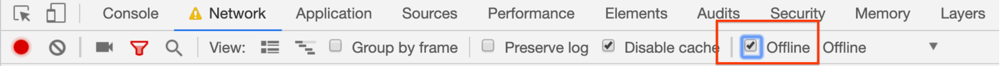

In the [previous section](../codelab-reliability-register-service-worker/) you
learned how to create a service worker using
[Workbox](https://developers.google.com/web/tools/workbox/). In this section
you'll learn how to add precaching to your service worker.


If you've finished previous sections of this project in your own Glitch, you
can continue working in it. Otherwise, you can use the Glitch provided here.



Make sure to [set up Glitch and DevTools](../codelab-reliability-setup/) if you
haven't already.


Precaching makes it possible to serve cached files to the browser without going
to the network, which makes the app accessible offline. The general rule is to
precache any HTML, JavaScript, or CSS that's crucial to displaying the basic
structure of a given page. In this app, it makes sense to precache all the
critical app shell files in the `public/` directory.

The easiest way to precache files with Workbox is to use its command line
interface (CLI). The
[Workbox CLI](https://developers.google.com/web/tools/workbox/modules/workbox-cli)
has two primary modes:
+  `generateSW`: generates a complete service worker for you.
+  `injectManifest`: injects a list (or _manifest_) of the project assets that
   you want to precache into an existing service worker file.


If you want to use other service worker features (e.g.,
[web push](https://developers.google.com/web/fundamentals/push-notifications/)),
import additional scripts, or add additional logic to your service worker,
`generateSW` probably isn't the best choice. Instead, consider using
`injectManifest`, which provides more control over your service worker.



Is `workbox-cli` the right choice for your build process? If you have an
existing build process that is based entirely on npm scripts, then
`workbox-cli` is a good choice. If you're currently using webpack as your build
tool, the
[`workbox-webback-plugin`](https://developers.google.com/web/tools/workbox/modules/workbox-webpack-plugin)
is a better choice.


This project will use the `injectManifest` mode, which uses options specified
in the Workbox config file `workbox-config.js`, discussed below. (A full list
of available options can be found on the
[Workbox CLI page](https://developers.google.com/web/tools/workbox/modules/workbox-cli#options_used_by_injectmanifest).)

Based on the options in the config file, Workbox will:
1. Look for a specific array (`precaching.precacheAndRoute([])` by default)
   in your source service worker file,
1. Replace the empty array with a list of URLs to precache, and
1. Write the service worker file to its destination location.

The rest of the code in your source service worker is left untouched.

To get started:

1. Add the following options to `workbox-config.js`:

    ```js/2-7
    const path = require('path');
    module.exports = {
      swSrc: path.join('src', 'service-worker.js'),
      swDest: path.join('dist', 'service-worker.js'),
      globDirectory: './public/',
      globPatterns: [
        '*.{html,js,css}'
      ]
    };
    ```

    A quick explanation of the options:

    +  `swSrc`: the path to the source service worker file that contains your
       custom code.
    +  `swDest`: the path and filename of the service worker file that will be
       created by the build process.
    +  `globDirectory`: the base directory that contains the files to be precached
       (For the sample app, the base directory is `public/`.)  
    +  `globPatterns`: the patterns that define what files will be included in the
       precache manifest (Here, the `html`, `js`, and `css` file extensions have
       been specified, so `index.html`, `offline.partial.html`, `app.js`, and
       `styles.css` will be matched.)

1. Add the line `workbox.precaching.precacheAndRoute([]);` to
   `service-worker.js`:

    ```js/4
    // ...

    workbox.core.skipWaiting();

    workbox.precaching.precacheAndRoute([]);
    ```

1. Next open the developer Glitch console by clicking __Tools > Full Page Console__:

    <figure class="w-figure w-figure--center">
      
    </figure>

1. Run the following command in the console to invoke the `injectManifest`
   module:

    ```
    workbox injectManifest workbox-config.js
    ```

    You should see the following message indicating that a service worker has
    been written to `dist/service-worker.js`:

    ```
    Using configuration from /app/workbox-config.js.
    The service worker was written to dist/service-worker.js
    4 files will be precached, totalling 17.2 kB.
    ```

    If you don't see `service-worker.js` in the `dist/` directory, run the
    following command in the Glitch console to refresh the visual filesystem:

    ```
    refresh
    ```

1. Open `dist/service-worker.js`. You should see that a precache
   manifest has been injected into your service worker, with the remainder
   of the service worker left untouched:

    ```js
    // ...
    workbox.precaching.precacheAndRoute([
      {
        "url": "app.js",
        "revision": "225a3b50beff884b6b0382367cd39da2"
      },
      {
        "url": "index.html",
        "revision": "c267d5f79131f190d2b157eb9c98137a"
      },
      {
        "url": "offline.partial.html",
        "revision": "46c20898f3d0f9c78b56834287a47d4a"
      },
      {
        "url": "styles.css",
        "revision": "aab5b6d2737656fcfd813373178afd10"
      }
    ]);
    // ...
    ```

The injected array includes all files that the service worker will precache.
Each object in the array contains a `revision` attribute, which Workbox uses
to track and update precached resources that have been modified. If a
URL-revision combination in the manifest changes, the service worker knows that
the previous cached entry is no longer valid and needs to be updated.

To see how Workbox's versioning works, copy the `revision` attribute for
`app.js` so you can reference it later. Then add a comment anywhere in the
`app.js` file and run Workbox again from the Glitch console:

```
workbox injectManifest workbox-config.js && refresh
```

Look at `dist/service-worker.js` to verify that the `revision` attribute for
`app.js` has changed, similar to the example below:

```js/5/4
// ...
workbox.precaching.precacheAndRoute([
  {
    "url": "app.js",
    "revision": "225a3b50beff884b6b0382367cd39da2"
    "revision": "879b834765f0c7c7ce4b72f877b29ad6"
  },
  // ...
]);
// ...
```

Now you're ready to see precaching in action. Modify `server.js` to serve the
generated service worker file from the `dist/` directory (instead of the
`src/` directory):

```js/3/2
// route for service worker
app.get(/service-worker\.js/, function(request, response) {
  response.sendFile(__dirname + `/src/service-worker.js`);
  response.sendFile(__dirname + `/dist/service-worker.js`);
});
```

Navigate to the app and refresh the page. In the __Network__ tab of DevTools,
you should see the service worker fetch and precache the app shell files in the
precache manifest.

<figure class="w-figure w-figure--center">
  
</figure>


Workbox appends a special \_\_WB_REVISION__ URL query parameter to URLs that
need revision information. If a URL already contains version information (e.g.,
a hash value), Workbox's build tools will detect it and exclude a revision
field.


Workbox should provide a message in the console confirming that four files have
been precached:

<figure class="w-figure w-figure--center">
  
</figure>

To verify that these files are cached locally, navigate to the __Application__
tab in DevTools. In the __Cache Storage__ panel, you should see a new cache
named `workbox-precache-...`, which is the default cache name used by Workbox
for precached files. View the contents of the cache by clicking the cache name:

<figure class="w-figure w-figure--center">
  
</figure>

Now return to the __Network__ tab and refresh the page to verify that the
assets are now served from the cache by the service worker. The __Size__ field
will indicate if resources were returned from the service worker. Workbox
should also provide a message in the console that these resources were returned
from the precache:

<figure class="w-figure w-figure--center">
  
</figure>

Now you're ready to see the app work offline:

+  Select the __Offline__ checkbox in the __Network__ tab of DevTools:

<figure class="w-figure w-figure--center">
  
</figure>

+  Refresh the page to verify that the app loads in offline mode.

Congratulations, you've just added offline functionality to your app!

## What's next
[Integrate Workbox into the build process](../codelab-reliability-integrate-workbox/)
