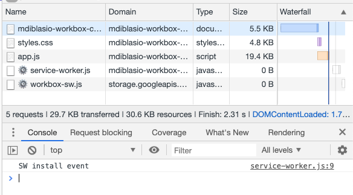
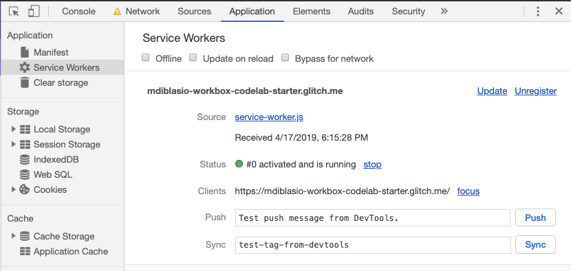
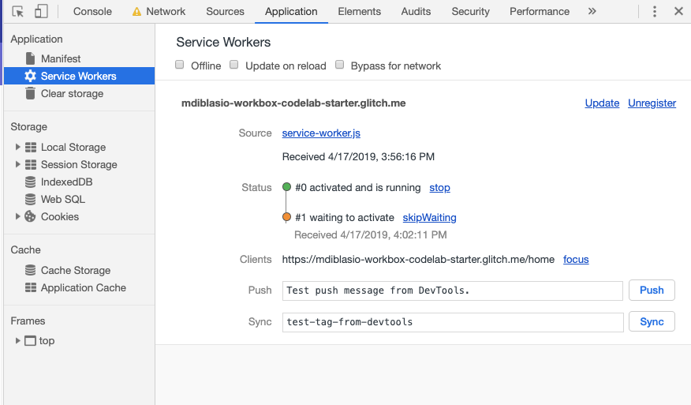
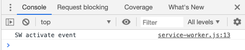

In this section you'll learn how to create a
[Workbox](https://developers.google.com/web/tools/workbox/)-powered service
worker, which you'll use to cache assets in later sections of the project.


Make sure to [set up Glitch and DevTools](../codelab-reliability-setup/) if you
haven't already.


A [service worker](https://developers.google.com/web/fundamentals/primers/service-workers/)
is a script that your browser runs in the background, separate from a web page.
Because they're run in the background, service workers let you create features
similar to those of a native application (like caching assets for viewing
offline, which you'll set up later).

To create your service worker, you'll use
[Workbox](https://developers.google.com/web/tools/workbox/), a JavaScript
library for adding offline support to web apps. To start using Workbox import
the `workbox-sw.js` file into your app by adding
the following line to `src/service-worker.js`:

```js
importScripts('https://storage.googleapis.com/workbox-cdn/releases/4.3.0/workbox-sw.js');
```

Two other things will be helpful while you're developing:
+  Enable Workbox's debug mode to provide extra logging.
+  Add an `install` event listener to log a message to the console
   when the service worker installs.

```js/2-10
importScripts('https://storage.googleapis.com/workbox-cdn/releases/4.1.1/workbox-sw.js');

// set Workbox debug mode to true
// Note: Ignore the error that Glitch raises about workbox being undefined.
workbox.setConfig({
  debug: true
});

self.addEventListener('install', (event) => {
  console.log('SW install event');
});
```

Register the service worker by adding the following code just before the
`</body>` tag in `index.html`:

```html/1-3
// ...
  <script>
    navigator.serviceWorker.register('/service-worker.js');
  </script>
</body>
```

It's good practice to first check whether the service worker is supported by
the browser and then delay registering the service worker until the browser has
finished rendering the current page. A convenient way to approximate when
rendering is complete is to wait until the `window.load` event has been fired:

```html/1-5
<script>
  if ('serviceWorker' in navigator) {
    window.addEventListener('load', () => {
      navigator.serviceWorker.register('/service-worker.js');
    });
  }
</script>
```


Waiting for `window.load` is a one-size-fits-all solution. If you know more
about how your web page loads resources, or if you're using a web app framework
that supports its own "everything's ready" lifecycle event, you can tweak the
timing accordingly.


Reload the page and confirm that the service worker registers and installs by
verifying that `SW install event` is logged to the console:

<figure class="w-figure w-figure--center">
  
</figure>

Now visit the __Applications__ tab in DevTools and select the
__Service Workers__ panel. You should see something like the following:

<figure class="w-figure w-figure--center">
  
</figure>

This screen lets you know that there's a service worker with a source URL of
`service-worker.js` that's currently activated and running. It also tells you
that there's currently one client (the browser tab where the sample app is open)
being controlled by the service worker.


Service workers tend to stick around unless they're explicitly unregistered.
If you find yourself wanting to start fresh during local development, a great
solution is to use a Chrome Incognito window to load pages that are
under service worker control. The service worker will persist only as long as
the window is open, and you can always start over by closing all Incognito
windows and opening a new one.


When a user returns to a URL that's within a service worker's scope,
the browser will automatically request the latest `service-worker.js` and check
for any changes. If anything in the service worker script is different, the new
service worker will get a chance to install, activate, and eventually take
control.

To see how this works, modify the service worker to trigger an update by adding
an `activate` event listener to `service-worker.js`:

```js
// ...
self.addEventListener('activate', (event) => {
  console.log('SW activate event');
});
```

Next refresh the app to trigger an update to the service worker. In the
__Service Workers__ panel in the __Application__ tab of DevTools, notice that
the updated service worker is waiting to activate:

<figure class="w-figure w-figure--center">
  
</figure>

The previous version, which was already activated, is running and in control of
the current page. The updated version of the service worker is listed right
below. It's in the waiting state and will remain waiting until all of the
open tabs that are controlled by the old service worker are closed.

Manually skip the waiting state by clicking __skipWaiting__. This should
trigger the `activate` event and log a message to the console:

<figure class="w-figure w-figure--center">
  
</figure>

This default behavior ensures that if your new service worker has a fundamental
difference in behavior from your old one—like a fetch handler that responds
with resources that are incompatible with older versions of your web app—it
won't go into effect until a user has shut down all previous instances of your
web app.

To skip the waiting stage each time you make an update to the service worker,
call `workbox.core.skipWaiting()`:

```js/8
importScripts('https://storage.googleapis.com/workbox-cdn/releases/4.1.1/workbox-sw.js');

// set Workbox debug mode to true
// Note: Ignore the error that Glitch raises about workbox being undefined.
workbox.setConfig({
  debug: true
});

workbox.core.skipWaiting();

// ...
```

Reload the page to verify that the service worker now skips the waiting stage
and immediately activates.

## What's next
[Implement precaching](../codelab-reliability-precaching/)
