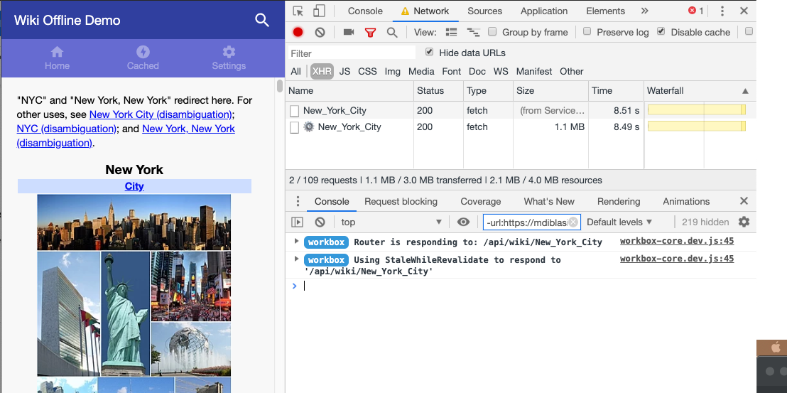
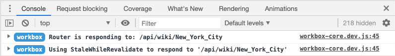
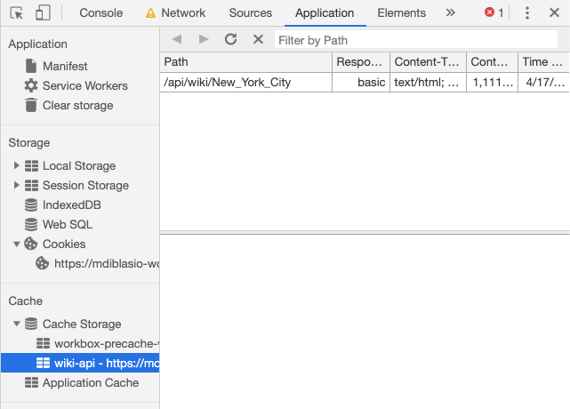
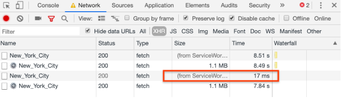
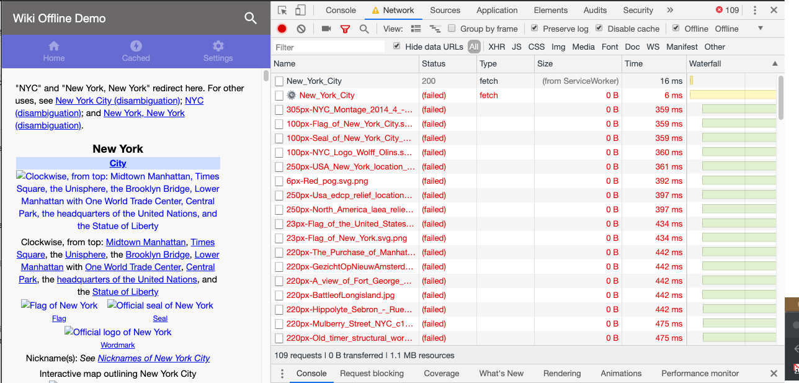

In previous sections of this project you learned how to create a
[Workbox-based service worker](../codelab-reliability-register-service-worker/)
that [precaches essential assets from your app](../codelab-reliability-precaching/)
and [handles navigation requests](/codelab-reliability-handle-nav-requests/).
In this section you'll learn how to add runtime caching so that your service
worker can cache external assets (in this case, Wikipedia articles and images).


If you've finished previous sections of this project in your own Glitch, you
can continue working in it. Otherwise, you can use the Glitch provided here.



Make sure to [set up Glitch and DevTools](../codelab-reliability-setup/) if you
haven't already.


With runtime caching, you gradually add responses to a cache as the browser
requests them. While runtime caching doesn't help with the reliability of the
first request of a URL, it _does_ help make future requests for the same URL
more reliable.

When implementing runtime caching, you should choose the most appropriate
caching strategy for each asset type that your app uses. Workbox has the
following caching strategies built in:

| Strategies | Use Cases |
|---------------------------------------------------------------------------------------------------------------------------------------------------------------------------------------------------------------------------------------|----------------------------------------------------------------------------------------------------------------------------------------------------------------------------------|
| __Network only__<br>Force the response to come from the network. | Uses maximum bandwidth and doesn't work when the user is offline. Best for cases in which it's critical that the user receives the latest version of an asset. |
| __Cache only__<br>Force the response to come from the cache. | Rarely appropriate, as the user will never receive an asset if it isn't already cached. |
| __Network first__<br>Try to get a request from the network first. If a response is received, it's passed to the browser and saved to the cache. If the network request fails, the last cached response is used. | Best for assets that are updated frequently. |
| __Cache first__<br>Check the cache for a response first. If the response isn't in the cache, the network will be used, and any valid response will be added to the cache before being passed to the browser. | Best for assets that are updated rarely, as users will receive stale content indefinitely. |
| __Stale while revalidate__<br>Use a cached response if it is available and update the cache in the background with a response from the network. (If the response isn't cached, Workbox will wait for the network response and use that.) | A fairly safe strategy since it ensures the cache is regularly updated. The downside is that an asset is requested from the network in all cases, using up the user's bandwidth. |                                  |

Since most Wikipedia articles are updated fairly infrequently, a
__stale-while-revalidate__ strategy makes the most sense: it will keep articles
up-to-date, but it will still serve articles from the cache when it can, which
will dramatically improve the load time when the user returns to a previously
viewed page.

To implement a __stale-while-revalidate__ runtime caching strategy, call
`workbox.routing.registerRoute(match, handler)` to register a route in
`src/service-worker.js`:

```js
// cache Wikimedia REST API calls
workbox.routing.registerRoute(
  new RegExp("\/api\/wiki"),
  new workbox.strategies.StaleWhileRevalidate({
    cacheName: 'wiki-articles'
  })
);
```

The first parameter, `new RegExp("\/api\/wiki")`, is a regular expression used
to match against the full URL. If a requested URL matches the expression, the
route will be triggered.

The second parameter is Workbox's built-in
[`StaleWhileRevalidate` handler](https://developers.google.com/web/tools/workbox/modules/workbox-strategies#stale-while-revalidate).
The `cacheName` option sets a custom cache name for the specified assets, which
makes it convenient to manage related asset groups.

This route will match against all Wikimedia REST API requests and apply a
__stale-while-revalidate__ caching strategy. To see it in action, update the
service worker by refreshing the page and search for a Wikipedia article. You
should see two Wikimedia REST API requests:

<figure class="w-figure w-figure--center">
  
</figure>

The first request is from the client and is handled by the service worker. The
second request is made from the service worker to the network in response to
the client. In the DevTools console, you should see Workbox messages confirming
that the __stale-while-revalidate__ strategy was applied:

<figure class="w-figure w-figure--center">
  
</figure>

In the __Cache Storage__ panel of the __Application__ tab in DevTools, you
should now see a new cache named `wiki-articles` that contains the Wikipedia
article:

<figure class="w-figure w-figure--center">
  
</figure>

Since the service worker will return this Wikipedia article from the cache on
repeat visits, repeat searches for this same article will be dramatically
faster. In the __Network__ tab in DevTools, filter by XHR requests and complete
another search for the same article.

Notice that the repeat search is near instant! You can see that the service
worker immediately responded to the client's request from the cache while
fetching an updated copy in the background:

<figure class="w-figure w-figure--center">
  
</figure>

Now refresh the page and search for the same article once more, this time while
offline. While the Wikipedia page itself is now cached and available offline,
users will see broken images since this runtime cache policy doesn't match
against Wikipedia image URLs:

<figure class="w-figure w-figure--center">
  
</figure>

To improve this experience, add another route to runtime cache Wikipedia image
assets, which take the form `https://upload.wikimedia.org/…(png|svg|jpeg|jpg)`.
Note that these assets are from a different origin.

<!-- TODO (mdiblasio): add information about different origins / CORS -->

For the sample app we'll assume Wikipedia images are unlikely to change and use
a __cache-first__ strategy. This requires assigning a separate cache name,
`wiki-images`:

```js
// cache Wikipedia article image assets
workbox.routing.registerRoute(
  new RegExp("https?:\/\/upload\.wikimedia\.org\/.*\.(png|jpg|svg|jpeg)$"),
  new workbox.strategies.CacheFirst({
    cacheName: 'wiki-images'
  })
);
```

One concern with this strategy is that the cache size can quickly grow out of
control if users view many image-heavy articles. To control storage size, use
the [workbox.expiration.Plugin](https://developers.google.com/web/tools/workbox/reference-docs/latest/workbox.expiration.Plugin)
to enforce a limit on the age and number of cached image requests.

```js
// cache Wikipedia article image assets
workbox.routing.registerRoute(
  new RegExp("https?:\/\/upload\.wikimedia\.org\/wikipedia\/.*\.(png|jpg|svg|jpeg)$", "i"),
  new workbox.strategies.CacheFirst({
    cacheName: 'wiki-images',
    plugins: [
      new workbox.expiration.Plugin({
        maxEntries: 500, // max 500 images
        maxAgeSeconds: 60 * 60 * 24 * 30 // 30 days
      })
    ]
  })
);
```

A quick explanation of the parameters:
+  `maxAgeSeconds` specifies the maximum age of an entry before it's treated as
   stale and removed (in this case 30 days).
+  `maxEntries` specifies the maximum number of entries to cache (in this case
   500). Entries used the least will be removed as the maximum is reached.

Whenever a cached request is used or updated, the `workbox.expiration`
plugin will evaluate the cache and remove any old or unnecessary requests.


When using `maxAgeSeconds`, requests may be used once after expiring because the
expiration clean up will not have occurred until after the cached request has
been used. If the request has a "Date" header, a lightweight expiration
check is performed, and the request will not be used immediately.


Try viewing a cached article while offline to verify that the image assets are
served from the cache.

## What's next
[Create an offline fallback](../codelab-reliability-offline-fallback/)
