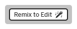
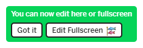
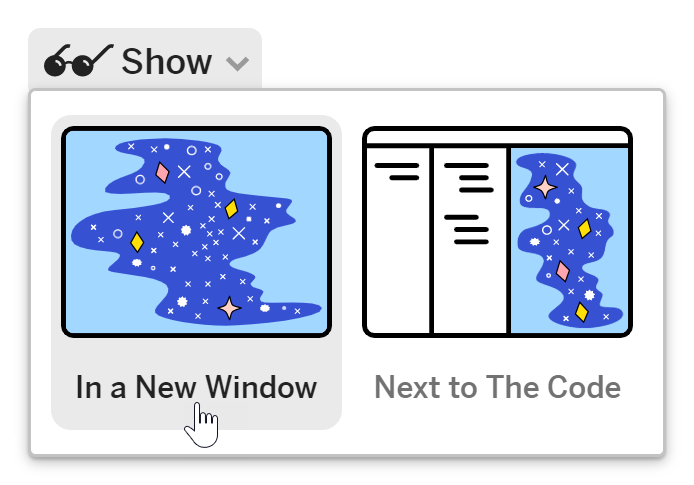
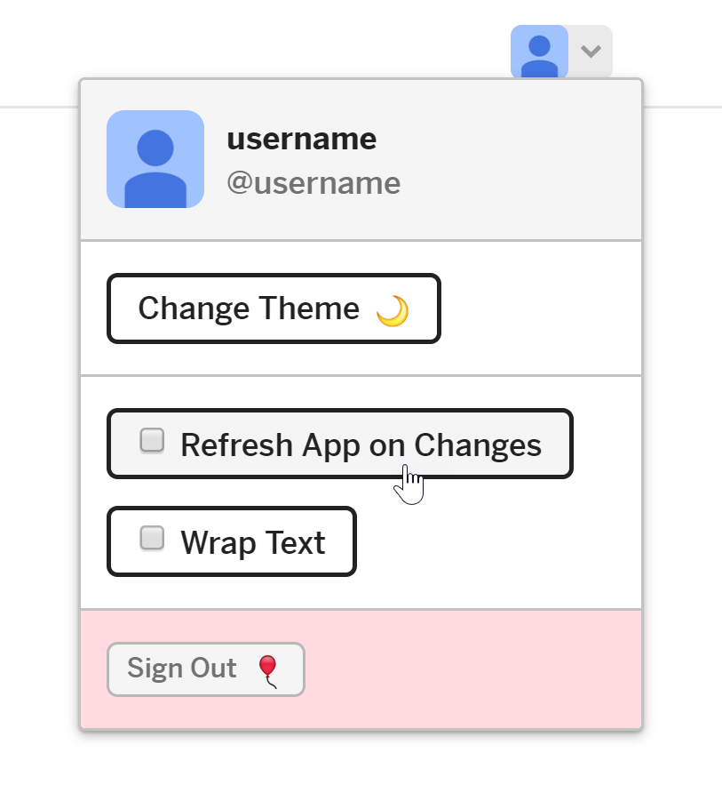
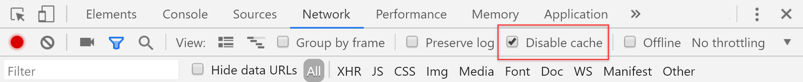

In this project you'll be working on a sample web app in Glitch, a web-based
development environment. You can complete the entire project in a single
Glitch, or you can work in the Glitch provided in each section. To edit a
glitch:
1. Click __Remix to Edit__.

    <figure class="w-figure w-figure--center">
      
    </figure>

1. Once a remixed Glitch has been created, click __Edit&nbsp;Fullscreen__. (This
   lets you see more Glitch options than you can in windowed mode.)

    <figure class="w-figure w-figure--center">
      
    </figure>

In most sections of the project, you'll use Chrome DevTools to see how your app
is working. To make sure you only see information about your app (rather than
the surrounding Glitch environment), click __Show__ and then select
__In a New Window__.

<figure class="w-figure w-figure--center">
  
</figure>

This means you'll have to switch between tabs while you're working, but it
makes it easier to see what's happening in your app.

Finally, you'll be creating and editing caches throughout the project, so you
need to set up Glitch and DevTools to make sure things work as expected:
1. In Glitch's full-screen view, click __User options__ and make sure the
   __Refresh App on Changes__ checkbox is unchecked.

   <figure class="w-figure w-figure--center">
     
   </figure>

1. Open Chrome DevTools by pressing `Control+Shift+I`  (or `Command+Option+I`
   on Mac).

1. Click the __Network__ tab and then select the __Disable cache__ checkbox.

    <figure class="w-figure w-figure--center">
      
    </figure>


  Some Chrome extensions can affect what you see in DevTools. If you run into
  any issues, try viewing your sample app in an Incognito window. Open one by
  pressing `Control+Shift+N` (`Command+Option+N` on a Mac).


## What's next
[Get familiar with the project](../codelab-reliability-get-familiar/)
