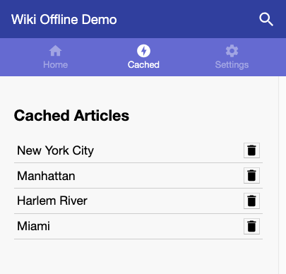
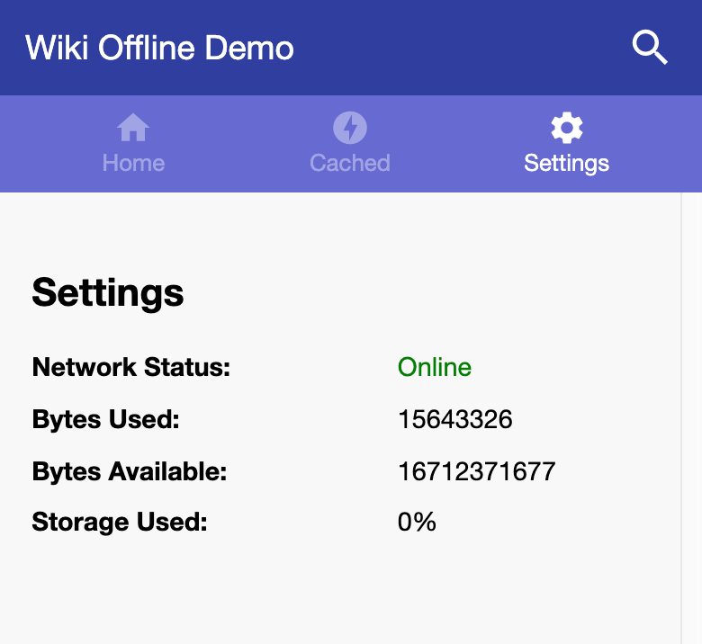

In [previous sections](../codelab-reliability-overview/) of this project you
learned how to add caching of external assets (in this case, Wikipedia
articles) to a sample app and show your users a list of what assets have been
cached.

In this section you'll learn how to give users control over what your app
caches.


If you've finished previous sections of this project in your own Glitch, you
can continue working in it. Otherwise, you can use the Glitch provided here.



Make sure to [set up Glitch and DevTools](../codelab-reliability-setup/) if you
haven't already.


The goal is to allow users to delete articles from the __Cached__ tab
in the sample app by clicking the trash button next to each article in the list.

<figure class="w-figure w-figure--center">
  
</figure>

To do that, you'll create a `deleteCachedEntry(title)` method in `app.js`,
which will be called when the user clicks a trash button. This method will:

+  Use the
[Cache Storage API](https://developers.google.com/web/fundamentals/instant-and-offline/web-storage/cache-api)
to delete the article from the app's `wiki-articles` cache and
+  Call the existing `queryWikiCache()` method to update the interface.

```js/3-5/2
// delete a cached entry
async function deleteCachedEntry(title) {
  // TODO: implement logic to delete an article from the cache
  const cache = await caches.open('wiki-articles');
  await cache.delete(`/api/wiki/${title}`);
  queryWikiCache();
}
```

To make the __Cached__ tab a little more useful, you might want to show users
how much storage they have remaining so they know when they need to delete
articles. Luckily, some browsers expose an interface for querying your origin's
upper storage limit and the approximate amount of storage currently being used
via the `navigator.storage.estimate()` method of the Cache Storage API. (See
[Estimating Available Storage Space](https://developers.google.com/web/updates/2017/08/estimating-available-storage-space)
for more information.)

To use `navigator.storage.estimate()` in your sample app, create an
`estimateStorage()` method in `app.js`. This method will populate the
`bytesUsed` and `bytesAvailable` HTML elements in the __Settings__ view of
`index.html` with the relevant information from `navigator.storage.estimate()`:

```js/3-9/2
// display storage information to user
function estimateStorage() {
  // TODO: display storage information to user
  if ('storage' in navigator && 'estimate' in navigator.storage) {
    navigator.storage.estimate().then(({ usage, quota }) => {
      document.getElementById('bytesUsed').innerText = usage;
      document.getElementById('bytesAvailable').innerText = quota;
      document.getElementById('storageUsage').innerText = `${Math.floor(usage / quota * 100)}%`;
    });
  }
}
```

<figure class="w-figure w-figure--center">
  
</figure>


## What's next
[Conclusion](../codelab-reliability-conclusion/)
