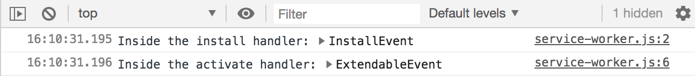
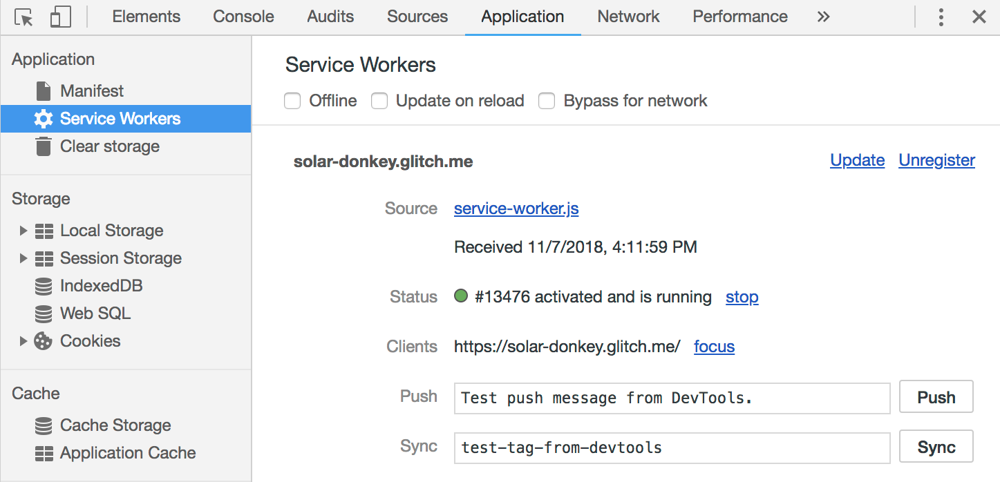
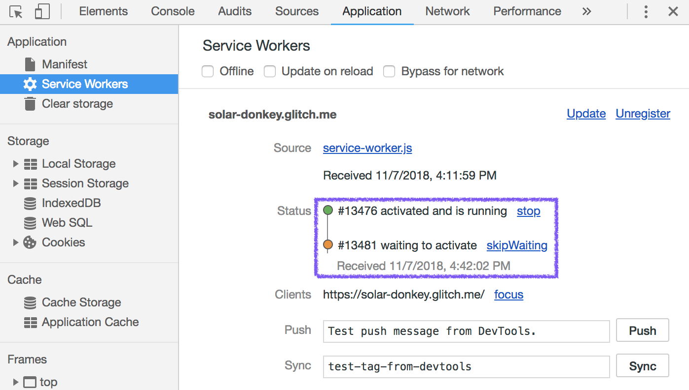



This codelab shows you how to register a service worker from within your web
application, and use the Chrome DevTools to observe its behavior. It also
covers some debugging techniques that you might find useful when dealing with
service workers.

## Get familiar with the sample project

The files in the sample project most relevant to this codelab are:

+  `register-sw.js` starts out empty, but it will contain the code used
    to register the service worker. It's already being loaded via a `<script>`
    tag inside of the project's `index.html`.
+  `service-worker.js` is similarly empty. It's the file that will contain
    the service worker for this project.

## Add in the service worker registration code

A service worker (even an empty one, like the current `service-worker.js` file)
won't be used unless it's
[registered](https://developer.mozilla.org/en-US/docs/Web/API/ServiceWorkerContainer/register)
first. You can do this via a call to:

```js
navigator.serviceWorker.register(
  '/service-worker.js'
)
```

inside your `register-sw.js` file.

Before you add that code, though, there are a couple of points to take into
account.

First, not every browser
[supports](https://developer.mozilla.org/en-US/docs/Web/API/Service_Worker_API#Browser_compatibility)
service workers. This is particularly true for older versions of browsers that
don't automatically update. So it's a best practice to call
`navigator.serviceWorker.register()` conditionally, after checking whether
`navigator.serviceWorker` is supported.

Second, when you register a service worker, the browser runs the code in your
`service-worker.js` file, and may potentially start downloading URLs to populate
caches, depending on the code in your service worker's
[`install`](https://developers.google.com/web/fundamentals/primers/service-workers/lifecycle#install)
and
[`activate`](https://developers.google.com/web/fundamentals/primers/service-workers/lifecycle#activate)
event handlers.

Running additional code and downloading assets can use up
valuable resources that your browser could otherwise use to display the current
web page. To help avoid this interference, it's a good practice to delay
registering a service worker until the browser has finished rendering the
current page. A convenient way of approximating this is to wait until the
`window.load` event has been fired.


Waiting for <code>window.load</code> is a one-size-fits-all solution. If you know
more about how your web page loads resources, or if you're using a web app
framework that supports its own "everything's ready" lifecycle event, you can
tweak the timing accordingly.


Putting those two points together, add this general-purpose service worker
registration code to your `register-sw.js` file:

```js
if ('serviceWorker' in navigator) {
  window.addEventListener('load', () => {
    navigator.serviceWorker.register('/service-worker.js');
  });
}
```

## Add some service worker logging code

Your `service-worker.js` file is where all the logic for your service worker
implementation would normally go. You'd use a mix of the service worker
[lifecycle events](https://developers.google.com/web/fundamentals/primers/service-workers/lifecycle),
the
[Cache Storage API](https://developer.mozilla.org/en-US/docs/Web/API/CacheStorage),
and knowledge about your web app's network traffic to create a perfectly crafted
service worker, ready to handle all of your web app's requests.

But… that's all for learning later. At this stage, the focus is on observing
various service worker events, and getting comfortable using Chrome's DevTools
to debug the state of your service worker.

To that end, add in the following code to `service-worker.js`, which will log
messages to the DevTools console in response to various events (but not do much
else):

```js
self.addEventListener('install', (event) => {
  console.log('Inside the install handler:', event);
});

self.addEventListener('activate', (event) => {
  console.log('Inside the activate handler:', event);
});

self.addEventListener(fetch, (event) => {
  console.log('Inside the fetch handler:', event);
});
```

## Get familiar with the Service Workers panel in DevTools

Now that you've got the code added to `register-sw.js` and `service-worker.js`
files, it's time to visit the Live version of your sample project, and observe
the service worker in action.




You should see something like the following log messages,
showing that the service worker has been installed and activated:



Then visit the **Applications** tab, and select the **Service Workers** panel.
You should see something like the following:



This lets you know that there's a service worker with a source URL of
`service-worker.js`, for the web app `solar-donkey.glitch.me`, that's currently
activated and running. It also tells you that there's currently one client (open
tab) that's being controlled by the service worker.

You can use the links on this panel, like `Unregister`, or `stop`, to make
changes to the currently registered service worker for debugging purposes.


Service workers tend to stick around, unless they're explicitly unregistered. If
you find yourself wanting to "start fresh" during local development, a great way
of doing so is to use a [Chrome Incognito
window](https://support.google.com/chrome/answer/95464) to load pages that are
under service worker control. The service worker will persist only as long as
the window is open, and you could always start over by closing all Incognito
windows and opening a new one.


## Trigger the service worker update flow

One of the key concepts to understand when developing with service workers is
the idea of
[an update flow](https://developers.google.com/web/fundamentals/primers/service-workers/lifecycle#updates).

After your users visit a web app which registers a service worker, they'll end
up with the code for the current copy of `service-worker.js` installed on their
local browser. But what happens when you make updates to the version of
service-worker.js that's stored on your web server?

When a repeat visitor returns to a URL that's within the scope of a service worker,
the browser will automatically request the latest `service-worker.js` and
check for any changes. If anything in the service worker script is different,
then the new service worker will get a chance to install, activate,
and eventually take control.

You can simulate this update flow by going back to the code editor for your project, and making _any_ change to the code. One quick change would be
to replace

```js
self.addEventListener('install', (event) => {
  console.log('Inside the install handler:', event);
});
```

with

```js
self.addEventListener('install', (event) => {
  console.log('Inside the UPDATED install handler:', event);
});
```

After making that change, return to the Live version of your sample app, and
reload the page with the DevTools Application tab still open. You should see
something like the following:



This shows that there are two versions of your service worker installed at this
point. The previous version, which was already activated, is running and in
control of the current page. The updated version of the service worker is listed
right below. It's in the
[`waiting` state](https://developers.google.com/web/fundamentals/primers/service-workers/lifecycle#waiting),
and will remain waiting until all of the open tabs that are controlled by the
old service worker are closed.

This default behavior ensures that if your new
service worker has a fundamental difference in behavior from your old one—like a
`fetch` handler which responds with resources that are incompatible with older
versions of your web app—it won't go into effect until a user has shut down all
previous instances of your web app.


If you don't want to wait, it's possible to
[call `skipWaiting()`](https://developers.google.com/web/fundamentals/primers/service-workers/lifecycle#skip_the_waiting_phase)
inside of your service worker (usually in the `install` handler), or to simulate
that behave by clicking on the `skipWaiting` link in DevTools.


## Summing things up

You should now be comfortable with the process of registering a service worker
and observing a service worker's behavior using Chrome's DevTools.

You're now in a good position to start implementing caching strategies, and all
the good stuff that will help your web app load both reliably and reliably
fast.
