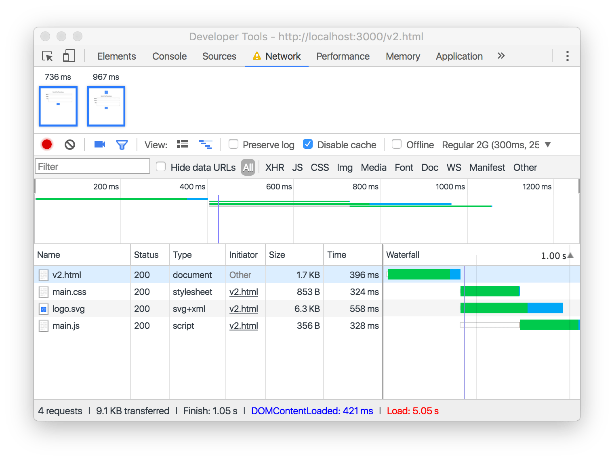
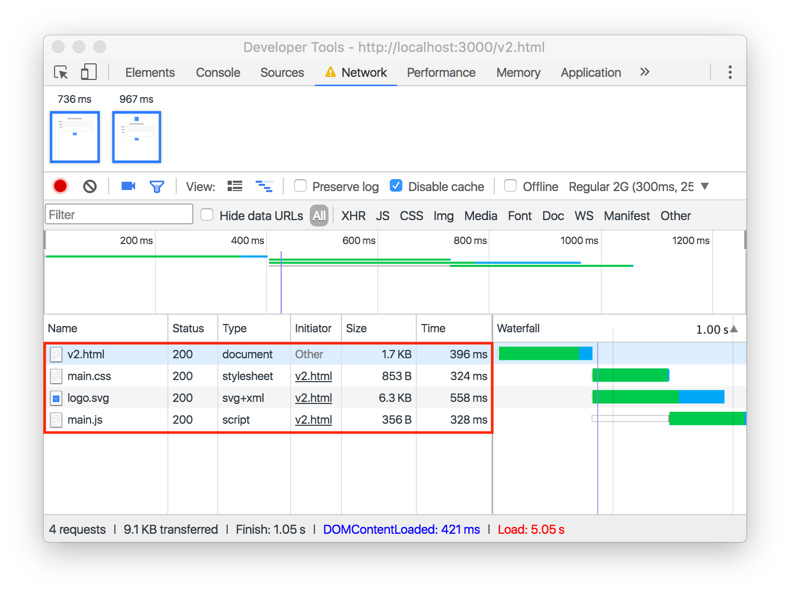
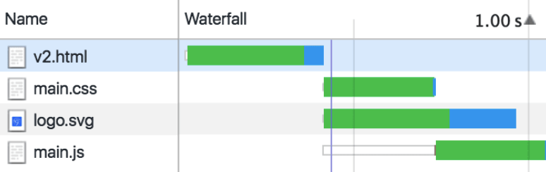

The Network panel in your browser's DevTools helps identify what resources are
loaded and when they are loaded. Each row in the Network panel corresponds to a
specific URL that your web app has loaded.

<figure class="w-figure">
  
</figure>


[Interpret network traffic using Chrome's DevTools](/codelab-explore-network-panel).



This guide uses screenshots and descriptions based on Chrome's DevTools
interface. Other browsers support similar functionality, but the overall
interface will be different if you're not using Chrome.


## Know what you load

Coming up with the right caching strategies for your web application requires
getting a handle on _what_ exactly you're loading. When building a reliable web
application, the network can be subject to all kinds of dark forces. You need to
understand the network's vulnerabilities if you hope to cope with them in your
app.

You might think that you already have a pretty good idea as to what your web
application loads. If you're just using a small scattering of static HTML,
JavaScript, CSS, and image files, that might be true. But as soon as you start
mixing in third-party resources hosted on content delivery networks, using
dynamic API requests and server-generated responses, the picture quickly becomes
murkier.

A caching strategy that makes sense for a few small CSS files probably won't
make sense for hundreds of large images, for instance.

## Know when you load

Another part of the overall loading picture is _when_ everything gets loaded.

Some requests to the network, such as the
[navigation request](https://developer.mozilla.org/en-US/docs/Web/API/Request/mode#Value)
for your initial HTML, are made unconditionally as soon as a user visits a given
URL. That HTML might contain hardcoded references to critical CSS or JavaScript
files that must also load in order to display your interactive page. These
requests all sit in your critical loading path. You will need to aggressively
cache these to be reliably fast.

Other resources, such as API requests or lazy-loaded assets, might not
start to load until well after all of the initial loading is complete. If
those requests only happen following a specific sequence of user interactions,
then a completely different set of resources might end up being requested
across multiple visits to the same page. A less aggressive caching strategy is
often appropriate for content that you've identified as being outside the
critical loading path.


Advanced techniques outside the scope of this guide, like [<link
rel="preload">](https://developer.mozilla.org/en-US/docs/Web/HTML/Preloading_content),
add a twist to this story by giving a head start to what would otherwise be a
late-loaded request.


### The Name and Type columns help with the what

The Name and Type columns help provide a meaningful picture of _what_'s being
loaded. The answer to "_what_'s loading?" in the example above is a total of
four URLs, each representing a unique type of content.

<figure class="w-figure">
  
</figure>

The Name represents the URL that your browser requested—though you'll only see
the last portion of the URL's path listed. For example, if
`https://example.com/main.css` is loaded, you'd only end up seeing `main.css`
listed under Name.

The last few characters of the URL's path, following the
period (e.g. "css"), are known as the URL's extension.
The URL's extension generally tells you what type of resource is being requested,
and maps directly to the information shown in the Type column. For example,
`v2.html` is a document, and `main.css` is a stylesheet.

### The Waterfall column helps with the when

Examine the Waterfall column, starting at the top and working your way down. The
length of each bar represents the total amount of time that was spent loading
each resource. How can you tell the difference between a request that's made as
part of the critical loading path and a request that's fired off dynamically,
long after the page's initial load is complete?

The first request in the waterfall is always going to be for the HTML document,
for example, `v2.html`. All of the subsequent requests will flow (like a
waterfall!) from this initial navigation request, based on what images, scripts,
and styles the HTML document references.

The waterfall shows that as soon as `v2.html` has finished loading, the requests
for the assets it references (also referred to as _subresources_) start. The
browser can request multiple subresources at the same time, and that's
represented by the overlapping bars in the Waterfall column for `main.css` and
`logo.svg`. Finally, you can see from the screenshot that `main.js` starts
loading last, and it finishes loading after the other three URLs have completed
as well. 
