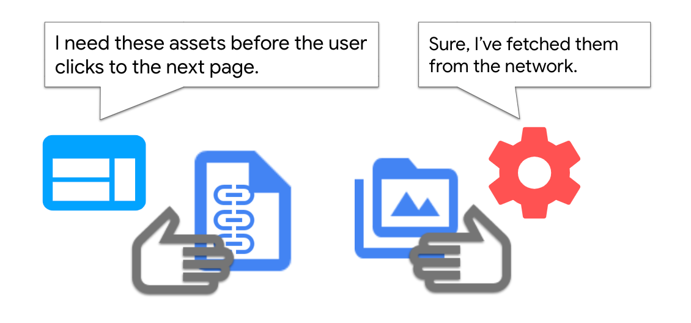
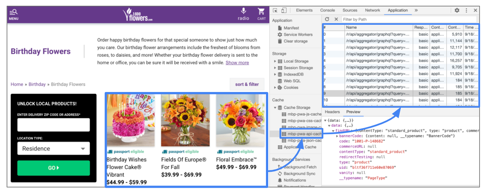

Some websites might need to communicate to the service worker without the need of being
informed about the result. Here are some examples:

- A page sends the service worker a list of URLs [to
  prefetch](/instant-navigation-experiences/), so that, when the user clicks on a
  link the document or page subresources are already available in the cache, making subsequent
  navigation much faster.
- The page asks the service worker to retrieve and cache a set of top articles, to have them
  available for offline purposes.

Delegating these types of non-critical tasks to the service worker has the benefit of freeing up the
main thread for better handling more pressing tasks such as responding to user interactions.

<figure class="w-figure">
  
</figure>

In this guide we'll explore how to implement a **one-way** communication technique from the page to
the service worker by using standard browser APIs and the Workbox library. We'll call these types of
use cases **imperative caching**.


  Check out [Workers overview](/workers-overview/) for a high-level explanation
  of when to use web workers versus service workers and the rest of the
  [Communicate with workers](/reliable/#communicate-with-workers) series
  for guides on other common use cases.


## Production case {: #production-case }

1-800-Flowers.com implemented **imperative caching** (prefetching) with service workers via
[`postMessage()`](https://developer.mozilla.org/en-US/docs/Web/API/Worker/postMessage) to prefetch the
top items in category pages to speed up subsequent navigation to product detail pages.

<figure class="w-figure">
  
</figure>

They use a mixed approach to decide which items to prefetch:

- At page load time they ask the servicer worker to retrieve the JSON data for the top 9 items, and
  add the resulting response objects to the cache.
- For the remaining items, they listen to the [`mouseover`
  ](https://developer.mozilla.org/en-US/docs/Web/API/Element/mouseover_event) event, so that, when a
  user moves the cursor on top of an item, they can trigger a fetch for the resource on "demand".

They use the [Cache API](https://developer.mozilla.org/en-US/docs/Web/API/Cache) to store JSON
responses:

<figure class="w-figure">
  
   <figcaption class="w-figcaption">Prefetching JSON product data from product listing pages in 1-800Flowers.com.</figcaption>
</figure>

When the user clicks on an item, the JSON data associated with it can be picked up from the cache,
without the need of going to the network, making the navigation faster.

## Using Workbox {: #using-workbox }

[Workbox](https://developers.google.com/web/tools/workbox) provides an easy way to send messages to
a service worker, via the [`workbox-window`](https://developers.google.com/web/tools/workbox/modules/workbox-window) package, a set of modules
that are intended to run in the window context. They're a complement to the other Workbox packages
that run in the service worker.

To communicate the page with the service worker, first obtain a Workbox object reference to the
registered service worker:

```javascript
const wb = new Workbox('/sw.js');
wb.register();
```

Then you can directly send the message declaratively, without the hassle of the getting the
registration, checking for activation, or thinking about the underlying communication API:

```javascript
wb.messageSW({"type": "PREFETCH", "payload": {"urls": ["/data1.json", "data2.json"]}}); });
```

The service worker implements a [`message`](https://developer.mozilla.org/en-US/docs/Web/API/ServiceWorkerGlobalScope/message_event) handler to
listen to these messages. It can optionally return a response, although, in cases like these, it's
not necessary:

```javascript
self.addEventListener('message', (event) => {
  if (event.data && event.data.type === 'PREFETCH') {
    // do something
  }
});
```

## Using browser APIs {: #using-browser-apis }

If the Workbox library is not enough for your needs, here is how you can implement window to service
worker communication, using browser APIs.

The [postMessage API](https://html.spec.whatwg.org/multipage/workers.html#dom-worker-postmessage)
can be used to establish a **one-way** communication mechanism from the page to the service worker.

The page calls
[`postMessage()`](https://html.spec.whatwg.org/multipage/workers.html#dom-worker-postmessage) on the
service worker interface:

```javascript
navigator.serviceWorker.controller.postMessage({
  type: 'MSG_ID',
  payload: 'some data to perform the task',
});
```
The service worker implements a [`message`](https://developer.mozilla.org/en-US/docs/Web/API/ServiceWorkerGlobalScope/message_event) handler to
listen to these messages.

```javascript
self.addEventListener('message', (event) => {
  if (event.data && event.data.type === MSG_ID) {
    // do something
  }
});
```

The `{type : ‘MSG_ID'}` attribute is not absolutely required, but it is one way to allow the page to
send different types of instructions to the service worker (i.e. 'to prefetch' vs. 'to clear
storage').  The service worker can branch into different execution paths based on this flag.

If the operation was successful, the user will be able to get the benefits from it but, if not, it won't alter the main user flow. For example, when 1-800-Flowers.com attempts to precache, the page doesn't need to know whether the service worker succeeded. If it does, then the user will enjoy a faster navigation. If it doesn't the page still needs to navigate to the new page. It's just going to take a little longer.

### A simple prefetching example {: #a-simple-prefetching-example }

One of the most common applications of **imperative caching** is **prefetching**, meaning fetching
resources for a given URL, before the user moves to it, in order to speed up navigation.

There are different ways of implementing prefetching in sites:

- Using [Link prefetch tags](/link-prefetch/) in pages: resources are kept in the
  browser cache for five minutes, after which the normal `Cache-Control` rules for the resource
  apply.
- Complementing the previous technique with [a runtime caching strategy in the service
  worker](/instant-navigation-experiences/) to extend the lifetime of the prefetch
  resource beyond this limit.

For relatively simple prefetching scenarios, like prefetching documents, or specific assets (JS,
CSS, etc.), those techniques are the best approach.

If additional logic is required, for example, parsing the prefetch resource (a JSON file or page) in
order to fetch its internal URLs, it's more appropriate to delegate this task entirely to the
service worker.

Delegating these types of operations to the service worker has the following advantages:

- Offloading the heavy lifting of fetching and post-fetch processing (which will be introduced
  later) to a secondary thread. By doing this, it frees the main thread to handle more important
  tasks such as responding to user interactions.
- Allowing multiple clients (e.g. tabs) to reuse a common functionality, and even calling the
  service simultaneously without blocking the main thread.

### Prefetch product detail pages {: #prefetch-product-detail-pages }

First use [`postMessage()`](https://developer.mozilla.org/en-US/docs/Web/API/Worker/postMessage) on
the service worker interface and pass an array of URLs to cache:

```javascript
navigator.serviceWorker.controller.postMessage({
  type: 'PREFETCH',
  payload: {
    urls: [
      'www.exmaple.com/apis/data_1.json',
      'www.exmaple.com/apis/data_2.json',
    ],
  },
});
```

In the service worker, implement a [`message`](https://developer.mozilla.org/en-US/docs/Web/API/ServiceWorkerGlobalScope/message_event) handler to
intercept and process messages sent by any active tab:

```javascript
addEventListener('message', (event) => {
  let data = event.data;
  if (data && data.type === 'PREFETCH') {
    let urls = data.payload.urls;
    for (let i in urls) {
      fetchAsync(urls[i]);
    }
  }
});
```
In the previous code we introduced a small helper function called `fetchAsync()` to iterate on the
array of URLs and issue a fetch request for each of them:

```javascript
async function fetchAsync(url) {
  // await response of fetch call
  let prefetched = await fetch(url);
  // (optionally) cache resources in the service worker storage
}
```

When the response is obtained you can rely on the caching headers of the resource. In many cases
though, like in product detail pages, resources are not cached (which means, they have a
`Cache-control` header of `no-cache`). In cases like these you can override this behavior, by
storing the fetched resource in the service worker cache. This has the added benefit of allowing the
file to be served in offline scenarios.

### Beyond JSON data {: #beyond-json-data }

Once the JSON data is fetched from a server endpoint, it often contains other URLs that are also
worth prefetching, such as an image or other endpoint data that are associated with this first-level
data.

Let's say that in our example, the JSON data returned is the information of a grocery shopping site:

```json
{
  "productName": "banana",
  "productPic": "https://cdn.example.com/product_images/banana.jpeg",
  "unitPrice": "1.99"
 }
```

Modify the `fetchAsync()` code to iterate over the list of products and cache the hero image for
each of them:

```javascript
async function fetchAsync(url, postProcess) {
  // await response of fetch call
  let prefetched = await fetch(url);

  //(optionally) cache resource in the service worker cache

  // carry out the post fetch process if supplied
  if (postProcess) {
    await postProcess(prefetched);
  }
}

async function postProcess(prefetched) {
  let productJson = await prefetched.json();
  if (productJson && productJson.product_pic) {
    fetchAsync(productJson.product_pic);
  }
}
```

You can add some exception handling around this code for situations like 404s.
But the beauty of using a service worker to prefetch is that it can fail without much
consequence to the page and the main thread. You may also have more elaborate logic in the
post-processing of the prefetched content, making it more flexible and decoupled with the data it's
handling. The sky's the limit.

 Prefetching techniques consume extra bytes for resources that are not
immediately needed, so it needs to be applied thoughtfully; only prefetch resources when you are
confident that users will need them. Avoid prefetching when users are on slow connections.
You can detect that with the [Network Information
API](https://developer.mozilla.org/en-US/docs/Web/API/Network_Information_API). 

## Conclusion {: #conclusion }

In this article, we covered a common use case of **one-way** communication between page and service
worker: **imperative caching**. The examples discussed are only meant for demonstrating one way of
using this pattern and the same approach can be applied to other use cases as well, for example,
caching top articles on demand for offline consumption, bookmarking, and others.

For more patterns of page and service worker communication, check out:

- [Broadcast updates](/broadcast-updates-guide): Calling the page from the service worker to inform
  about important updates (e.g. a new version of the webapp is available).
- [Two-way communication](/two-way-communication-guide): Delegating a task to a service worker (e.g.
  a heavy download), and keeping the page informed on the progress.
