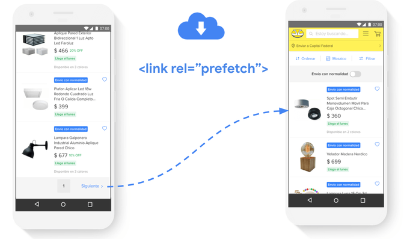
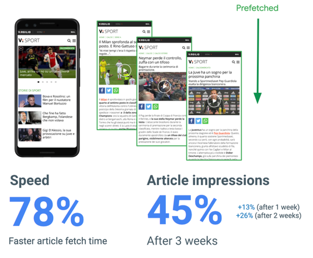
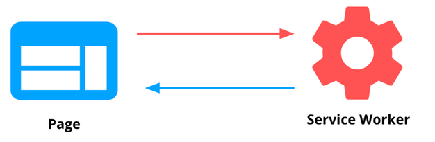



Performing a task on a site commonly involves several steps. For example, purchasing a product in an e-commerce website might involve searching for a product, picking an item from the list of results, adding the item to the cart, and completing the operation by checking out.

In technical terms, moving through different pages means making a **navigation request**. As a general rule, you **don't** want to use long-lived `Cache-Control` headers to cache the HTML response for a navigation request. They should normally be satisfied via the network, with `Cache-Control: no-cache`, to ensure that the HTML, along with the chain of subsequent network requests, is (reasonably) fresh.
Having to go against the network each time the user navigates to a new page unfortunately means that each navigation might be slow—at the very least, it means that it won't be *reliably* fast.

To speed up these requests, if you can anticipate the user's action, you can request these pages and assets beforehand and keep them in the cache for a short period of time until the user clicks on these links. This technique is called [prefetching](/link-prefetch/) and it's commonly implemented by adding `<link rel="prefetch">` tags to pages, indicating the resource to prefetch.

In this guide we'll explore different ways in which [service workers](https://developer.mozilla.org/en-US/docs/Web/API/Service_Worker_API) can be used as a complement of traditional prefetching techniques.

## Production cases

[MercadoLibre](https://www.mercadolibre.com.ar/) is the biggest e-commerce site in Latin America. To speed up navigations, they dynamically inject `<link rel="prefetch">` tags in some parts of the flow. For example, in listing pages, they fetch the next result page as soon as the user scrolls to the bottom of the listing:

<figure class="w-figure">
  
</figure>

Prefetched files are requested at the "Lowest" priority and stored in the [HTTP cache](/http-cache/) or the [memory cache](https://calendar.perfplanet.com/2016/a-tale-of-four-caches/) (depending on whether the resource is cacheable or not), for an amount of time that varies by browsers. For example, as of Chrome 85, this value is 5 minutes. Resources are kept around for five minutes, after which the normal `Cache-Control` rules for the resource apply.

Using service worker caching can help you extend the lifetime of prefetch resources beyond the five-minute window.

For example, Italian sports portal [Virgilio Sport](https://sport.virgilio.it/) uses service workers to prefetch the most popular posts in their home page. They also use the [Network Information API](https://developer.mozilla.org/en-US/docs/Web/API/Network_Information_API) to avoid prefetching for users that are on a 2G connection.

<figure class="w-figure">
  
</figure>

As a result of this, over 3 weeks of observation Virgilio Sport witnessed load times for navigation to articles improve **78%**, and the number of article impressions increase **45%**.

<figure class="w-figure">
  
</figure>

## Implement precaching with Workbox

In the following section we'll use [Workbox](/workbox/) to show how to implement different caching techniques in the service worker that can be used as a complement to `<link rel="prefetch">`, or even a replacement for it, by delegating this task completely to the service worker.

 You must take steps to ensure that adding a service worker to your site doesn't end up actually slowing down your navigations. Starting up the service worker without using it to respond to a navigation request will introduce a small amount of latency (as explained in [Building Faster, More Resilient Apps with Service Workers](https://www.youtube.com/watch?v=25aCD5XL1Jk)). You can mitigate this overhead by enabling a feature called [navigation preload](https://developers.google.com/web/updates/2017/02/navigation-preload), and then using the [network response](https://developers.google.com/web/updates/2017/02/navigation-preload#using_the_preloaded_response) that's been preloaded inside of your fetch event handler.


### 1. Precache static pages and page subresources

[Precaching](/precache-with-workbox/) is the ability of the service worker to save files to the cache while it's installing.


Precaching sounds similar to prefetching, but it's a different technique. In the first one, the service worker fetches and stores resources (typically static files) while it's installing and keeps them in the cache until a new version of the file is available. In the second, resources are requested ahead of time to have it in the cache for brief periods of time in order to speed up subsequent navigations.


In the following cases precaching is used to achieve a similar goal as prefetching: making navigations faster.

#### Precaching static pages

For pages that are generated at build time (e.g. `about.html`, `contact.html`), or in completely static sites, one can just add the site's documents to the precache list, so they are already available in the cache every time the user accesses them:

```javascript
workbox.precaching.precacheAndRoute([
  {url: '/about.html', revision: 'abcd1234'},
  // ... other entries ...
]);
```

#### Precaching page subresources

Precaching static assets that the different sections of the site might use (e.g. JavaScript, CSS, etc.), is a general best practice and can give an extra boost in prefetching scenarios.

To speed up navigations in an e-commerce site, you can use  `<link rel="prefetch">` tags in listing pages to prefetch product detail pages for the first few products of a listing page. If you have already precached the product page subresources, this can make the navigation even faster.

To implement this:

- Add a `<link rel="prefetch">` tag to the page:

```html
 <link rel="prefetch" href="/phones/smartphone-5x.html" as="document">
```

- Add the page subresources to the precache list in the service worker:

```javascript
workbox.precaching.precacheAndRoute([
  '/styles/product-page.ac29.css',
  // ... other entries ...
]);
```

### 2. Extend the lifetime of prefetch resources

As mentioned earlier, `<link rel="prefetch">` fetches and keeps resources in the HTTP cache for a limited amount of time, after which point the `Cache-Control` rules for a resource apply. As of Chrome 85, this value is 5 minutes.

Service workers allow you to extend the lifetime of the prefetch pages, while providing the added benefit of making those resources available for offline usage.

In the previous example, one could complement the `<link rel="prefetch">` used to prefetch a product page with a [Workbox runtime caching strategy](/runtime-caching-with-workbox/).

To implement that:

- Add a `<link rel="prefetch">` tag to the page:

```html
 <link rel="prefetch" href="/phones/smartphone-5x.html" as="document">
 ```

 - Implement a runtime caching strategy in the service worker for these types of requests:

```javascript
new workbox.strategies.StaleWhileRevalidate({
  cacheName: 'document-cache',
  plugins: [
    new workbox.expiration.Plugin({
      maxAgeSeconds: 30 * 24 * 60 * 60, // 30 Days
    }),
  ],
});
```

In this case, we have opted to use a [stale-while-revalidate strategy](https://developers.google.com/web/tools/workbox/modules/workbox-strategies#stale-while-revalidate). In this strategy, pages can be requested from both the cache and the network, in parallel. The response comes from the cache if available, otherwise from the network. The cache is always kept up to date with the network response with each successful request.

### 3. Delegate prefetching to the service worker

In most cases the best approach is to use `<link rel="prefetch">`. The tag is a [resource hint](https://www.w3.org/TR/resource-hints/) designed to make prefetching as efficient as possible.

In some cases, though, it might be better to delegate this task completely to the service worker.
For example: to prefetch the first few products in a client-side rendered product listing page, one might need to inject several `<link rel="prefetch">` tags dynamically in the page, based on an API response. This can momentarily consume time on the page's main thread and make the implementation more difficult.

In cases like this, use a "page to service worker communication strategy", to delegate the task of prefetching completely to the service worker. This type of communication can be achieved by using [worker.postMessage()](https://html.spec.whatwg.org/multipage/workers.html#dom-worker-postmessage):

<figure class="w-figure">
  
</figure>

The [Workbox Window package](https://developers.google.com/web/tools/workbox/modules/workbox-window) simplifies this type of communication, abstracting many details of the underlying call being done.

Prefetching with Workbox Window can be implemented in the following way:

- In the page: call the service worker passing it the type of message, and the list of URLs to prefetch:

```javascript
const wb = new Workbox('/sw.js');
wb.register();

const prefetchResponse = await wb.messageSW({type: 'PREFETCH_URLS', urls: […]});
```

- In the service worker: implement a message handler to issue a `fetch()` request for each URL to prefetch:

```javascript
addEventListener('message', (event) => {
  if (event.data.type === 'PREFETCH_URLS') {
    // Fetch URLs and store them in the cache
  }
});
```
