With [Service Worker][sw_primer] we gave up trying to solve offline, and gave developers the moving
parts to go solve it themselves. It gives you control over caching and how requests are handled.
That means you get to create your own patterns. Let's take a look at a few possible patterns in
isolation, but in practice you'll likely use many of them in tandem depending on URL and context.

For a working demo of some of these patterns, see [Trained-to-thrill][ttt], and
[this video](https://www.youtube.com/watch?v=px-J9Ghvcx4) showing the performance impact.

## The cache machine—when to store resources

[Service Worker][sw_primer] lets you handle requests independently from caching, so I'll demonstrate
them separately. First up, caching, when should it be done?

### On install—as a dependency {: #on-install-as-dependency }

<figure class="w-figure">
  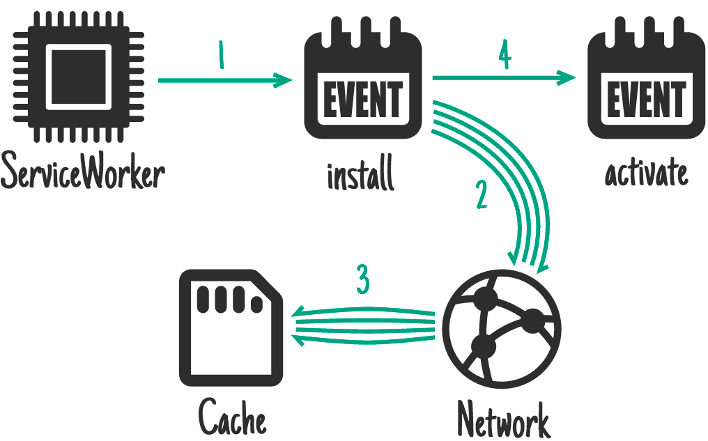
  <figcaption class="w-figcaption">On install - as a dependency.</figcaption>
</figure>

Service Worker gives you an `install` event. You can use this to get stuff ready, stuff that must be
ready before you handle other events. While this happens any previous version of your Service Worker
is still running and serving pages, so the things you do here mustn't disrupt that.

**Ideal for:** CSS, images, fonts, JS, templates… basically anything you'd consider static to that
"version" of your site.

These are things that would make your site entirely non-functional if they failed to be fetched, things
an equivalent platform-specific app would make part of the initial download.

```js
self.addEventListener('install', function (event) {
  event.waitUntil(
    caches.open('mysite-static-v3').then(function (cache) {
      return cache.addAll([
        '/css/whatever-v3.css',
        '/css/imgs/sprites-v6.png',
        '/css/fonts/whatever-v8.woff',
        '/js/all-min-v4.js',
        // etc.
      ]);
    }),
  );
});
```

`event.waitUntil` takes a promise to define the length and success of the install. If the promise
rejects, the installation is considered a failure and this Service Worker will be abandoned (if an
older version is running, it'll be left intact). `caches.open()` and `cache.addAll()` return promises.
If any of the resources fail to be fetched, the `cache.addAll()` call rejects.

On [trained-to-thrill][ttt] I use this to
[cache static assets](https://github.com/jakearchibald/trained-to-thrill/blob/3291dd40923346e3cc9c83ae527004d502e0464f/www/static/js-unmin/sw/index.js#L3).

### On install—not as a dependency {: #on-install-not }

<figure class="w-figure">
  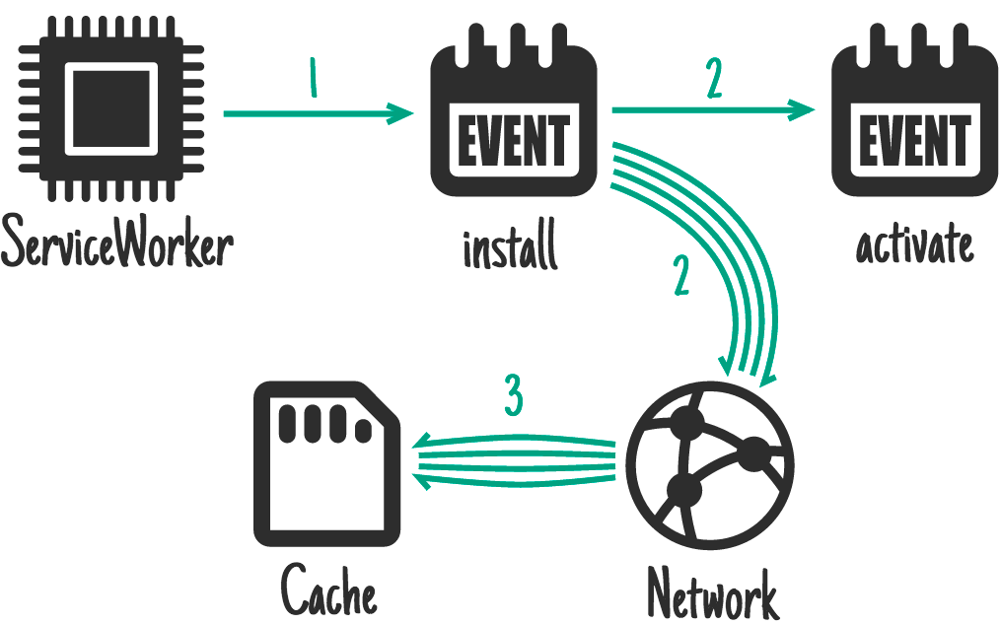
  <figcaption class="w-figcaption">On install - not as a dependency.</figcaption>
</figure>

This is similar to above, but won't delay install completing and won't cause installation to fail if caching
fails.

**Ideal for:** bigger resources that aren't needed straight away, such as assets for later levels of
a game.

```js
self.addEventListener('install', function (event) {
  event.waitUntil(
    caches.open('mygame-core-v1').then(function (cache) {
      cache
        .addAll
        // levels 11–20
        ();
      return cache
        .addAll
        // core assets and levels 1–10
        ();
    }),
  );
});
```

The above example does not pass the `cache.addAll` promise for levels 11–20 back to
`event.waitUntil`, so even if it fails, the game will still be available offline. Of course, you'll
have to cater for the possible absence of those levels and reattempt caching them if they're
missing.

The Service Worker may be killed while levels 11–20 download since it's finished handling events,
meaning they won't be cached. In future the
[Web Periodic Background Synchronization API](https://developer.mozilla.org/en-US/docs/Web/API/Web_Periodic_Background_Synchronization_API)
will handle cases like this, and larger downloads such as movies. That API is currently only
supported on Chromium forks.

### On activate {: #on-activate }

<figure class="w-figure">
  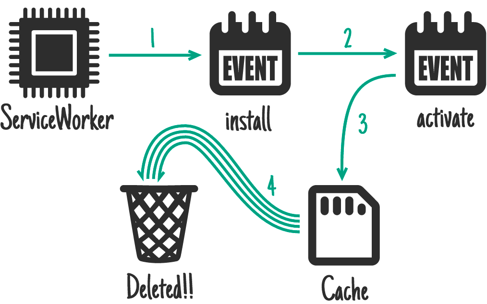
  <figcaption class="w-figcaption">On activate.</figcaption>
</figure>

**Ideal for:** clean-up and migration.

Once a new Service Worker has installed and a previous version isn't being used, the new one
activates, and you get an `activate` event. Because the old version is out of the way, it's a good
time to handle
[schema migrations in IndexedDB](https://developers.google.com/web/fundamentals/instant-and-offline/web-storage/indexeddb-best-practices)
and also delete unused caches.

```js
self.addEventListener('activate', function (event) {
  event.waitUntil(
    caches.keys().then(function (cacheNames) {
      return Promise.all(
        cacheNames
          .filter(function (cacheName) {
            // Return true if you want to remove this cache,
            // but remember that caches are shared across
            // the whole origin
          })
          .map(function (cacheName) {
            return caches.delete(cacheName);
          }),
      );
    }),
  );
});
```

During activation, other events such as `fetch` are put into a queue, so a long activation could
potentially block page loads. Keep your activation as lean as possible, and only use it for things you
_couldn't_ do while the old version was active.

On [trained-to-thrill][ttt] I use this to
[remove old caches](https://github.com/jakearchibald/trained-to-thrill/blob/3291dd40923346e3cc9c83ae527004d502e0464f/www/static/js-unmin/sw/index.js#L17).

### On user interaction {: #on-user-interaction }

<figure class="w-figure">
  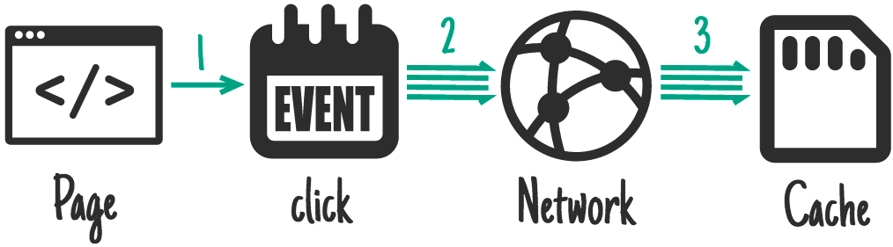
  <figcaption class="w-figcaption">On user interaction.</figcaption>
</figure>

**Ideal for:** when the whole site can't be taken offline, and you chose to allow the user to select
the content they want available offline. E.g. a video on something like YouTube, an article on
Wikipedia, a particular gallery on Flickr.

Give the user a "Read later" or "Save for offline" button. When it's clicked, fetch what you need
from the network and pop it in the cache.

```js
document.querySelector('.cache-article').addEventListener('click', function (event) {
  event.preventDefault();

  var id = this.dataset.articleId;
  caches.open('mysite-article-' + id).then(function (cache) {
    fetch('/get-article-urls?id=' + id)
      .then(function (response) {
        // /get-article-urls returns a JSON-encoded array of
        // resource URLs that a given article depends on
        return response.json();
      })
      .then(function (urls) {
        cache.addAll(urls);
      });
  });
});
```

The [caches API][caches_api] is available from pages as well as service workers, meaning you don't
need to involve the service worker to add things to the cache.

### On network response {: #on-network-response }

<figure class="w-figure">
  
  <figcaption class="w-figcaption">On network response.</figcaption>
</figure>

**Ideal for:** frequently updating resources such as a user's inbox, or article contents. Also
useful for non-essential content such as avatars, but care is needed.

If a request doesn't match anything in the cache, get it from the network, send it to the page, and
add it to the cache at the same time.

If you do this for a range of URLs, such as avatars, you'll need to be careful you don't bloat the
storage of your origin. If the user needs to reclaim disk space you don't want to be the prime
candidate. Make sure you get rid of items in the cache you don't need any more.

```js
self.addEventListener('fetch', function (event) {
  event.respondWith(
    caches.open('mysite-dynamic').then(function (cache) {
      return cache.match(event.request).then(function (response) {
        return (
          response ||
          fetch(event.request).then(function (response) {
            cache.put(event.request, response.clone());
            return response;
          })
        );
      });
    }),
  );
});
```

To allow for efficient memory usage, you can only read a response/request's body once. The code
above uses [`.clone()`](https://fetch.spec.whatwg.org/#dom-request-clone) to create additional
copies that can be read separately.

On [trained-to-thrill][ttt] I use this to
[cache Flickr images](https://github.com/jakearchibald/trained-to-thrill/blob/3291dd40923346e3cc9c83ae527004d502e0464f/www/static/js-unmin/sw/index.js#L109).

### Stale-while-revalidate {: #stale-while-revalidate }

<figure class="w-figure">
  
  <figcaption class="w-figcaption">Stale-while-revalidate.</figcaption>
</figure>

**Ideal for:** frequently updating resources where having the very latest version is non-essential.
Avatars can fall into this category.

If there's a cached version available, use it, but fetch an update for next time.

```js
self.addEventListener('fetch', function (event) {
  event.respondWith(
    caches.open('mysite-dynamic').then(function (cache) {
      return cache.match(event.request).then(function (response) {
        var fetchPromise = fetch(event.request).then(function (networkResponse) {
          cache.put(event.request, networkResponse.clone());
          return networkResponse;
        });
        return response || fetchPromise;
      });
    }),
  );
});
```

This is very similar to HTTP's [stale-while-revalidate](https://www.mnot.net/blog/2007/12/12/stale).

### On push message {: #on-push-message }

<figure class="w-figure">
  
  <figcaption class="w-figcaption">On push message.</figcaption>
</figure>

The [Push API](/web/fundamentals/push-notifications) is another feature built on top of
Service Worker. This allows the Service Worker to be awoken in response to a message from the OS's
messaging service. This happens even when the user doesn't have a tab open to your site. Only the
Service Worker is woken up. You request permission to do this from a page and the user will be
prompted.

**Ideal for:** content relating to a notification, such as a chat message, a breaking news story, or
an email. Also infrequently changing content that benefits from immediate sync, such as a todo list
update or a calendar alteration.



The common final outcome is a notification which, when tapped, opens/focuses a relevant page, but
for which updating caches before this happens is _extremely_ important. The user is obviously online at the
time of receiving the push message, but they may not be when they finally interact with the
notification, so making this content available offline is important.

This code updates caches before showing a notification:

```js
self.addEventListener('push', function (event) {
  if (event.data.text() == 'new-email') {
    event.waitUntil(
      caches
        .open('mysite-dynamic')
        .then(function (cache) {
          return fetch('/inbox.json').then(function (response) {
            cache.put('/inbox.json', response.clone());
            return response.json();
          });
        })
        .then(function (emails) {
          registration.showNotification('New email', {
            body: 'From ' + emails[0].from.name,
            tag: 'new-email',
          });
        }),
    );
  }
});

self.addEventListener('notificationclick', function (event) {
  if (event.notification.tag == 'new-email') {
    // Assume that all of the resources needed to render
    // /inbox/ have previously been cached, e.g. as part
    // of the install handler.
    new WindowClient('/inbox/');
  }
});
```

### On background-sync {: #on-background-sync }

<figure class="w-figure">
  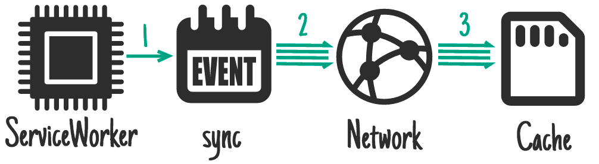
  <figcaption class="w-figcaption">On background-sync.</figcaption>
</figure>

[Background sync](/web/updates/2015/12/background-sync) is another feature built on top of
Service Worker. It allows you to request background data synchronization as a one-off, or on an
(extremely heuristic) interval. This happens even when the user doesn't have a tab open to your
site. Only the Service Worker is woken up. You request permission to do this from a page and the user
will be prompted.

**Ideal for:** non-urgent updates, especially those that happen so regularly that a push message per
update would be too frequent for users, such as social timelines or news articles.

```js
self.addEventListener('sync', function (event) {
  if (event.id == 'update-leaderboard') {
    event.waitUntil(
      caches.open('mygame-dynamic').then(function (cache) {
        return cache.add('/leaderboard.json');
      }),
    );
  }
});
```

## Cache persistence {: #cache-persistence }

Your origin is given a certain amount of free space to do what it wants with. That free space is
shared between all origin storage:
[(local) Storage](https://developer.mozilla.org/en-US/docs/Web/API/Storage),
[IndexedDB](https://developer.mozilla.org/en-US/docs/Glossary/IndexedDB),
[File System Access](/file-system-access/), and of course
[Caches](https://developer.mozilla.org/en-US/docs/Web/API/Cache).

The amount you get isn't spec'd. It will differ depending on device and storage conditions. You can
find out how much you've got via:

```js
navigator.storageQuota.queryInfo('temporary').then(function (info) {
  console.log(info.quota);
  // Result: <quota in bytes>
  console.log(info.usage);
  // Result: <used data in bytes>
});
```

However, like all browser storage, the browser is free to throw away your data if the device comes
under storage pressure. Unfortunately the browser can't tell the difference between those movies you
want to keep at all costs, and the game you don't really care about.

To work around this, use the
[StorageManager](https://developer.mozilla.org/en-US/docs/Web/API/StorageManager) interface:

```js
// From a page:
navigator.storage.persist()
.then(function(persisted) {
  if (persisted) {
    // Hurrah, your data is here to stay!
  } else {
   // So sad, your data may get chucked. Sorry.
});
```

Of course, the user has to grant permission.  For this, use the Permissions API.

Making the user part of this flow is important, as we
can now expect them to be in control of deletion. If their device comes under storage pressure, and
clearing non-essential data doesn't solve it, the user gets to judge which items to keep and
remove.

For this to work, it requires operating systems to treat "durable" origins as equivalent to platform-specific
apps in their breakdowns of storage usage, rather than reporting the browser as a single item.

## Serving Suggestions—responding to requests {: #serving-suggestions }

It doesn't matter how much caching you do, the service worker won't use the cache unless you tell it
when and how. Here are a few patterns for handling requests:

### Cache only {: #cache-only }

<figure class="w-figure">
  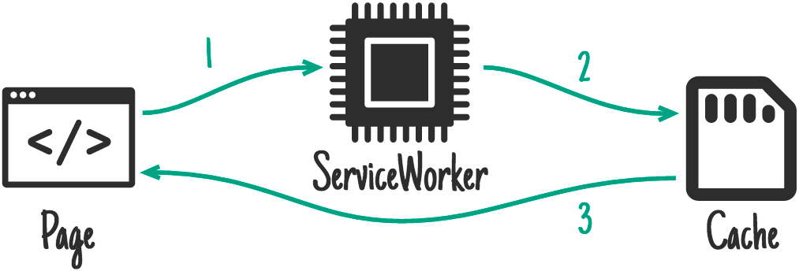
  <figcaption class="w-figcaption">Cache only.</figcaption>
</figure>

**Ideal for:** anything you'd consider static to a particular "version" of your site. You should
have cached these in the install event, so you can depend on them being there.

```js
self.addEventListener('fetch', function (event) {
  // If a match isn't found in the cache, the response
  // will look like a connection error
  event.respondWith(caches.match(event.request));
});
```

…although you don't often need to handle this case specifically,
[Cache, falling back to network](#cache-falling-back-to-network) covers it.

### Network only {: #network-only }

<figure class="w-figure">
  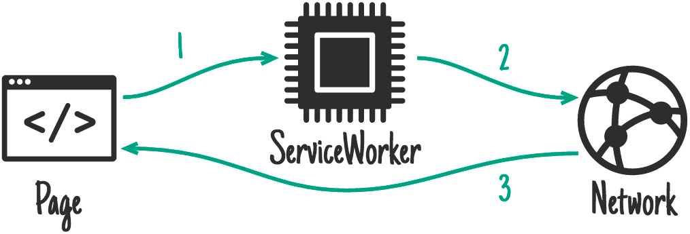
  <figcaption class="w-figcaption">Network only.</figcaption>
</figure>

**Ideal for:** things that have no offline equivalent, such as analytics pings, non-GET requests.

```js
self.addEventListener('fetch', function (event) {
  event.respondWith(fetch(event.request));
  // or simply don't call event.respondWith, which
  // will result in default browser behavior
});
```

…although you don't often need to handle this case specifically,
[Cache, falling back to network](#cache-falling-back-to-network) covers it.

### Cache, falling back to network {: #cache-falling-back-to-network }

<figure class="w-figure">
  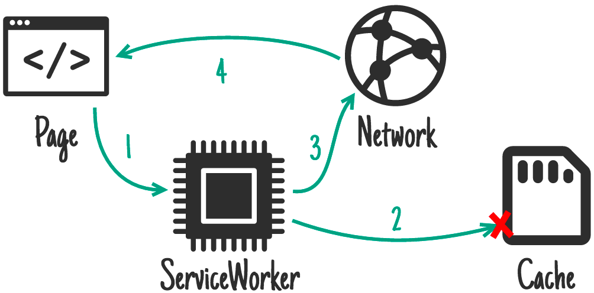
  <figcaption class="w-figcaption">Cache, falling back to network.</figcaption>
</figure>

**Ideal for:** building offline-first. In such cases, this is how you'll handle the majority of
requests. Other patterns will be exceptions based on the incoming request.

```js
self.addEventListener('fetch', function (event) {
  event.respondWith(
    caches.match(event.request).then(function (response) {
      return response || fetch(event.request);
    }),
  );
});
```

This gives you the "cache only" behavior for things in the cache and the "network only" behavior
for anything not-cached (which includes all non-GET requests, as they cannot be cached).

### Cache and network race {: #cache-and-network-race }

<figure class="w-figure">
  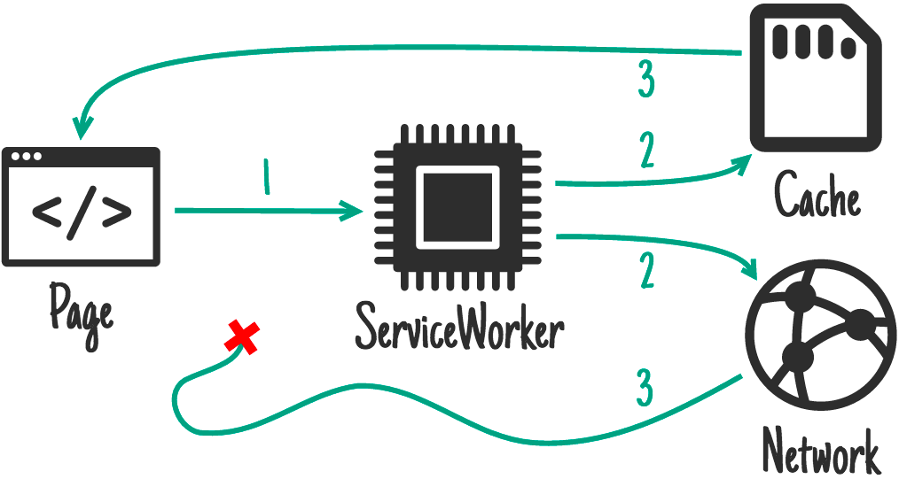
  <figcaption class="w-figcaption">Cache and network race.</figcaption>
</figure>

**Ideal for:** small assets where you're chasing performance on devices with slow disk access.

With some combinations of older hard drives, virus scanners, and faster internet connections,
getting resources from the network can be quicker than going to disk. However, going to the network
when the user has the content on their device can be a waste of data, so bear that in mind.

```js
// Promise.race is no good to us because it rejects if
// a promise rejects before fulfilling. Let's make a proper
// race function:
function promiseAny(promises) {
  return new Promise((resolve, reject) => {
    // make sure promises are all promises
    promises = promises.map((p) => Promise.resolve(p));
    // resolve this promise as soon as one resolves
    promises.forEach((p) => p.then(resolve));
    // reject if all promises reject
    promises.reduce((a, b) => a.catch(() => b)).catch(() => reject(Error('All failed')));
  });
}

self.addEventListener('fetch', function (event) {
  event.respondWith(promiseAny([caches.match(event.request), fetch(event.request)]));
});
```

### Network falling back to cache {: #network-falling-back-to-cache }

<figure class="w-figure">
  
  <figcaption class="w-figcaption">Network falling back to cache.</figcaption>
</figure>

**Ideal for:** a quick-fix for resources that update frequently, outside of the "version" of the
site. E.g. articles, avatars, social media timelines, and game leader boards.

This means you give online users the most up-to-date content, but offline users get an older cached
version. If the network request succeeds you'll most likely want to
[update the cache entry](#on-network-response).

However, this method has flaws. If the user has an intermittent or slow connection they'll have to
wait for the network to fail before they get the perfectly acceptable content already on their
device. This can take an extremely long time and is a frustrating user experience. See the next
pattern, [Cache then network](#cache-then-network), for a better solution.

```js
self.addEventListener('fetch', function (event) {
  event.respondWith(
    fetch(event.request).catch(function () {
      return caches.match(event.request);
    }),
  );
});
```

### Cache then network {: #cache-then-network }

<figure class="w-figure">
  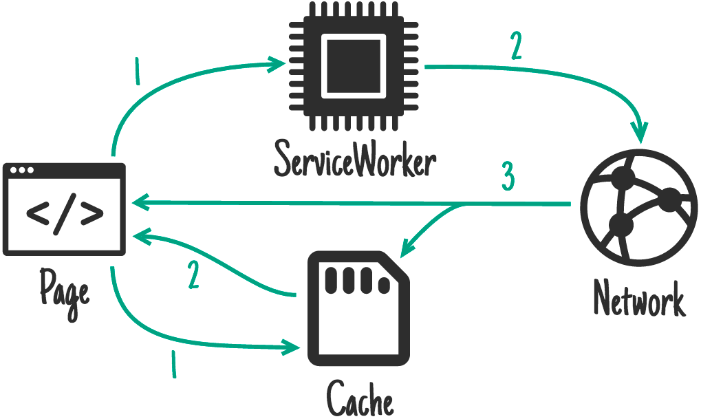
  <figcaption class="w-figcaption">Cache then network.</figcaption>
</figure>

**Ideal for:** content that updates frequently. E.g. articles, social media timelines, and games.
leaderboards.

This requires the page to make two requests, one to the cache, and one to the network. The idea is to
show the cached data first, then update the page when/if the network data arrives.

Sometimes you can just replace the current data when new data arrives (e.g. game leaderboard), but
that can be disruptive with larger pieces of content. Basically, don't "disappear" something the
user may be reading or interacting with.

Twitter adds the new content above the old content and adjusts the scroll position so the user is
uninterrupted. This is possible because Twitter mostly retains a mostly-linear order to content. I
copied this pattern for [trained-to-thrill][ttt] to get content on screen as fast as possible, while
displaying up-to-date content as soon as it arrives.

**Code in the page:**

```js
var networkDataReceived = false;

startSpinner();

// fetch fresh data
var networkUpdate = fetch('/data.json')
  .then(function (response) {
    return response.json();
  })
  .then(function (data) {
    networkDataReceived = true;
    updatePage(data);
  });

// fetch cached data
caches
  .match('/data.json')
  .then(function (response) {
    if (!response) throw Error('No data');
    return response.json();
  })
  .then(function (data) {
    // don't overwrite newer network data
    if (!networkDataReceived) {
      updatePage(data);
    }
  })
  .catch(function () {
    // we didn't get cached data, the network is our last hope:
    return networkUpdate;
  })
  .catch(showErrorMessage)
  .then(stopSpinner);
```

**Code in the Service Worker:**

You should always go to the network and update a cache as you go.

```js
self.addEventListener('fetch', function (event) {
  event.respondWith(
    caches.open('mysite-dynamic').then(function (cache) {
      return fetch(event.request).then(function (response) {
        cache.put(event.request, response.clone());
        return response;
      });
    }),
  );
});
```

In [trained-to-thrill][ttt] I worked around this by using
[XHR instead of fetch](https://github.com/jakearchibald/trained-to-thrill/blob/3291dd40923346e3cc9c83ae527004d502e0464f/www/static/js-unmin/utils.js#L3),
and abusing the Accept header to tell the Service Worker where to get the result from
([page code](https://github.com/jakearchibald/trained-to-thrill/blob/3291dd40923346e3cc9c83ae527004d502e0464f/www/static/js-unmin/index.js#L70),
[Service Worker code](https://github.com/jakearchibald/trained-to-thrill/blob/3291dd40923346e3cc9c83ae527004d502e0464f/www/static/js-unmin/sw/index.js#L61)).

### Generic fallback {: #generic-fallback }

<figure class="w-figure">
  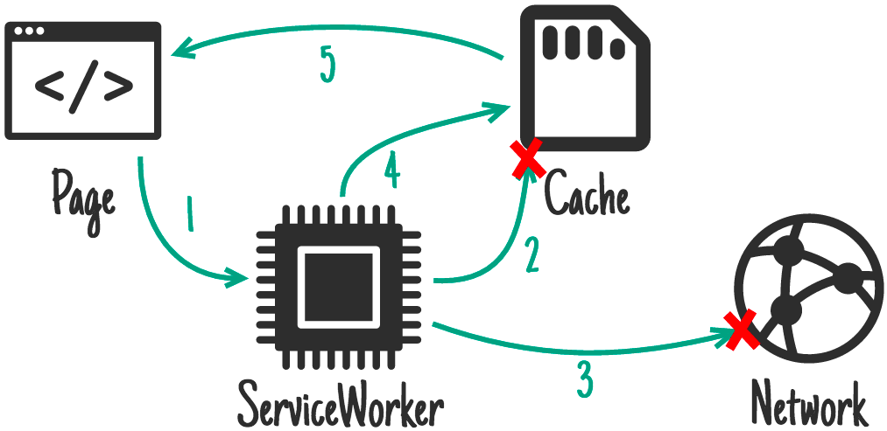
  <figcaption class="w-figcaption">Generic fallback.</figcaption>
</figure>

If you fail to serve something from the cache and/or network you may want to provide a generic
fallback.

**Ideal for:** secondary imagery such as avatars, failed POST requests, and an "Unavailable while offline".
page.

```js
self.addEventListener('fetch', function (event) {
  event.respondWith(
    // Try the cache
    caches
      .match(event.request)
      .then(function (response) {
        // Fall back to network
        return response || fetch(event.request);
      })
      .catch(function () {
        // If both fail, show a generic fallback:
        return caches.match('/offline.html');
        // However, in reality you'd have many different
        // fallbacks, depending on URL and headers.
        // Eg, a fallback silhouette image for avatars.
      }),
  );
});
```

The item you fallback to is likely to be an [install dependency](#on-install-as-dependency).

If your page is posting an email, your service worker may fall back to storing the email in an IndexedDB
'outbox' and respond by letting the page know that the send failed but the data was successfully
retained.

### Service worker-side templating {: #Service Worker-side-templating }

<figure class="w-figure">
  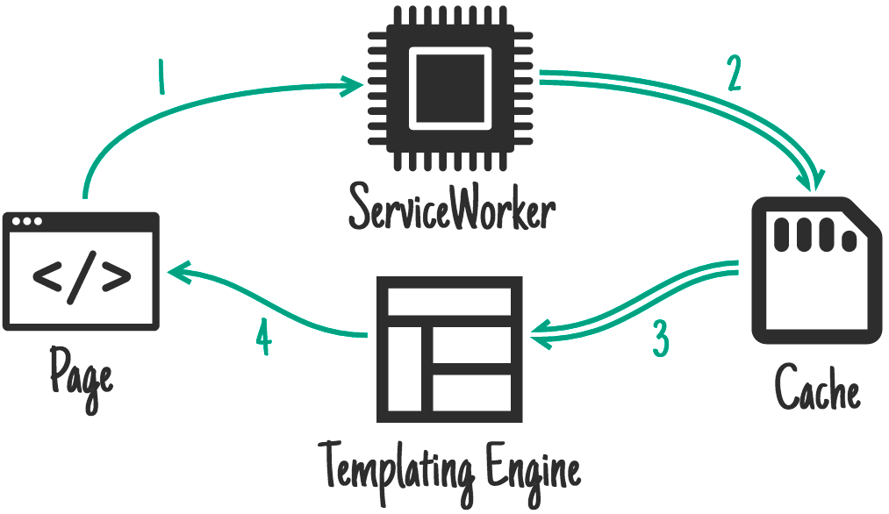
  <figcaption class="w-figcaption">ServiceWorker-side templating.</figcaption>
</figure>

**Ideal for:** pages that cannot have their server response cached.

[Rendering pages on the server makes things fast](https://jakearchibald.com/2013/progressive-enhancement-is-faster/),
but that can mean including state data that may not make sense in a cache, e.g. "Logged in as…". If
your page is controlled by a service worker, you may instead choose to request JSON data along with a
template, and render that instead.

```js
importScripts('templating-engine.js');

self.addEventListener('fetch', function (event) {
  var requestURL = new URL(event.request.url);

  event.respondWith(
    Promise.all([
      caches.match('/article-template.html').then(function (response) {
        return response.text();
      }),
      caches.match(requestURL.path + '.json').then(function (response) {
        return response.json();
      }),
    ]).then(function (responses) {
      var template = responses[0];
      var data = responses[1];

      return new Response(renderTemplate(template, data), {
        headers: {
          'Content-Type': 'text/html',
        },
      });
    }),
  );
});
```

## Putting it together

You aren't limited to one of these methods. In fact, you'll likely use many of them depending on request
URL. For example, [trained-to-thrill][ttt] uses:

- [cache on install](#on-install-as-dependency), for the static UI and behavior
- [cache on network response](#on-network-response), for the Flickr images and data
- [fetch from cache, falling back to network](#cache-falling-back-to-network), for most requests
- [fetch from cache, then network](#cache-then-network), for the Flickr search results

Just look at the request and decide what to do:

```js
self.addEventListener('fetch', function (event) {
  // Parse the URL:
  var requestURL = new URL(event.request.url);

  // Handle requests to a particular host specifically
  if (requestURL.hostname == 'api.example.com') {
    event.respondWith(/* some combination of patterns */);
    return;
  }
  // Routing for local URLs
  if (requestURL.origin == location.origin) {
    // Handle article URLs
    if (/^\/article\//.test(requestURL.pathname)) {
      event.respondWith(/* some other combination of patterns */);
      return;
    }
    if (/\.webp$/.test(requestURL.pathname)) {
      event.respondWith(/* some other combination of patterns */);
      return;
    }
    if (request.method == 'POST') {
      event.respondWith(/* some other combination of patterns */);
      return;
    }
    if (/cheese/.test(requestURL.pathname)) {
      event.respondWith(
        new Response('Flagrant cheese error', {
          status: 512,
        }),
      );
      return;
    }
  }

  // A sensible default pattern
  event.respondWith(
    caches.match(event.request).then(function (response) {
      return response || fetch(event.request);
    }),
  );
});
```

…you get the picture.

### Credits

…for the lovely icons:

- [Code](http://thenounproject.com/term/code/17547/) by buzzyrobot
- [Calendar](http://thenounproject.com/term/calendar/4672/) by Scott Lewis
- [Network by](http://thenounproject.com/term/network/12676/) Ben Rizzo
- [SD](http://thenounproject.com/term/sd-card/6185/) by Thomas Le Bas
- [CPU](http://thenounproject.com/term/cpu/72043/) by iconsmind.com
- [Trash](http://thenounproject.com/term/trash/20538/) by trasnik
- [Notification](http://thenounproject.com/term/notification/32514/) by @daosme
- [Layout](http://thenounproject.com/term/layout/36872/) by Mister Pixel
- [Cloud](http://thenounproject.com/term/cloud/2788/) by P.J. Onori

And thanks to [Jeff Posnick](https://twitter.com/jeffposnick) for catching many howling errors
before I hit "publish".

### Further reading

- [Service Workers—an Introduction][sw_primer]
- [Is Service Worker ready?][is_sw_ready]—track the implementation status across the main browsers
- [JavaScript Promises—an Introduction](/web/fundamentals/getting-started/primers/promises) - guide
  to promises

[ttt]: https://jakearchibald.github.io/trained-to-thrill/
[is_sw_ready]: https://jakearchibald.github.io/isserviceworkerready/
[sw_primer]: /service-workers-cache-storage/
[caches_api]: https://developer.mozilla.org/en-US/docs/Web/API/Cache
