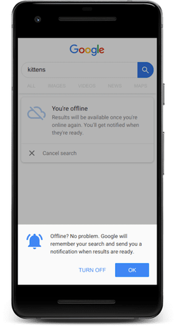



Even in locations with fast networks a user might lose connection or connect to a flaky network, at some moments of the day.
For example: a user is on the subway searching on the phone for a product on an e-commerce website. They type the product name, click the "search" button, and while waiting for the results, the connection is lost, leading to the standard browser offline page.

As a result, unless the user decides to come back to the site later, and repeat the same task, the site might lose a potential transaction and customer.

To provide a more resilient search experience in these cases you can use the [Background Sync API](https://developers.google.com/web/updates/2015/12/background-sync), which persists failed queries so they can be retried once the connection is recovered. This technique, in combination with [Web Push Notifications](https://developers.google.com/web/fundamentals/push-notifications) lets you inform the user of the search results, allowing you to keep them engaged with your service.


  Try the [Building resilient search experiences with Workbox](/codelab-building-resilient-search-experiences)
  for a hands-on demonstration of the ideas explained in this guide.


## Production case

For concrete application of this technique let's take a look at Google Search for Chrome in Android.
When visiting the Google Search web app and going offline, instead of showing the standard network error page, the site serves a custom offline response, but allows users to enter their search query immediately.
The page also prompts the user to opt-in for notifications, to receive a link to the search results page once the connection is recovered.

<figure class="w-figure">
  
</figure>

When the user performs a search, the service worker allows the query to be deferred and sent to Google's servers as soon as the device goes back online by using the [Background Sync API](https://developers.google.com/web/updates/2015/12/background-sync), and to inform the user of the result by using the [Push API](https://developer.mozilla.org/en-US/docs/Web/API/Push_API).



Service workers allow Google Search to provide a [meaningful offline experience](/google-search-sw/#meaningful-offline-experience) and keep the user engaged, letting them complete their task.

## Implement resilient search experiences with Workbox

While Google Search implements this functionality without using Workbox, the [Workbox library](https://developers.google.com/web/tools/workbox) makes it easier by providing a [Background Sync module](https://developers.google.com/web/tools/workbox/modules/workbox-background-sync), which takes care of many implementation details for us.



To implement a resilient search experience in Workbox, first, import the following modules in your service worker:

```javascript
import {BackgroundSyncPlugin} from 'workbox-background-sync';
import {registerRoute} from 'workbox-routing';
import {NetworkOnly} from 'workbox-strategies';
```

Next, create an instance of the [workbox.backgroundSync plugin](https://developers.google.com/web/tools/workbox/reference-docs/v4/workbox.backgroundSync.Plugin), to automatically add failed requests to a queue, so they can be retried later:

```javascript
const bgSyncPlugin = new workbox.backgroundSync.Plugin('offlineQueryQueue', {
  maxRetentionTime: 60,
  onSync: async ({queue}) => {
    let entry;
    while ((entry = await queue.shiftRequest())) {
      try {
        const response = await fetch(entry.request);
        const cache = await caches.open('offline-search-responses');
        const offlineUrl = `${entry.request.url}&notification=true`;
        cache.put(offlineUrl, response);
        showNotification(offlineUrl);
      } catch (error) {
        await this.unshiftRequest(entry);
        throw error;
      }
    }
  },
});
```

The plugin receives the following parameters:

- `offlineQueryQueue`: The name of the queue that will be used to persist the failed requests in [IndexedDB](https://developer.mozilla.org/en-US/docs/Web/API/IndexedDB_API).
- `maxRetentionTime`: The amount of time in minutes a request may be retried, after which point they will be discarded.
- `onSync`: The callback that will be triggered when the connection is recovered. At that point, each failed request can be dequeued and processed, by calling `queue.shiftRequest()`.

Finally, define a [networkOnly](https://developers.google.com/web/tools/workbox/modules/workbox-strategies#network_only) runtime caching strategy for requests to the search URL (e.g. `/search_action`) and pass it the `bgSyncPlugin` defined previously:

```javascript
workbox.routing.registerRoute(
  matchSearchUrl,
  new workbox.strategies.NetworkOnly({
        plugins: [bgSyncPlugin]
  })
);
```

This tells Workbox to always go to the network when the service worker intercepts a request for the search endpoint, and to delegate to the Background Sync plugin the task of managing offline scenarios.

As a result, when the user goes offline while searching, the query is automatically saved. When the connection is recovered the offline logic is triggered to process the request and inform the user of the result.

## Conclusion

In this article you learned how to implement a search experience capable of responding gracefully to offline scenarios, by combining the [Background Sync API](https://developers.google.com/web/updates/2015/12/background-sync) and the [Push API](https://developer.mozilla.org/en-US/docs/Web/API/Push_API).
We used Workbox to show how to implement this feature, as it simplifies the process, but the same can be achieved by writing vanilla service worker code.

In the code samples we focused on the core part of the feature: how requests are intercepted and managed by the service worker. For a step-by-step guide on how to implement this functionality, including the offline page and the notification logic, check out the codelab at the end of this article.
