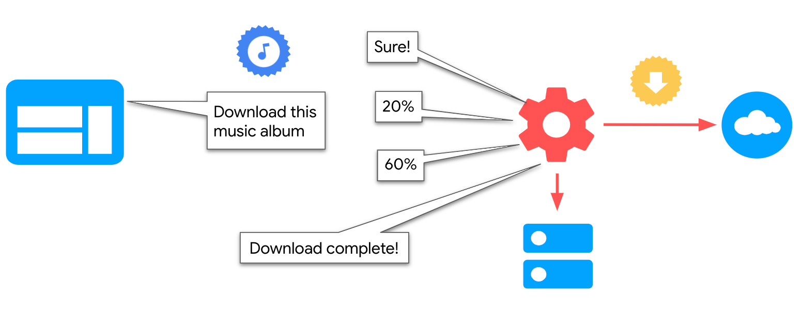
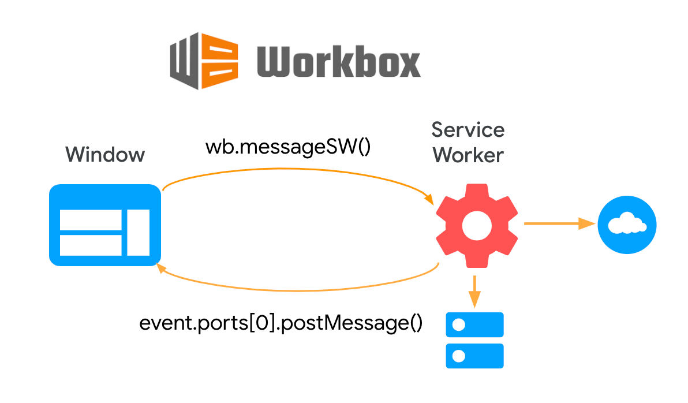
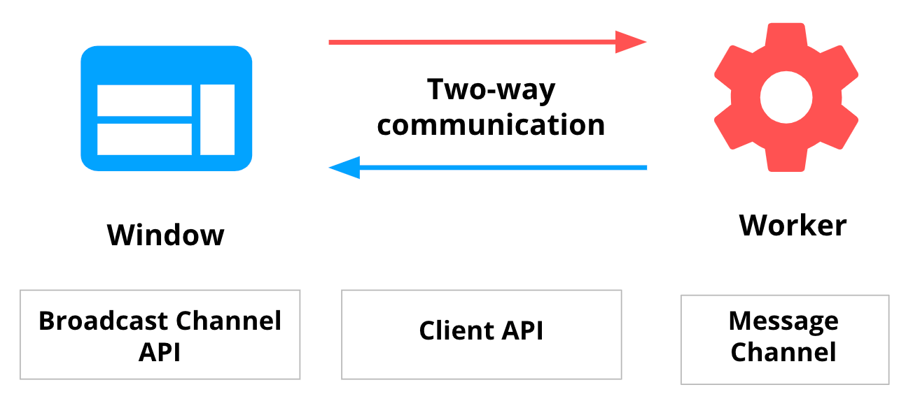
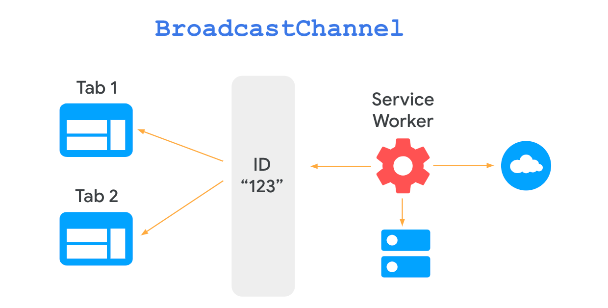
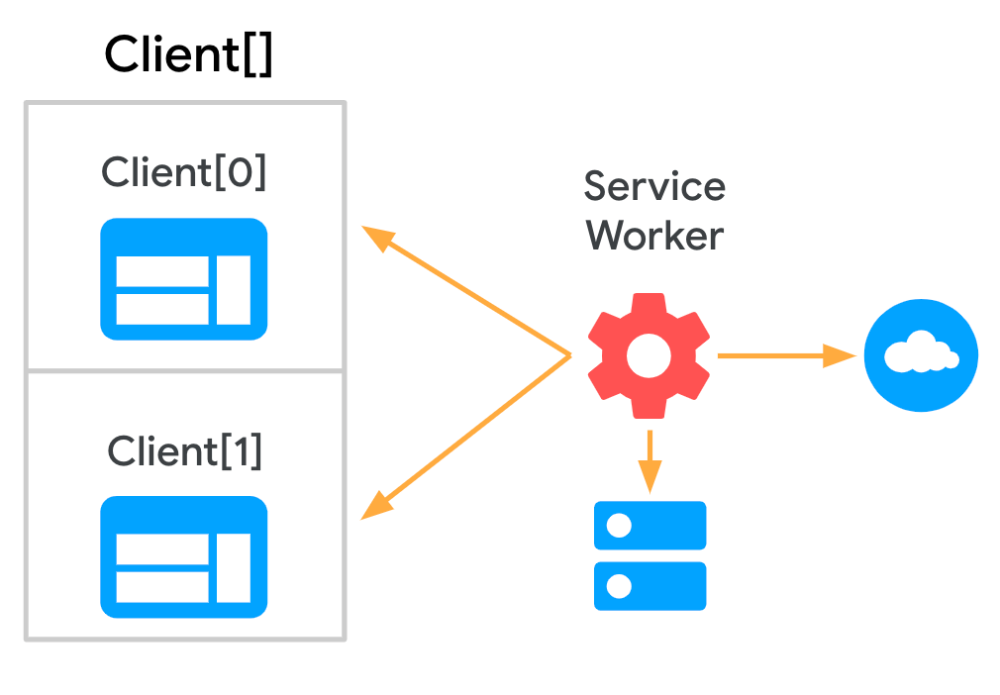
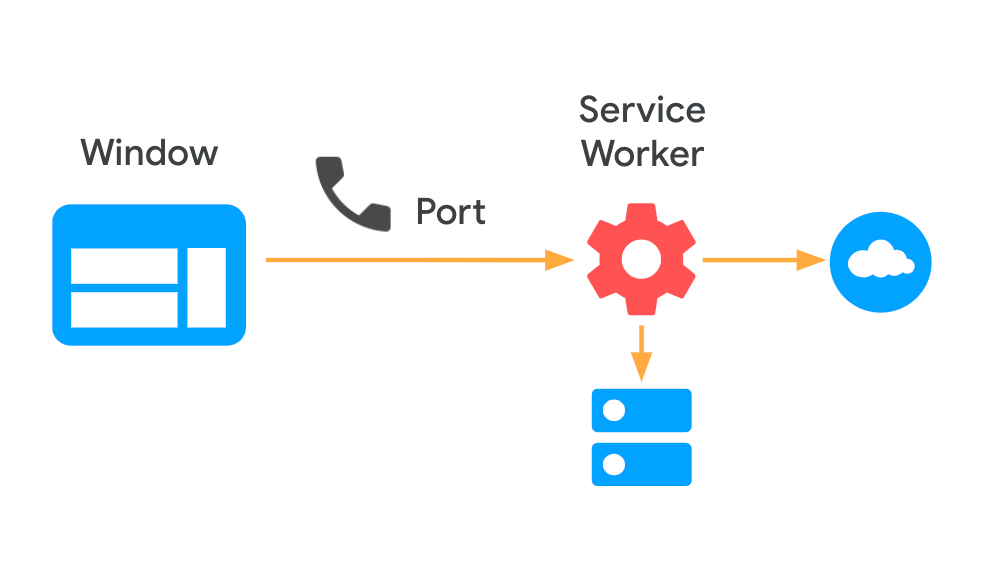
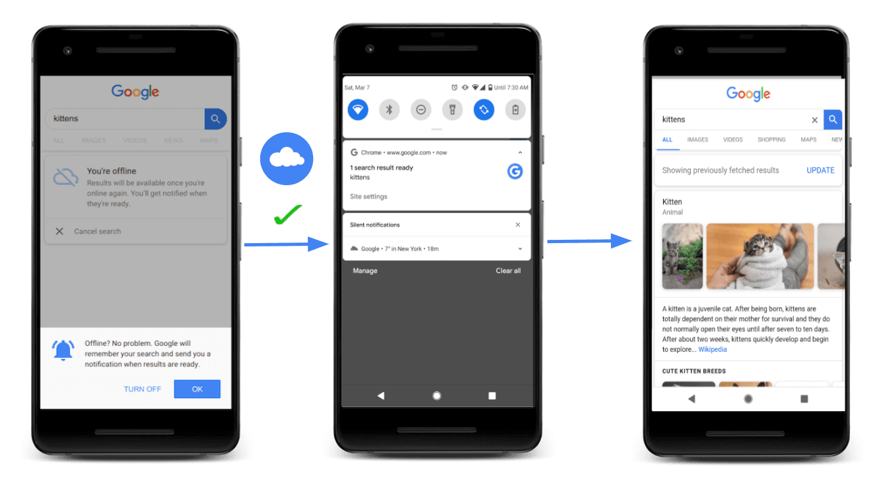
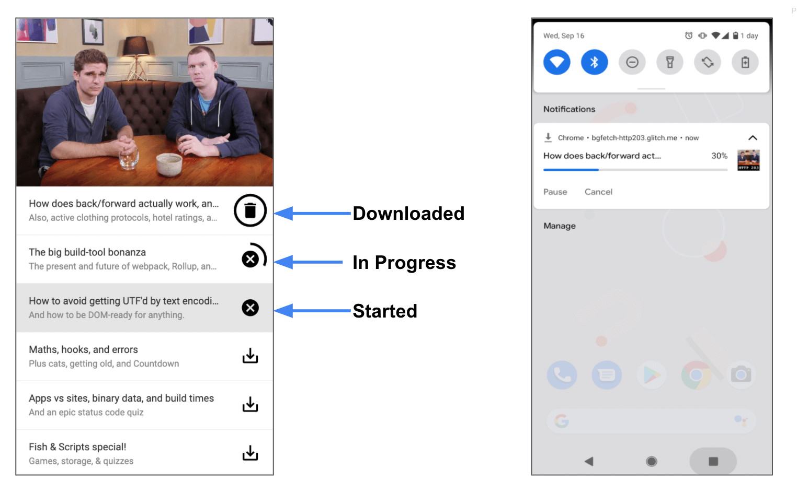

In some cases, a web app might need to establish a **two-way** communication channel between the
page and the service worker.

For example: in a podcast PWA one could build a feature to let the user [download episodes for
offline consumption](/app-like-pwas/#proactive-background-downloading) and allow the
service worker to keep the page regularly informed about the progress, so the [main
thread](https://developer.mozilla.org/en-US/docs/Glossary/Main_thread) can update the UI.

In this guide we'll explore the different ways of implementing a **two-way** communication between
the [Window](https://developer.mozilla.org/en-US/docs/Web/API/Window) and [service
worker](https://developer.mozilla.org/en-US/docs/Web/API/Service_Worker_API) context, by exploring
different APIs, the [Workbox library](https://developers.google.com/web/tools/workbox), as well as
some advanced cases.

<figure class="w-figure">
  
</figure>


  Check out [Workers overview](/workers-overview/) for a high-level explanation
  of when to use web workers versus service workers and the rest of the
  [Communicate with workers](/reliable/#communicate-with-workers) series
  for guides on other common use cases.


## Using Workbox {: #using-workbox }

[`workbox-window`](https://developers.google.com/web/tools/workbox/modules/workbox-window) is a set of
modules of the [Workbox library](https://developers.google.com/web/tools/workbox) that are intended
to run in the window context. The [`Workbox`
](https://developers.google.com/web/tools/workbox/reference-docs/latest/module-workbox-window.Workbox) class provides a `messageSW()` method to send a message to the instance's registered service worker and
await a response.

The following page code creates a new `Workbox` instance and sends a message to the service worker
to obtain its version:

```javascript
const wb = new Workbox('/sw.js');
wb.register();

const swVersion = await wb.messageSW({type: 'GET_VERSION'});
console.log('Service Worker version:', swVersion);
```

The service worker implements a message listener on the other end, and responds to the registered
service worker:

```javascript
const SW_VERSION = '1.0.0';

addEventListener('message', (event) => {
  if (event.data.type === 'GET_VERSION') {
    event.ports[0].postMessage(SW_VERSION);
  }
});
```

Under the hood the library uses a browser API that we'll review in the next section: [Message
Channel](https://developer.mozilla.org/en-US/docs/Web/API/Channel_Messaging_API), but abstracts many
implementation details, making it easier to use, while leveraging the [wide browser
support](https://caniuse.com/mdn-api_messagechannel_port1) this API has.

<figure class="w-figure">
  
</figure>

## Using Browser APIs {: #using-browser-apis }

If the Workbox library is not enough for your needs, there are several lower-level APIs available to
implement **"two-way"** communication between pages and service workers. They have some similarities
and differences:

Similarities:

- In all cases the communication starts on one end via the `postMessage()` interface and is received
  on the other end by implementing a `message` handler.
- In practice, all the available APIs allow us to implement the same use cases, but some of them
  might simplify development in some scenarios.

Differences:

- They have different ways of identifying the other side of the communication: some of them use an
  explicit reference to the other context, while others can communicate implicitly via a proxy
  object instantiated on each side.
- Browser support varies among them.

<figure class="w-figure">
  
</figure>

### Broadcast Channel API {: #broadcast-channel-api }

The [Broadcast Channel API](https://developer.mozilla.org/en-US/docs/Web/API/Broadcast_Channel_API)
allows basic communication between browsing contexts via [BroadcastChannel
objects](https://developer.mozilla.org/en-US/docs/Web/API/BroadcastChannel).

To implement it, first, each context has to instantiate a `BroadcastChannel` object with the same ID
and send and receive messages from it:

```javascript
const broadcast = new BroadcastChannel('channel-123');
```

The BroadcastChannel object exposes a `postMessage()` interface to send a message to any listening
context:

```javascript
//send message
broadcast.postMessage({ type: 'MSG_ID', });
```

Any browser context can listen to messages via the `onmessage` method of the `BroadcastChannel`
object:

```javascript
//listen to messages
broadcast.onmessage = (event) => {
  if (event.data && event.data.type === 'MSG_ID') {
    //process message...
  }
};
```

As seen, there's no explicit reference to a particular context, so there's no need of obtaining a
reference first to the service worker or any particular client.

<figure class="w-figure">
  
</figure>

The disadvantage is that, at the moment of this writing, the API has support from Chrome, Firefox
and Edge, but other browsers, like Safari, [don't support it
yet](https://caniuse.com/?search=broadcastchannel).

### Client API {: #channel-api }

The [Client API](https://developer.mozilla.org/en-US/docs/Web/API/Client) allows you to obtain a
reference to all the [`WindowClient`](https://developer.mozilla.org/en-US/docs/Web/API/WindowClient) objects representing the active tabs that the service worker is controlling.

Since the page is controlled by a single service worker, it listens to and sends messages to the
active service worker directly via the `serviceWorker` interface:

```javascript
//send message
navigator.serviceWorker.controller.postMessage({
  type: 'MSG_ID',
});

//listen to messages
navigator.serviceWorker.onmessage = (event) => {
  if (event.data && event.data.type === 'MSG_ID') {
    //process response
  }
};
```

Similarly, the service worker listens to messages by implementing an `onmessage` listener:

```javascript
//listen to messages
self.addEventListener('message', (event) => {
  if (event.data && event.data.type === 'MSG_ID') {
    //Process message
  }
});
```

To communicate back with any of its clients, the service worker obtains an array of
[`WindowClient`](https://developer.mozilla.org/en-US/docs/Web/API/WindowClient) objects by executing
methods such as
[`Clients.matchAll()`](https://developer.mozilla.org/en-US/docs/Web/API/Clients/matchAll) and
[`Clients.get()`](https://developer.mozilla.org/en-US/docs/Web/API/Clients/get). Then it can
`postMessage()` any of them:

```javascript
//Obtain an array of Window client objects
self.clients.matchAll(options).then(function (clients) {
  if (clients && clients.length) {
    //Respond to last focused tab
    clients[0].postMessage({type: 'MSG_ID'});
  }
});
```

<figure class="w-figure">
  
</figure>

`Client API` is a good option to communicate easily with all the active tabs from a service worker
in a relatively straightforward way. The API is supported by [all major
browsers](https://wpt.fyi/results/service-workers/service-worker/client-id.https.html?label=experimental&label=master&aligned),
but not all its methods might be available, so make sure to check browser support before
implementing it in your site.

 In this guide we focus mostly on reliability use cases. Another interesting usage of
this API is synchronizing data across documents via a service worker. Check out [this episode of
HTTP 203](https://www.youtube.com/watch?v=9UNwHmagedE&feature=youtu.be&t=697) to know more about it.


### Message Channel {: #message-channel }

[Message Channel](https://developer.mozilla.org/en-US/docs/Web/API/Channel_Messaging_API) requires
defining and passing a port from one context to another to establish a **two-way** communication
channel.

To initialize the channel, the page instantiates a [`MessageChannel`](https://developer.mozilla.org/en-US/docs/Web/API/MessageChannel/MessageChannel) object and uses it
to send a port to the registered service worker. The page also implements an `onmessage` listener on
it to receive messages from the other context:

```javascript
const messageChannel = new MessageChannel();

//Init port
navigator.serviceWorker.controller.postMessage({type: 'PORT_INITIALIZATION'}, [
  messageChannel.port2,
]);

//Listen to messages
messageChannel.port1.onmessage = (event) => {
  // Process message
};
```

<figure class="w-figure">
  
</figure>

The service worker receives the port, saves a reference to it and uses it to send a message to the other
side:

```javascript
let communicationPort;

//Save reference to port
self.addEventListener('message', (event) => {
  if (event.data && event.data.type === 'PORT_INITIALIZATION') {
    communicationPort = event.ports[0];
  }
});

//Send messages
communicationPort.postMessage({type: 'MSG_ID'});
```

`MessageChannel` is currently supported by [all major
browsers](https://caniuse.com/?search=channel).

### Advanced APIs: Background Sync and Background Fetch {: #advanced-apis:-background-sync-and-background-fetch }

In this guide we explored ways of implementing **two-way** communication techniques, for relatively
simple cases, like passing a string message describing the operation to perform, or a list of URLs
to cache from one context to the other. In this section we'll explore two APIs to handle specific
scenarios: lack of connectivity and long downloads.

#### Background Sync {: #background-sync }

A chat app might want to make sure that messages are never lost due to bad connectivity. The
[Background Sync API](https://developers.google.com/web/updates/2015/12/background-sync) lets you
defer actions to be retried when the user has stable connectivity. This is useful for ensuring that
whatever the user wants to send, is actually sent.

Instead of the `postMessage()` interface, the page registers a `sync`:

```javascript
navigator.serviceWorker.ready.then(function (swRegistration) {
  return swRegistration.sync.register('myFirstSync');
});
```

The service worker then listens for the `sync` event to process the message:

```javascript
self.addEventListener('sync', function (event) {
  if (event.tag == 'myFirstSync') {
    event.waitUntil(doSomeStuff());
  }
});
```

The function `doSomeStuff()` should return a promise indicating the success/failure of whatever it's
trying to do. If it fulfills, the sync is complete. If it fails, another sync will be scheduled to
retry. Retry syncs also wait for connectivity, and employ an exponential back-off.

Once the operation has been performed, the service worker can then communicate back with the page to
update the UI, by using any of the communication APIs explored earlier.

Google search uses Background Sync to persist failed queries due to bad connectivity, and retry
them later when the user is online. Once the operation is performed, they communicate the result to
the user via a web push notification:

<figure class="w-figure">
  
</figure>

 Check out [Resilient search experiences
](/resilient-search-experiences/) to learn how to implement this feature using [Workbox Background
Sync](https://developers.google.com/web/tools/workbox/modules/workbox-background-sync). 

#### Background Fetch {: #background-fetch }

For relatively short bits of work like sending a message, or a list of URLs to cache, the options
explored so far are a good choice. If the task takes too long the browser will kill the service
worker, otherwise it's a risk to the user's privacy and battery.

The [Background Fetch API](https://developers.google.com/web/updates/2018/12/background-fetch)
allows you to offload a long task to a service worker, like downloading movies, podcasts, or levels
of a game.

To communicate to the service worker from the page, use `backgroundFetch.fetch`, instead of
`postMessage()`:

```javascript
navigator.serviceWorker.ready.then(async (swReg) => {
  const bgFetch = await swReg.backgroundFetch.fetch(
    'my-fetch',
    ['/ep-5.mp3', 'ep-5-artwork.jpg'],
    {
      title: 'Episode 5: Interesting things.',
      icons: [
        {
          sizes: '300x300',
          src: '/ep-5-icon.png',
          type: 'image/png',
        },
      ],
      downloadTotal: 60 * 1024 * 1024,
    },
  );
});
```

The `BackgroundFetchRegistration` object allows the page listen to the `progress` event to follow
the progress of the download:

```javascript
bgFetch.addEventListener('progress', () => {
  // If we didn't provide a total, we can't provide a %.
  if (!bgFetch.downloadTotal) return;

  const percent = Math.round(
    (bgFetch.downloaded / bgFetch.downloadTotal) * 100,
  );
  console.log(`Download progress: ${percent}%`);
});
```

<figure class="w-figure">
  
    <figcaption class="w-figcaption">The UI is updated to indicate the progress of a download (left). Thanks to service workers, the operation can continue running when all tabs have been closed (right).
    </figcaption>
</figure>

 Check out the [Background Fetch
guide](https://developers.google.com/web/updates/2018/12/background-fetch), which includes an
[example podcast app](https://bgfetch-http203.glitch.me/) along with its [Glitch
code](https://glitch.com/edit/#!/bgfetch-http203). 

## Next steps {: #next-steps }

In this guide we explored the most general case of communication between page and service workers
(bidirectional communication).

Many times, one might need only one context to communicate with the other, without receiving a
response. Check out the following guides for guidance how to implement unidirectional techniques in
your pages from and to the service worker, along with use cases and production examples:

- [Imperative caching guide](/imperative-caching-guide): Calling a service worker from the page to
  cache resources in advance (e.g. in prefetching scenarios).
- [Broadcast updates](/broadcast-updates-guide): Calling the page from the service worker to inform
  about important updates (e.g. a new version of the webapp is available).
