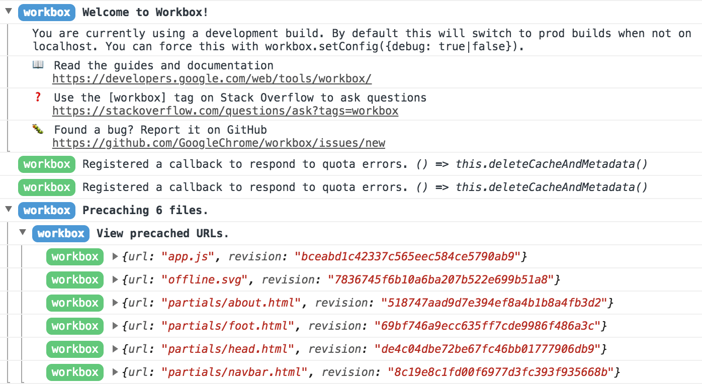

Two APIs play a crucial role in building reliable web apps:
[Service Worker](https://developer.mozilla.org/en-US/docs/Web/API/Service_Worker_API)
and [Cache Storage](https://developer.mozilla.org/en-US/docs/Web/API/Cache). But
using them effectively—without introducing subtle bugs or bumping into edge
cases—can be a challenge. For example, errors in your service worker code can
cause caching problems; users might be shown out-of-date content or broken
links.

[Workbox](https://developers.google.com/web/tools/workbox/) is a high-level
service worker toolkit built on top of the Service Worker and Cache Storage
APIs. It provides a production-ready set of libraries for adding offline support to
web apps. The toolkit is structured into two collections: tools that help manage
code that runs inside of your service worker, and tools that integrate with your
build process.

### Runtime code

This is the code that runs inside of your service worker script and controls how
it intercepts outgoing requests and interacts with the Cache Storage API.
Workbox has a
[dozen or so library modules in total](https://developers.google.com/web/tools/workbox/modules/),
that each handle a variety of specialized use cases. The most important modules
determine _whether_ the service worker will respond (known as
[routing](https://developers.google.com/web/tools/workbox/modules/workbox-routing)),
and _how_ it will respond (known as the
[caching strategy](https://developers.google.com/web/tools/workbox/modules/workbox-strategies)).

### Build integration

Workbox offers
[command line](https://developers.google.com/web/tools/workbox/modules/workbox-cli),
[Node.js module](https://developers.google.com/web/tools/workbox/modules/workbox-build),
and
[webpack plugin](https://developers.google.com/web/tools/workbox/modules/workbox-webpack-plugin)
tools that provide alternative ways to accomplish two things:

+  Create a service worker script based on a set of configuration
    options. The generated service worker uses Workbox's runtime libraries
    "under the hood" to put into action the caching strategies you configure.
+  Generate a list of URLs that should be
    "[precached](https://developers.google.com/web/tools/workbox/modules/workbox-precaching)",
    based on configurable patterns to include and exclude files generated
    during your build process.

## Why should you use Workbox?

Using Workbox when building your service worker is optional—there are a number
of guides out there that walk through
[common caching strategies](https://developers.google.com/web/fundamentals/instant-and-offline/offline-cookbook/)
from a "vanilla" service worker perspective. If you do decide to use Workbox,
here are some of its benefits.

### Cache management

Workbox handles cache updates for you, either tied in to your build process when
using precaching, or via configurable size/age policies when using runtime
caching. The underlying Cache Storage API is powerful, but it does not have any
built-in support for cache expiration. Tools like Workbox fill that gap.

### Extensive logging and error reporting

When you're getting started with service workers, figuring out _why_ something
is being cached (or, equally frustrating, why it _isn't_ cached) is a challenge.
Workbox automatically detects when you're running a development version of your
website on `localhost`, and turns on debug logging in your browser's JavaScript
console.



By following along with the log messages, you can get to the root of any
configuration or invalidation problems much more quickly than if you were going
it alone.

### A tested, cross-browser codebase

Workbox is developed against a cross-browser test suite, and when possible,
automatically falls back to alternative implementations of features that are
missing from certain browsers.

+  The
    [`workbox-broadcast-cache-update module`](https://developers.google.com/web/tools/workbox/modules/workbox-broadcast-cache-update)
    uses the
    [Broadcast Channel API](https://developer.mozilla.org/en-US/docs/Web/API/Broadcast_Channel_API)
    when available, and falls back to a
    [`postMessage()`](https://developer.mozilla.org/en-US/docs/Web/API/Window/postMessage)-based
    implementation on browsers that lack support.
+  The
    [workbox-background-sync module](https://developers.google.com/web/tools/workbox/modules/workbox-background-sync)
    uses the
    [Background Sync API](https://developers.google.com/web/updates/2015/12/background-sync)
    if possible, and if not, falls back to retrying queued events each time the
    service worker starts up.

## How should you use Workbox?

### Framework integration

If you're starting a new project from scratch, you can take advantage of the
Workbox integration found in many popular starter kits and add-on plugins:

+  [create-react-app](https://facebook.github.io/create-react-app/docs/making-a-progressive-web-app)
+  [vue-cli](https://github.com/vuejs/vue-cli/blob/dev/packages/%40vue/cli-plugin-pwa/README.md)
+  [preact-cli](https://github.com/prateekbh/preact-cli-workbox-plugin/blob/master/README.md)
+  [Gatsby](https://www.gatsbyjs.org/packages/gatsby-plugin-offline/)
+  [Next.js](https://github.com/hanford/next-offline/blob/master/readme.md)

### Add Workbox to your existing build process

If you already have a build process for your site in place, dropping in the
appropriate
[command line](https://developers.google.com/web/tools/workbox/modules/workbox-cli),
[Node.js module](https://developers.google.com/web/tools/workbox/modules/workbox-build),
or
[webpack plugin](https://developers.google.com/web/tools/workbox/modules/workbox-webpack-plugin)
tool may be all you need to start using Workbox.

In particular, the Workbox command line interface makes it easy to get up and
running, featuring a `wizard` mode that will check your local development
environment and suggest a reasonable default configuration that you could use
moving forward:

```bash
workbox wizard
? What is the root of your web app (i.e. which directory do you deploy)? src/
? Which file types would you like to precache? css, js, html
? Where would you like your service worker file to be saved? build/sw.js
? Where would you like to save these configuration options? workbox-config.js
```

To build your service worker, run `workbox generateSW workbox-config.js`
as part of a build process. See the [`generateSW` documentation](https://goo.gl/fdTQBf) for details.
You can further customize your service worker by making changes to `workbox-config.js`.
See the [documentation of the options](https://goo.gl/gVo87N) for details.


### Use Workbox at runtime in an existing service worker

If you have an existing service worker and want to try out Workbox's runtime
libraries,
[import Workbox from its official CDN](https://developers.google.com/web/tools/workbox/modules/workbox-sw#using_workbox_sw_via_cdn)
and start using it for runtime caching right away. Please note that this use
case means that you won't be able to take advantage of precaching (which
requires build-time integration), but it's great for prototyping and trying out
different caching strategies on the fly.

```js
// Replace 3.6.3 with the current version number of Workbox.
importScripts('https://storage.googleapis.com/workbox-cdn/releases/3.6.3/workbox-sw.js');

workbox.routing.registerRoute(
  new RegExp('\.png$'),
  workbox.strategies.cacheFirst({
    cacheName: 'images-cache',
  })
);
```
