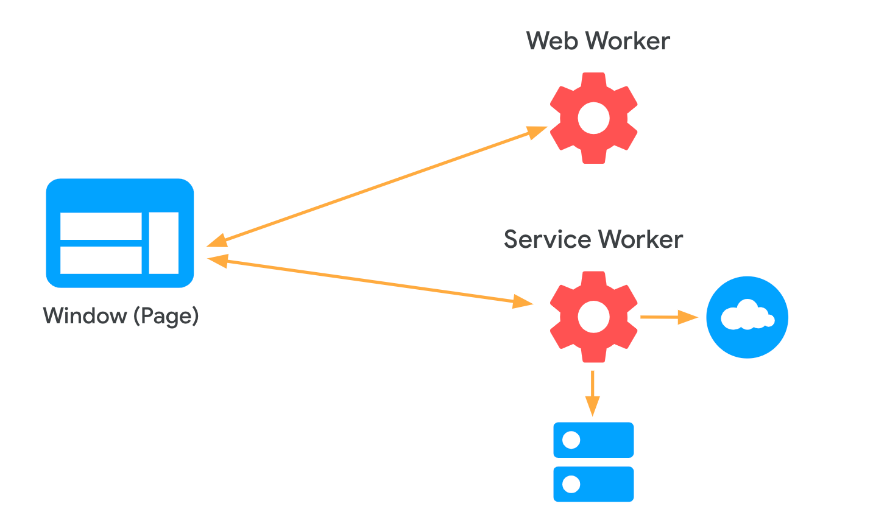
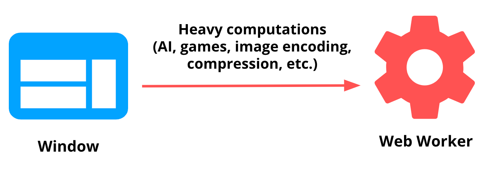
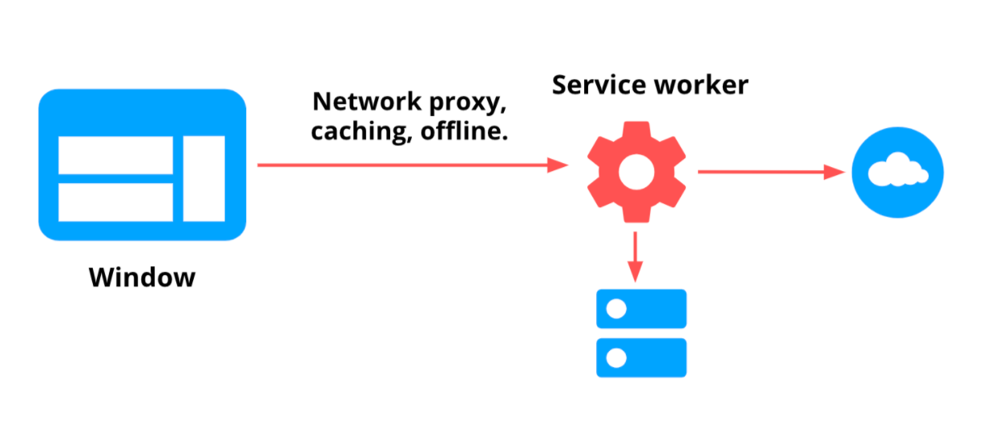
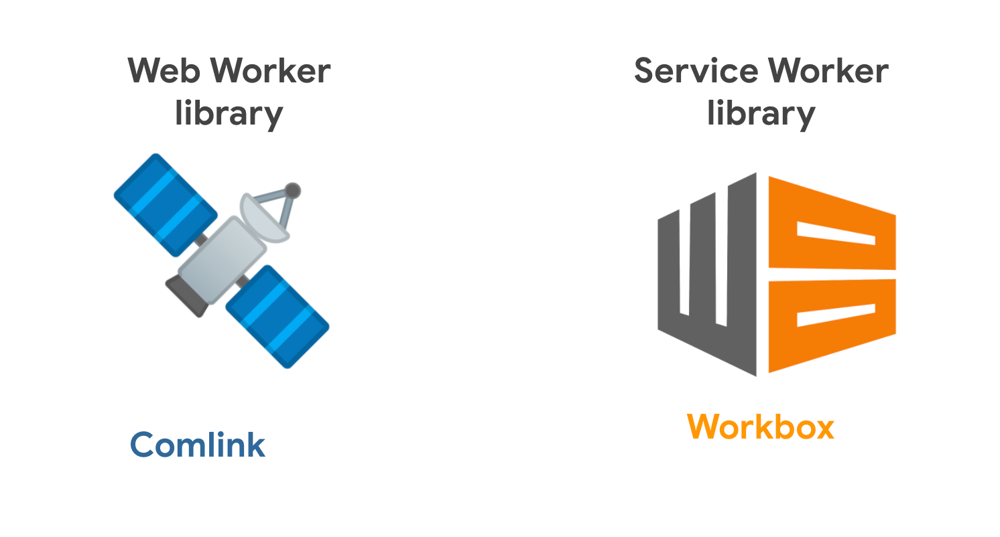

This overview explains how web workers and service workers can improve the performance of your website, and when to use a web worker versus a service worker. Check out the rest of [this series](#next-steps) for
specific patterns of window and service worker communication.

## How workers can improve your website {: #how-workers-can-improve-your-website }

The browser uses a single thread (the [main
thread](https://developer.mozilla.org/en-US/docs/Glossary/Main_thread)) to run all the JavaScript in
a web page, as well as to perform tasks like rendering the page and performing garbage collection.
Running excessive JavaScript code can block the main thread, delaying the browser from performing
these tasks and leading to a poor user experience.

In iOS/Android application development, a common pattern to ensure that the app's main thread
remains free to respond to user events is to offload operations to additional threads. In fact, in
the latest versions of Android, blocking the main thread for too long [leads to an app
crash](https://www.youtube.com/watch?v=eHjHlujp3Tg&feature=youtu.be&t=806).

On the web, JavaScript was designed around the concept of a single thread, and lacks capabilities
needed to implement a multithreading model like the one apps have, like shared memory.

Despite these limitations, a similar pattern can be achieved in the web by using
workers to run scripts in background
threads, allowing them to perform tasks without interfering with the main thread. Workers are an
entire JavaScript scope running on a separate thread, without any shared memory.

In this post you'll learn about two different types of workers (web workers and service workers), their similarities and differences, and the most common patterns for using them in production websites.

<figure class="w-figure">
  
</figure>

## Web workers and service workers {: #web-workers-and-service-workers }

### Similarities {: #similarities }

[Web workers](https://developer.mozilla.org/en-US/docs/Web/API/Web_Workers_API/Using_web_workers)
and [service
workers](https://developer.mozilla.org/en-US/docs/Web/API/Service_Worker_API/Using_Service_Workers)
are two types of workers available to websites. They have some things in common:

- Both run in a secondary thread, allowing JavaScript code to execute without blocking the main
  thread and the user interface.
- They don't have access to the [`Window`](https://developer.mozilla.org/en-US/docs/Web/API/Window)
  and [`Document`](https://developer.mozilla.org/en-US/docs/Web/API/Document) objects, so they can't
  interact with the DOM directly, and they have limited access to browser APIs.

### Differences {: #differences }

One might think that most things that can be delegated to a web worker can be done in a service
worker and vice versa, but there are important differences between them:

- Unlike web workers, service workers allow you to intercept network requests (via the
  [`fetch`](https://developer.mozilla.org/en-US/docs/Web/API/FetchEvent) event) and to listen for Push
  API events in the background (via the
  [`push`](https://developer.mozilla.org/en-US/docs/Web/API/PushEvent) event).
- A page can spawn multiple web workers, but a single service worker controls all the active tabs
  under the
  [scope](https://developer.mozilla.org/en-US/docs/Web/API/ServiceWorkerRegistration/scope) it was
  registered with.
- The lifespan of the web worker is tightly coupled to the tab it belongs to, while the [service
  worker's
  lifecycle](https://developers.google.com/web/fundamentals/primers/service-workers/lifecycle) is
  independent of it. For that reason, closing the tab where a web worker is running will terminate
  it, while a service worker can continue running in the background, even when the site doesn't have
  any active tabs open.

 For relatively short bits of work like sending a message, the browser won't likely
terminate a service worker when there are no active tabs, but if the task takes too long the browser
will terminate the service worker, otherwise it's a risk to the user's privacy and battery. APIs
like [Background Fetch](https://developers.google.com/web/updates/2018/12/background-fetch), that
can let you avoid the service worker's termination. 

## Use cases {: #use-cases }

The differences between both types of workers suggest in which situations one might want to use one
or the other:

**Use cases for web workers** are more commonly related to offloading work (like [heavy
computations](https://www.youtube.com/watch?v=mDdgfyRB5kg&feature=youtu.be&t=875)) to a secondary
thread, to avoid blocking the UI.

<figure class="w-figure">
  
</figure>

- **Example:** the team that built the videogame [PROXX](https://proxx.app/) wanted to leave the
  main thread as free as possible to take care of user input and animations. To achieve that, they
  [used web workers](/proxx-announce/#web-workers) to run the game logic and state
  maintenance on a separate thread.

<figure class="w-figure">
  
</figure>

**Service workers tasks** are generally more related to acting as a network proxy, handling
background tasks, and things like caching and offline.

<figure class="w-figure">
  
</figure>

**Example:** In a [podcast PWA](https://bgfetch-http203.glitch.me/), one might want to allow users
to download complete episodes to listen to them while offline. A service worker, and, in particular,
the [Background Fetch API](https://developers.google.com/web/updates/2018/12/background-fetch) can
be used to that end. That way, if the user closes the tab while the episode is downloading, the task
doesn't have to be interrupted.

<figure class="w-figure">
  
    <figcaption class="w-figcaption">The UI is updated to indicate the progress of a download (left). Thanks to service workers, the operation can continue running when all tabs have been closed (right).</figcaption>
</figure>

## Tools and libraries {: #tools-and-libraries }

Window and worker communication can be implemented by using different lower level APIs. Fortunately,
there are libraries that abstract this process, taking care of the most common use cases. In this
section, we'll cover two of them that take care of window to web workers and service workers
respectively: [Comlink](https://github.com/GoogleChromeLabs/comlink) and
[Workbox](https://developers.google.com/web/tools/workbox).

<figure class="w-figure">
  
</figure>

### Comlink {: #comlink }

[Comlink](https://github.com/GoogleChromeLabs/comlink) is a small (1.6k)
[RPC](https://en.wikipedia.org/wiki/Remote_procedure_call) library that takes care of many
underlying details when building websites that use Web Workers. It has been used in websites
like [PROXX](https://proxx.app/) and [Squoosh](https://squoosh.app/). A summary of its motivations
and code samples can be found [here](https://surma.dev/things/when-workers/).

### Workbox {: #workbox }

[Workbox](https://developers.google.com/web/tools/workbox) is a popular library to build websites
that use service workers. It packages a set of best practices around things like caching, offline,
background synchronization, etc. The [`workbox-window`](https://developers.google.com/web/tools/workbox/modules/workbox-window) module provides a
convenient way to exchange messages between the service worker and the page.

## Next steps {: #next-steps }

The rest of this series focuses on patterns for window and service worker communication:

- [Imperative caching guide](/imperative-caching-guide): Calling a service worker from the page to
  cache resources in advance (e.g. in prefetching scenarios).
- [Broadcast updates](/broadcast-updates-guide/): Calling the page from the service worker to inform
  about important updates (e.g. a new version of the website is available).
- [Two-way communication](/two-way-communication-guide/): Delegating a task to a service worker
  (e.g. a heavy download), and keeping the page informed on the progress.

For patterns of window and web worker communication check out: [Use web workers to run JavaScript
off the browser's main thread](/off-main-thread/).
