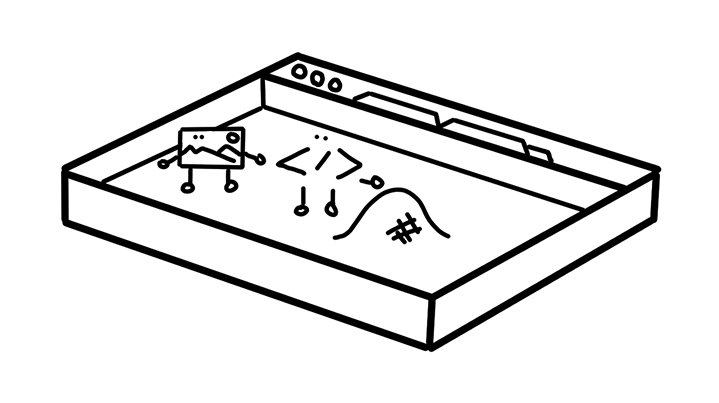

To defend against attacks, a developer needs to mitigate vulnerabilities and add
security features to an application. Luckily, on the web, the browser provides
many security features. Some are available for developers to opt-in, and some
are turned on by default to protect users. 

## The idea of a "sandbox"  

<figure class="w-figure w-figure--inline-right">
  
  <figcaption class="w-figcaption">
    Figure: Browser as a sandbox
  </figcaption>
</figure>

Modern web browsers are built on the idea of a "sandbox". A sandbox is a
security mechanism used to run an application in a restricted environment. Just
like the physical sandbox at a playground where kids can create anything they
want within the boundary without making a mess elsewhere, application code has
the freedom to execute within a restricted environment. For example, JavaScript
can add and modify elements on the page but might be restricted from accessing
an external JSON file. This is because of a sandbox feature called same-origin

## Why is a sandbox necessary?

Every day, users of the web download arbitrary code and execute it on their
computer or phone multiple times. If someone told you "Hey! Download and run
this application!", you might pause to think if that application comes from a
trusted source, read up on the application vendor, or check reviews carefully.
How about when someone sends you a URL saying "check out this blog post"? You
would probably click on it without asking questions like "What kind of
JavaScript will this site download?".

The browser sandbox is the key feature that makes browsing on the web
frictionless by making it safer to run arbitrary code. 

## Make it secure by design

If the browser is sandboxing each web application, should we even care about
security? Absolutely yes!

First of all, sandbox features are not the perfect shield. Even though browser
engineers work hard, browsers could have vulnerabilities and attackers are
always trying to bypass the sandbox (such as with
[Spectre Attack](https://developers.google.com/web/updates/2018/02/meltdown-spectre)).

The sandbox could sometimes get in a way of creating a great web experience. For
example, a browser may block a fetch request to an image hosted on a different
domain. You can share resources on different domains by turning on Cross-Origin
Resource Sharing (CORS for short), but if it is not done carefully you can
expose a resource to everyone else on the web, essentially undoing the
sandbox.

## Wrap up
A secure web experience can only be achieved if security is baked into the
design of your application, and strong design starts with understanding existing
features. The next two guides dive into CORS and same-origin policy in depth.
