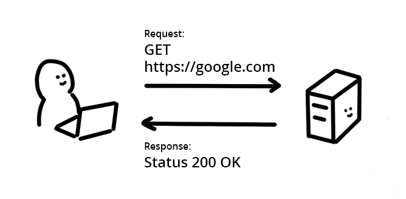

The browser's same-origin policy blocks reading a resource from a different
origin. This mechanism stops a malicious site from reading another site's data,
but it also prevents legitimate uses. What if you wanted to get weather data
from another country?

In a modern web application, an application often wants to get resources from a
different origin. For example, you want to retrieve JSON data from a different
domain or load images from another site into a `<canvas>` element.

In other words, there are **public resources** that should be available for
anyone to read, but the same-origin policy blocks that. Developers have used
work-arounds such as
[JSONP](https://stackoverflow.com/questions/2067472/what-is-jsonp-all-about),
but **Cross-Origin Resource Sharing (CORS)** fixes this in a standard way.

Enabling **CORS** lets the server tell the browser it's permitted to use an
additional origin.

## How does a resource request work on the web?

<figure class="w-figure w-figure--inline-right">
  
  <figcaption class="w-figcaption">
    Figure: Illustrated client request and server response
  </figcaption>
</figure>

A browser and a server can exchange data over the network using the **Hypertext
Transfer Protocol** (HTTP). HTTP defines the communication rules between the
requester and the responder, including what information is needed to get a
resource.

The HTTP header is used to negotiate the type of message exchange between the
client and the server and is used to determine access. Both the browser's
request and the server's response message are divided into two parts: **header**
and **body**:

### header

Information about the message such as the type of message or the encoding of the
message. A header can include a
[variety of information](https://en.wikipedia.org/wiki/List_of_HTTP_header_fields)
expressed as key-value pairs. The request header and response header contain
different information.


It's important to note that headers cannot contain comments.


**Sample Request header**

```text
Accept: text/html
Cookie: Version=1
```

The above is equivalent to saying "I want to receive HTML in response. Here is
a cookie I have."

**Sample Response header**

```text
Content-Encoding: gzip
Cache-Control: no-store
```

The above is equivalent to saying "Data is encoded with gzip. Do not cache this
please."

### body

The message itself. This could be plain text, an image binary, JSON, HTML, and so on.

## How does CORS work?

Remember, the same-origin policy tells the browser to block cross-origin
requests. When you want to get a public resource from a different
origin, the resource-providing server needs to tell the browser "This origin
where the request is coming from can access my resource". The browser remembers that
and allows cross-origin resource sharing.

### Step 1: client (browser) request

When the browser is making a cross-origin request, the browser adds an `Origin`
header with the current origin (scheme, host, and port).

### Step 2: server response

On the server side, when a server sees this header, and wants to allow access,
it needs to add an `Access-Control-Allow-Origin` header to the response
specifying the requesting origin (or `*` to allow any origin.)

### Step 3: browser receives response

When the browser sees this response with an appropriate
`Access-Control-Allow-Origin` header, the browser allows the response data to be
shared with the client site.

## See CORS in action

Here is a tiny web server using Express.



The first endpoint (line 8) does not have any response header set, it just sends
a file in response.



- Try the following command:

```js
fetch('https://cors-demo.glitch.me/', {mode:'cors'})
```

You should see an error saying:

```bash
request has been blocked by CORS policy: No 'Access-Control-Allow-Origin' header
is present on the requested resource.
```

The second endpoint (line 13) sends the same file in response but adds
`Access-Control-Allow-Origin: *` in the header. From the console, try

```js
fetch('https://cors-demo.glitch.me/allow-cors', {mode:'cors'})
```

This time, your request should not be blocked.

## Share credentials with CORS

For privacy reasons, CORS is normally used for "anonymous requests"—ones where
the request doesn't identify the requestor. If you want to send cookies when
using CORS (which could identify the sender), you need to add additional headers
to the request and response.

### Request

Add `credentials: 'include'` to the fetch options like below. This will include
the cookie with the request.

```js
fetch('https://example.com', {
  mode: 'cors',
  credentials: 'include'
})
```

### Response

`Access-Control-Allow-Origin` must be set to a specific origin (no wildcard
using `*`) and must set `Access-Control-Allow-Credentials` to `true`.

```text
HTTP/1.1 200 OK
Access-Control-Allow-Origin: https://example.com
Access-Control-Allow-Credentials: true
```

## Preflight requests for complex HTTP calls

If a web app needs a complex HTTP request, the browser adds a **[preflight
request](https://developer.mozilla.org/en-US/docs/Web/HTTP/CORS#preflighted_requests)** to the front of the request chain.

The CORS specification defines a **complex request** as

- A request that uses methods other than GET, POST, or HEAD
- A request that includes headers other than `Accept`, `Accept-Language` or
  `Content-Language`
- A request that has a `Content-Type` header other than
  `application/x-www-form-urlencoded`, `multipart/form-data`, or `text/plain`

Browsers create a preflight request if it is needed. It's an `OPTIONS` request
like below and is sent before the actual request message.

```text
OPTIONS /data HTTP/1.1
Origin: https://example.com
Access-Control-Request-Method: DELETE
```

On the server side, an application needs to respond to the preflight request
with information about the methods the application accepts from this origin.

```text
HTTP/1.1 200 OK
Access-Control-Allow-Origin: https://example.com
Access-Control-Allow-Methods: GET, DELETE, HEAD, OPTIONS
```

The server response can also include an `Access-Control-Max-Age` header to
specify the duration (in seconds) to cache preflight results so the client does not need to
make a preflight request every time it sends a complex request.
