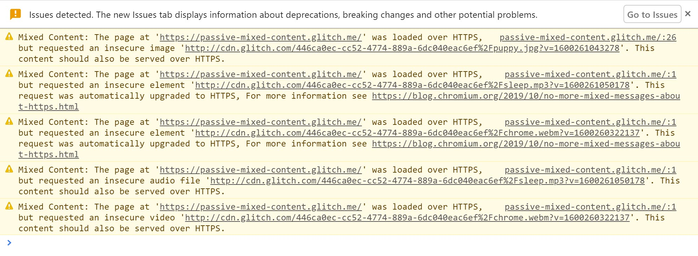
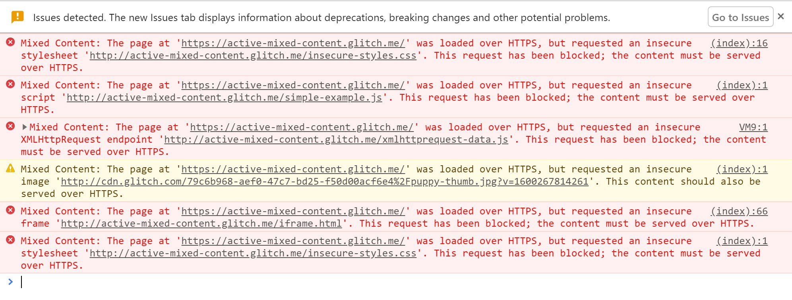

Supporting HTTPS for your website is an important step to protecting your site and your users from attack,
but mixed content can render that protection useless.
Increasingly insecure mixed content will be blocked by browsers, as explained in [What is mixed content?](/what-is-mixed-content)

In this guide we will demonstrate techniques and tools for fixing existing mixed content issues
and preventing new ones from happening.

## Finding mixed content by visiting your site

When visiting an HTTPS page in Google Chrome,
the browser alerts you to mixed content as errors and warnings in the JavaScript console.

In [What is mixed content?](/what-is-mixed-content),
you can find a number of examples and see how the problems are reported in Chrome DevTools.

The example of [passive mixed content](https://passive-mixed-content.glitch.me/) will give the following warnings.
If the browser is able to find the content at an `https` URL it automatically upgrades it, then shows a message.

<figure class="w-figure">
  
</figure>

[Active mixed content](https://active-mixed-content.glitch.me/) is blocked and displays a warning.

<figure class="w-figure">
  
</figure>

If you find warnings like these for `http://` URLs on your site,
you need to fix them in your site's source.
It's helpful to make a list of these URLs, along with the page you found them on, for use when you fix them.


Mixed content errors and warnings are only shown for the page you are currently viewing,
and the JavaScript console is cleared every time you navigate to a new  page.
This means you will have to view every page of your site individually to find these errors.


### Finding mixed content in your site

You can search for mixed content directly in your source code.
Search for `http://` in your source and look for tags that include HTTP URL attributes.
Note that having `http://` in the `href` attribute of anchor tags (`<a>`)
is often not a mixed content issue, with some notable exceptions discussed later.

If your site is published using a content management system,
it is possible that links to insecure URLs are inserted when pages are published.
For example, images may be included with a full URL rather than a relative path.
You will need to find and fix these within the CMS content.

### Fixing mixed content

Once you've found mixed content in your site's source,
you can follow these steps to fix it.

If you get a console message that a resource request has been automatically upgraded from HTTP to HTTPS,
you can safely change the `http://` URL for the resource in your code to `https://`.
You can also check to see if a resource is available securely by changing `http://` to `https://` in the browser URL bar
and attempting to open the URL in a browser tab.

If the resource is not available via `https://`, you should consider one of the following options:

* Include the resource from a different host, if one is available.
* Download and host the content on your site directly, if you are legally allowed to do so.
* Exclude the resource from your site altogether.

Having fixed the problem,
view the page where you found the error originally and verify that the error no longer appears.

### Beware of non-standard tag usage

Beware of non-standard tag usage on your site.
For instance, anchor (`<a>`) tag URLs don't result in mixed content errors,
as they cause the browser to navigate to a new page.
This means they usually don't need to be fixed.
However some image gallery scripts override the functionality of the `<a>`
tag and load the HTTP resource specified by the `href` attribute into a lightbox display on the page,
causing a mixed content problem.

## Handle mixed content at scale

The manual steps above work well for smaller websites;
but for large websites or sites with many separate development teams,
it can be tough to keep track of all the content being loaded.
To help with this task, you can use content security policy
to instruct the browser to notify you about mixed content and ensure that your pages never unexpectedly load insecure resources.

### Content security policy

[Content security policy](https://developers.google.com/web/fundamentals/security/csp/) (CSP)
is a multi-purpose browser feature that you can use to manage mixed content at scale.
The CSP reporting mechanism can be used to track mixed content on your site,
and provide enforcement policies to protect users by upgrading or blocking mixed content.

You can enable these features for a page by including the
`Content-Security-Policy` or `Content-Security-Policy-Report-Only` header in the response sent from your server.
Additionally you can set `Content-Security-Policy`
(though **not** `Content-Security-Policy-Report-Only`) using a `<meta>` tag in the `<head>` section of your page.


Modern browsers enforce all content security policies that they receive.
Multiple CSP header values received by the browser in the response header or
`<meta>` elements are combined and enforced as a single policy;
reporting policies are likewise combined.
Policies are combined by taking the intersection of the policies;
that is to say, each policy after the first can only further restrict the allowed content, not broaden it.


### Finding mixed content with content security policy

You can use content security policy to collect reports of mixed content on your site.
To enable this feature, set the `Content-Security-Policy-Report-Only` directive by adding it as a response header for your site.

Response header:

`Content-Security-Policy-Report-Only: default-src https: 'unsafe-inline' 'unsafe-eval'; report-uri https://example.com/reportingEndpoint`


The [report-uri](https://developer.mozilla.org/en-US/docs/Web/HTTP/Headers/Content-Security-Policy/report-uri) response header is being deprecated in favor of
[report-to](https://developer.mozilla.org/en-US/docs/Web/HTTP/Headers/Content-Security-Policy/report-to).
Browser support for `report-to` is currently limited to Chrome and Edge.
You can provide both headers, in which case `report-uri` will be ignored if the browser supports `report-to`.


Whenever a user visits a page on your site,
their browser sends JSON-formatted reports regarding anything that violates the content security policy to
`https://example.com/reportingEndpoint`.
In this case, anytime a subresource is loaded over HTTP, a report is sent.
These reports include the page URL where the policy violation occurred and the subresource URL that violated the policy.
If you configure your reporting endpoint to log these reports,
you can track the mixed content on your site without visiting each page yourself.

The two caveats to this are:

* Users have to visit your page in a browser that understands the CSP header. This is true for most modern browsers.
* You only get reports for pages visited by your users.
So if you have pages that don't get much traffic,
it might be some time before you get reports for your entire site.

The [Content security policy](https://developers.google.com/web/fundamentals/security/csp/)
guide has more information and an example endpoint.

### Alternatives to reporting with CSP

If your site is hosted for you by a platform such as Blogger,
you may not have access to modify headers and add a CSP.
Instead, a viable alternative could be to use a website crawler to find issues across your site for you, such as
[HTTPSChecker](https://httpschecker.net/how-it-works#httpsChecker)
or
[Mixed Content Scan](https://github.com/bramus/mixed-content-scan).

### Upgrading insecure requests

Browsers are beginning to upgrade and block insecure requests.
You can use CSP directives to force automatic upgrading or blocking of these assets.

The [`upgrade-insecure-requests`](https://www.w3.org/TR/upgrade-insecure-requests/)
CSP directive instructs the browser to upgrade insecure URLs before making network requests.

As an example, if a page contains an image tag with an HTTP URL such as
``

The browser instead makes a secure request for
`https://example.com/image.jpg`, thus saving the user from mixed content.

You can enable this behavior either by sending a `Content-Security-Policy` header with this directive:

```markup
Content-Security-Policy: upgrade-insecure-requests
```

Or by embedding that same directive inline in the document's `<head>`
section using a `<meta>` element:

```html
<meta http-equiv="Content-Security-Policy" content="upgrade-insecure-requests">
```

As with browser automatic upgrading, if the resource is not available over HTTPS,
the upgraded request fails and the resource is not loaded.
This maintains the security of your page. The `upgrade-insecure-requests` directive will go further than automatic browser upgrading,
attempting to upgrade requests that the browser currently does not.

The `upgrade-insecure-requests` directive cascades into `<iframe>` documents,
ensuring the entire page is protected.

### Blocking all mixed content

An alternative option for protecting users is the
[`block-all-mixed-content`](https://www.w3.org/TR/mixed-content/#strict-checking) CSP directive.
This directive instructs the browser to never load mixed content;
all mixed content resource requests are blocked,
including both active and passive mixed content.
This option also cascades into `<iframe>` documents, ensuring the entire page is mixed content free.

A page can opt itself into this behavior either by sending a
`Content-Security-Policy` header with this directive:

```markup
Content-Security-Policy: block-all-mixed-content
```

Or by embedding that same directive inline in the document's `<head>`
section using a `<meta>` element:

```html
<meta http-equiv="Content-Security-Policy" content="block-all-mixed-content">
```


If you set both `upgrade-insecure-requests` and `block-all-mixed-content`
`upgrade-insecure-requests` will be evaluated and used first.
The browser will not go on to block requests.
Therefore you should use one or the other.

