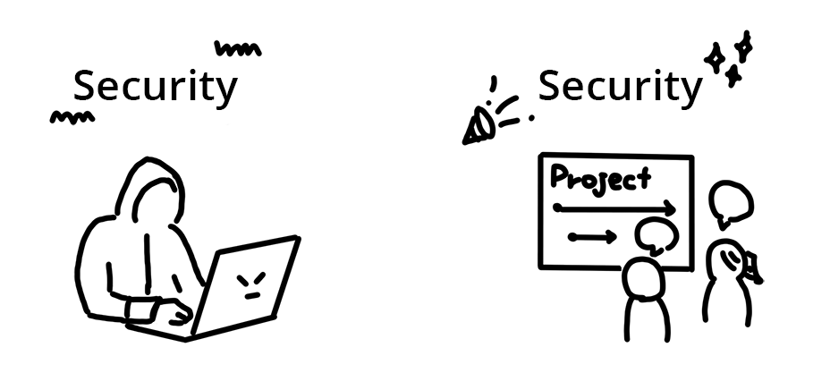

What do you imagine when someone says "security"?

Hackers? Attacks? Defenses? A programmer in a black hoodie in a dark room?

When the word "security" comes to mind, it's usually in the context of bad news.
You often encounter headlines like "A big social network leaked login passwords"
or "an attacker stole credit card information from a shopping site".

But security is something to be taken as a positive and necessary part of web
development just like "user experience" or "accessibility".

<figure class="w-figure">
  
  <figcaption class="w-figcaption">
    A hacker in hoodie is a negative security image. A team working on a project
    together is a positive security image.
  </figcaption>
</figure>

In the next few guides, you'll learn how to keep your
business and your users' content secure.

## What is a security vulnerability?

In software development, when an application does not work the way it is
intended to work, it's called "a bug". Sometimes a bug displays wrong
information or crashes on a certain action. A **vulnerability**
(sometimes called a **security bug**) is a type of bug that could be used for
abuse.

Bugs are common in the day to day activities of a developer. Which means,
vulnerabilities are also frequently introduced into applications. What's
important is that you are aware of common vulnerabilities in order
to mitigate them as much as you can. It is just like minimizing other bugs by
following common patterns and techniques.

Most security techniques are just good programming, for example:
- Check values entered by a user (not null, not an empty string, checking the
amount of data).
- Ensure a single user can't take up too much time.
- Build unit tests so security bugs can't slip in by accident.

## What are security features?

Your first lines of defense are security features such as HTTPS and CORS.
(You'll learn about these acronyms later so don't worry about them for now.)
For example, encrypting data using HTTPS might not be fixing a bug, but it
protects the data you're exchanging with users to other parties. (Intercepting
data is a common attack.)

## What's the impact?

When an application is not secure, different people could be affected.

  <table>
    <tbody>
      <tr>
        <td><strong>Impact on users</strong></td>
        <td>
          <ul class="w-unstyled-list">
            <li>
              Sensitive information, such as personal data, could be leaked or
              stolen.
            </li>
            <li>
              Content could be tampered with. A tampered site could direct users
              to a malicious site.
            </li>
          </ul>
        </td>
      </tr>
      <tr>
        <td><strong>Impact on the application</strong></td>
        <td>
          <ul class="w-unstyled-list">
            <li>
              User trust may be lost.
            </li>
            <li>
              Business could be lost due to downtime or loss of confidence as a
              result of tampering or system shortage.
            </li>
          </ul>
        </td>
      </tr>
      <tr>
        <td><strong>Impact on other systems</strong></td>
        <td>
          <ul class="w-unstyled-list">
            <li>
              A hijacked application could be used to attack other systems, such
              as with a denial-of-service attack using a botnet.
            </li>
          </ul>
        </td>
      </tr>
    </tbody>
  </table>

Actively securing your application is not only crucial for you and
your business but also for your users, protecting them and other systems from
attacks launched from your site.

## Wrap up

Congratulations! You are halfway through this introduction. Now you know the difference
between security vulnerabilities and features, and you are aware that not only
you but everyone else gets affected when your application is not secure. The
next guide covers the types of attacks in depth to make security even less
scary.
