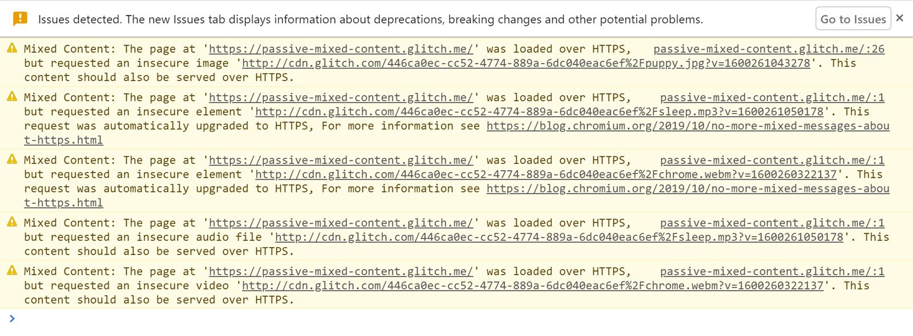
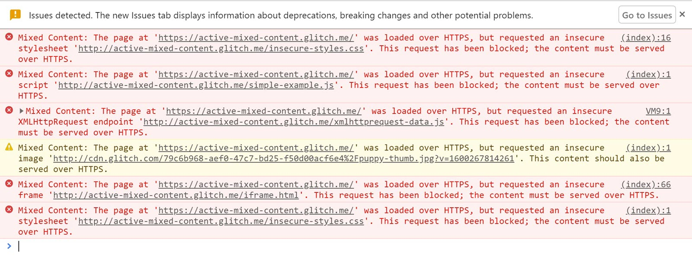

**Mixed content** occurs when initial HTML is loaded over a secure
[HTTPS](/why-https-matters/) connection, but other resources (such as images,
videos, stylesheets, scripts) are loaded over an insecure HTTP connection.
This is called mixed content
because both HTTP and HTTPS content are being loaded to display the same page,
and the initial request was secure over HTTPS.

Requesting subresources using the insecure HTTP protocol weakens the security of the entire page,
as these requests are vulnerable to [**on-path attacks**](https://www.ietf.org/rfc/rfc7835.html#section-2.1.1),
where an attacker eavesdrops on a network connection and views or modifies the communication between two parties.
Using these resources, attackers can track users and replace content on a website,
and in the case of active mixed content, take complete control over the page, not just the insecure resources.

Although many browsers report mixed content warnings to the user,
by the time this happens, it is too late:
the insecure requests have already been performed and the security of the page is compromised.

This is why browsers are increasingly blocking mixed content.
If you have mixed content on your site,
then fixing it will ensure the content continues to load as browsers become more strict.

## The two types of mixed content

The two types of mixed content are: active and passive.

**Passive mixed content** refers to content that doesn't interact with the rest of the page,
and thus a man-in-the-middle attack is restricted to what they can do if they intercept or change that content.
Passive mixed content is defined as images, video, and audio content.

**Active mixed content** interacts with the page as a whole and allows an attacker to do almost anything with the page.
Active mixed content includes scripts, stylesheets, iframes,
and other code that the browser can download and execute.

### Passive mixed content

Passive mixed content is seen as less problematic yet still poses a security threat to your site and your users.
For example, an attacker can intercept HTTP requests for images on your site and swap or replace these images;
the attacker can swap the _save_ and _delete_ button images,
causing your users to delete content without intending to;
replace your product diagrams with lewd or pornographic content,
defacing your site; or replace your product pictures with ads for a different site or product.

Even if the attacker doesn't alter the content of your site,
an attacker can track users via mixed content requests.
The attacker can tell which pages a user visits and which products they view based on images or other resources that the browser loads.

If passive mixed content is present most browsers will indicate in the URL bar that the page is not secure,
even when the page itself was loaded over HTTPS.
You can observe this behavior with this [demo](https://passive-mixed-content.glitch.me/)
that contains examples of passive mixed content.

Until recently passive mixed content was loaded in all browsers,
as to block it would have broken many websites.
This is now beginning to change and so it is vital to update any instances of mixed content on your site.

[Chrome is currently rolling out](https://blog.chromium.org/2019/10/no-more-mixed-messages-about-https.html )
automatic upgrading of passive mixed content where possible.
Automatic upgrading means that if the asset is available over HTTPS, but has been hardcoded as HTTP,
the browser will load the HTTPS version. If no secure version can be found the asset will not load.

Whenever it detects mixed content or auto-upgrades passive mixed content,
Chrome logs detailed messages to the **Issues** tab in DevTools
to guide you on how to fix the specific issue.

<figure class="w-figure">
  
</figure>

### Active mixed content

Active mixed content poses a greater threat than passive mixed content.
An attacker can intercept and rewrite active content,
thereby taking full control of your page or even your entire website.
This allows the attacker to change anything about the page,
including displaying entirely different content,
stealing user passwords or other login credentials,
stealing user session cookies,
or redirecting the user to a different site entirely.

Due to the severity of this threat,
most browsers already block this type of content by default to protect users,
but functionality varies between browser vendors and versions.

This other [demo](https://active-mixed-content.glitch.me/) contains examples of active mixed content.
[Load the example over HTTP](http://active-mixed-content.glitch.me/)
to see the content that's blocked when you [load the example over
HTTPS](https://active-mixed-content.glitch.me/). Blocked content will also
be detailed in the **Issues** tab.

<figure class="w-figure">
  
</figure>


  Browsers also highlight blocked content in their DevTools. Blocked content
  issues are detailed in the **Issues** tab in Chromium-based browsers. Firefox
  and Safari log messages in the console.


## The mixed content specification

Browsers follow the [mixed content specification](https://w3c.github.io/webappsec-mixed-content/),
which defines the [**optionally blockable content**](https://w3c.github.io/webappsec-mixed-content/#optionally-blockable-mixed-content)
and [**blockable content**](https://w3c.github.io/webappsec-mixed-content/#category-blockable) categories.

From the spec,
a resource qualifies as optionally blockable content
"when the risk of allowing its usage as mixed content is outweighed by the risk of breaking significant portions of the web";
this is a subset of the passive mixed content category described above.

All content that is not **optionally blockable** is considered **blockable**,
and should be blocked by the browser.


There is a [Level 2 of the Mixed Content specification](https://w3c.github.io/webappsec-mixed-content/level2.html) in progress,
which will add automatic upgrading to the spec.


In recent years, [HTTPS usage has risen dramatically](https://transparencyreport.google.com/https/overview),
and has become the clear default on the web.
This makes it more feasible now for browsers to consider blocking all mixed content,
even those subresource types defined in the [mixed content specification](https://w3c.github.io/webappsec/specs/mixedcontent/) as **optionally blockable**.
This is why we now see Chrome taking a stricter approach to these subresources.

### Older browsers

It is important to remember that not every visitor to your website uses the most up-to-date browsers.
Different versions from different browser vendors each treat mixed content differently.
At worst, older browsers and versions don't block any mixed content at all,
which is very unsafe for the user.

By fixing your mixed content problems you ensure that your content is visible in new browsers.
You also help protect users from dangerous content that isn't blocked by older browsers.
