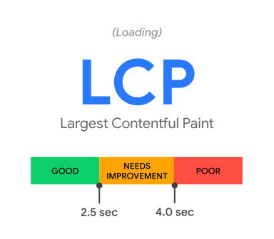
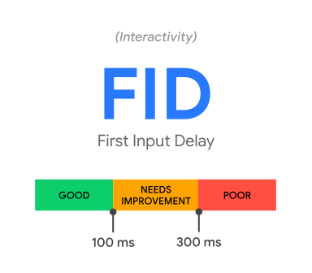
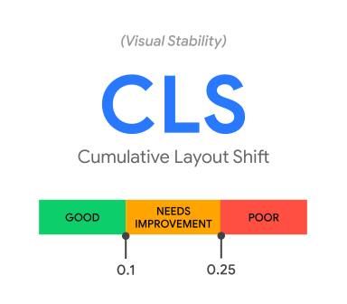

Optimizing for quality of user experience is key to the long-term success of any
site on the web. Whether you're a business owner, marketer, or developer, Web
Vitals can help you quantify the experience of your site and identify
opportunities to improve.

## Overview

Web Vitals is an initiative by Google to provide unified guidance for quality
signals that are essential to delivering a great user experience on the web.

Google has provided a number of tools over the years to measure and report on
performance. Some developers are experts at using these tools, while others have
found the abundance of both tools and metrics challenging to keep up with.

Site owners should not have to be performance gurus in order to understand the
quality of experience they are delivering to their users. The Web Vitals
initiative aims to simplify the landscape, and help sites focus on the metrics
that matter most, the **Core Web Vitals**.

## Core Web Vitals

Core Web Vitals are the subset of Web Vitals that apply to all web pages, should
be measured by all site owners, and will be surfaced across all Google tools.
Each of the Core Web Vitals represents a distinct facet of the user experience,
is measurable [in the
field](/user-centric-performance-metrics/#how-metrics-are-measured),
and reflects the real-world experience of a critical
[user-centric](/user-centric-performance-metrics/#how-metrics-are-measured)
outcome.

The metrics that make up Core Web Vitals will [evolve](#evolving-web-vitals)
over time. The current set for 2020 focuses on three aspects of the user
experience—_loading_, _interactivity_, and _visual stability_—and includes the
following metrics (and their respective thresholds):

<div class="w-stack w-stack--center w-stack--md">
  
  
  
</div>

- **[Largest Contentful Paint (LCP)](/lcp/)**: measures _loading_ performance.
  To provide a good user experience, LCP should occur within **2.5 seconds** of
  when the page first starts loading.
- **[First Input Delay (FID)](/fid/)**: measures _interactivity_. To provide a
  good user experience, pages should have a FID of less than **100
  milliseconds**.
- **[Cumulative Layout Shift (CLS)](/cls/)**: measures _visual stability_. To
  provide a good user experience, pages should maintain a CLS of less than
  **0.1.**

For each of the above metrics, to ensure you're hitting the recommended target
for most of your users, a good threshold to measure is the **75th percentile**
of page loads, segmented across mobile and desktop devices.

Tools that assess Core Web Vitals compliance should consider a page passing if
it meets the recommended targets at the 75th percentile for all of the above
three metrics.


  To learn more about the research and methodology behind these recommendations,
  see: [Defining the Core Web Vitals metrics
  thresholds](/defining-core-web-vitals-thresholds/)


### Tools to measure and report Core Web Vitals

Google believes that the Core Web Vitals are critical to all web experiences. As
a result, it is committed to surfacing these metrics [in all of its popular
tools](/vitals-tools/). The following sections details which tools support the
Core Web Vitals.

#### Field tools to measure Core Web Vitals

The [Chrome User Experience
Report](https://developers.google.com/web/tools/chrome-user-experience-report)
collects anonymized, real user measurement data for each Core Web Vital. This
data enables site owners to quickly assess their performance without requiring
them to manually instrument analytics on their pages, and powers tools like
[PageSpeed Insights](https://developers.google.com/speed/pagespeed/insights/),
and Search Console's [Core Web Vitals
report](https://support.google.com/webmasters/answer/9205520).

<div class="w-table-wrapper">
  <table>
    <tr>
      <td>&nbsp;</td>
      <td>LCP</td>
      <td>FID</td>
      <td>CLS</td>
    </tr>
    <tr>
      <td><a href="https://developers.google.com/web/tools/chrome-user-experience-report">
        Chrome User Experience Report</a></td>
      <td>✔</td>
      <td>✔</td>
      <td>✔</td>
    </tr>
    <tr>
      <td><a href="https://developers.google.com/speed/pagespeed/insights/">
        PageSpeed Insights</a></td>
      <td>✔</td>
      <td>✔</td>
      <td>✔</td>
    </tr>
    <tr>
      <td><a href="https://support.google.com/webmasters/answer/9205520">
        Search Console (Core Web Vitals report)</a></td>
      <td>✔</td>
      <td>✔</td>
      <td>✔</td>
    </tr>
  </table>
</div>


  For guidance on how to use these tools, and which tool is right for your use
  case, see: [Getting started with measuring Web
  Vitals](/vitals-measurement-getting-started/)


The data provided by Chrome User Experience Report offers a quick way to assess
the performance of sites, but it does not provide the detailed, per-pageview
telemetry that is often necessary to accurately diagnose, monitor, and quickly
react to regressions. As a result, we strongly recommend that sites set up their
own real-user monitoring.

#### Measure Core Web Vitals in JavaScript

Each of the Core Web Vitals can be measured in JavaScript using standard web
APIs.

The easiest way to measure all the Core Web Vitals is to use the
[web-vitals](https://github.com/GoogleChrome/web-vitals) JavaScript library, a
small, production-ready wrapper around the underlying web APIs that measures
each metric in a way that accurately matches how they're reported by all the
Google tools listed above.

With the [web-vitals](https://github.com/GoogleChrome/web-vitals) library,
measuring each metric is as simple as calling a single function (see the
documentation for complete
[usage](https://github.com/GoogleChrome/web-vitals#usage) and
[API](https://github.com/GoogleChrome/web-vitals#api) details):

```js
import {getCLS, getFID, getLCP} from 'web-vitals';

function sendToAnalytics(metric) {
  const body = JSON.stringify(metric);
  // Use `navigator.sendBeacon()` if available, falling back to `fetch()`.
  (navigator.sendBeacon && navigator.sendBeacon('/analytics', body)) ||
      fetch('/analytics', {body, method: 'POST', keepalive: true});
}

getCLS(sendToAnalytics);
getFID(sendToAnalytics);
getLCP(sendToAnalytics);
```

Once you've configured your site to use the
[web-vitals](https://github.com/GoogleChrome/web-vitals) library to measure and
send your Core Web Vitals data to an analytics endpoint, the next step is to
aggregate and report on that data to see if your pages are meeting the
recommended thresholds for at least 75% of page visits.

While some analytics providers have built-in support for Core Web Vitals
metrics, even those that don't should include basic custom metric features that
allow you to measure Core Web Vitals in their tool.

One example of this is the [Web Vitals
Report](https://github.com/GoogleChromeLabs/web-vitals-report), which allows
site owners to measure their Core Web Vitals using Google Analytics. For
guidance on measuring Core Web Vitals using other analytics tools, see [Best
practices for measuring Web Vitals in the
field](/vitals-field-measurement-best-practices/).

You can also report on each of the Core Web Vitals without writing any code
using the [Web Vitals Chrome
Extension](https://github.com/GoogleChrome/web-vitals-extension). This extension
uses the [web-vitals](https://github.com/GoogleChrome/web-vitals) library to
measure each of these metrics and display them to users as they browse the web.

This extension can be helpful in understanding the performance of your own
sites, your competitor's sites, and the web at large.

<div class="w-table-wrapper">
  <table>
    <thead>
      <tr>
        <th>&nbsp;</th>
        <th>LCP</th>
        <th>FID</th>
        <th>CLS</th>
      </tr>
    </thead>
    <tbody>
      <tr>
        <td><a href="https://github.com/GoogleChrome/web-vitals">web-vitals</a></td>
        <td>✔</td>
        <td>✔</td>
        <td>✔</td>
      </tr>
      <tr>
        <td><a href="https://github.com/GoogleChrome/web-vitals-extension">
          Web Vitals Extension</a></td>
        <td>✔</td>
        <td>✔</td>
        <td>✔</td>
      </tr>
    </tbody>
  </table>
</div>

Alternatively, developers who prefer to measure these metrics directly via the
underlying web APIs can refer to these metric guides for implementation details:

- [Measure LCP in JavaScript](/lcp/#measure-lcp-in-javascript)
- [Measure FID in JavaScript](/fid/#measure-fid-in-javascript)
- [Measure CLS in JavaScript](/cls/#measure-cls-in-javascript)


  For additional guidance on how to measure these metrics using popular
  analytics services (or your own in-house analytics tools), see: [Best
  practices for measuring Web Vitals in the
  field](/vitals-field-measurement-best-practices/)


#### Lab tools to measure Core Web Vitals

While all of the Core Web Vitals are, first and foremost, field metrics, many of
them are also measurable in the lab.

Lab measurement is the best way to test the performance of features during
development—before they've been released to users. It's also the best way to
catch performance regressions before they happen.

The following tools can be used to measure the Core Web Vitals in a lab
environment:

<div class="w-table-wrapper">
  <table>
    <thead>
      <tr>
        <th>&nbsp;</th>
        <th>LCP</th>
        <th>FID</th>
        <th>CLS</th>
      </tr>
    </thead>
    <tbody>
      <tr>
        <td><a href="https://developers.google.com/web/tools/chrome-devtools">
          Chrome DevTools</a></td>
        <td>✔</td>
        <td>✘ (use <a href="/tbt/">TBT</a> instead)</td>
        <td>✔</td>
      </tr>
      <tr>
        <td><a href="https://developers.google.com/web/tools/lighthouse">
          Lighthouse</a></td>
        <td>✔</td>
        <td>✘ (use <a href="/tbt/">TBT</a> instead)</td>
        <td>✔</td>
      </tr>
    </tbody>
  </table>
</div>


  Tools like Lighthouse that load pages in a simulated environment without a
  user cannot measure FID (there is no user input). However, the Total Blocking
  Time (TBT) metric is lab-measurable and is an excellent proxy for FID.
  Performance optimizations that improve TBT in the lab should improve FID in
  the field (see performance recommendations below).


While lab measurement is an essential part of delivering great experiences, it
is not a substitute for field measurement.

The performance of a site can vary dramatically based on a user's device
capabilities, their network conditions, what other processes may be running on
the device, and how they're interacting with the page. In fact, each of the Core
Web Vitals metrics can have its score affected by user interaction. Only field
measurement can accurately capture the complete picture.

### Recommendations for improving your scores

Once you've measured the Core Web Vitals and identified areas for improvement,
the next step is to optimize. The following guides offer specific
recommendations for how to optimize your pages for each of the Core Web Vitals:

- [Optimize LCP](/optimize-lcp/)
- [Optimize FID](/optimize-fid/)
- [Optimize CLS](/optimize-cls/)

## Other Web Vitals

While the Core Web Vitals are the critical metrics for understanding and
delivering a great user experience, there are other vital metrics as well.

These other Web Vitals often serve as proxy or supplemental metrics for the Core
Web Vitals, to help capture a larger part of the experience or to aid in
diagnosing a specific issue.

For example, the metrics [Time to First Byte (TTFB)](/time-to-first-byte/) and
[First Contentful Paint (FCP)](/fcp/) are both vital aspects of the _loading_
experience, and are both useful in diagnosing issues with LCP (slow [server
response times](/overloaded-server/) or [render-blocking
resources](/render-blocking-resources/), respectively).

Similarly, metrics like [Total Blocking Time (TBT)](/tbt/) and [Time to
Interactive (TTI)](/tti/) are lab metrics that are vital in catching and
diagnosing potential _interactivity_ issues that will impact FID. However, they
are not part of the Core Web Vitals set because they are not field-measurable,
nor do they reflect a
[user-centric](/user-centric-performance-metrics/#how-metrics-are-measured)
outcome.

## Evolving Web Vitals

Web Vitals and Core Web Vitals represent the best available signals developers
have today to measure quality of experience across the web, but these signals
are not perfect and future improvements or additions should be expected.

The **Core Web Vitals** are relevant to all web pages and featured across
relevant Google tools. Changes to these metrics will have wide-reaching impact;
as such, developers should expect the definitions and thresholds of the Core Web
Vitals to be stable, and updates to have prior notice and a predictable, annual
cadence.

The other Web Vitals are often context or tool specific, and may be more
experimental than the Core Web Vitals. As such, their definitions and thresholds
may change with greater frequency.

For all Web Vitals, changes will be clearly documented in this public
[CHANGELOG](http://bit.ly/chrome-speed-metrics-changelog).