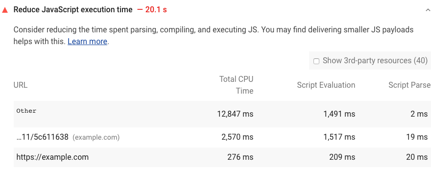

Gdy wykonanie JavaScript zajmuje dużo czasu, spowalnia działanie strony na kilka sposobów:

- **Koszt sieci**

    Więcej bajtów to dłuższy czas pobierania.

- **Analiza i kompilacja kosztów**

    JavaScript jest analizowany i kompilowany w głównym wątku. Gdy główny wątek jest zajęty, strona nie może odpowiadać na dane wejściowe użytkownika.

- **Koszt wykonania**

    JavaScript jest również wykonywany w głównym wątku. Jeśli Twoja strona zawiera dużo kodu, zanim będzie naprawdę potrzebny, opóźnia to również [czas potrzebny na interaktywność](/interactive) , który jest jednym z kluczowych wskaźników związanych z tym, jak użytkownicy postrzegają szybkość strony.

- **Koszt pamięci**

    Jeśli Twój JavaScript zachowuje wiele odniesień, może potencjalnie zajmować dużo pamięci. Strony, które zajmują dużo pamięci, wydają się szarpane lub powolne. Wycieki pamięci mogą spowodować całkowite zawieszenie się strony.

## Jak zawodzi audyt czasu wykonania Lighthouse JavaScript

[Lighthouse](https://developers.google.com/web/tools/lighthouse/) wyświetla ostrzeżenie, gdy wykonanie JavaScript trwa dłużej niż 2 sekundy. Audyt kończy się niepowodzeniem, gdy wykonanie trwa dłużej niż 3,5 sekundy:

<figure class="w-figure"></figure>

Aby pomóc Ci zidentyfikować najbardziej przyczyniających się do czasu wykonania, Lighthouse raportuje czas spędzony na wykonywaniu, ocenie i analizowaniu każdego pliku JavaScript, który ładuje Twoja strona.



## Jak przyspieszyć wykonywanie JavaScript



## Zasoby

[Kod źródłowy do audytu **Skróć czas wykonywania JavaScript**](https://github.com/GoogleChrome/lighthouse/blob/master/lighthouse-core/audits/bootup-time.js)
