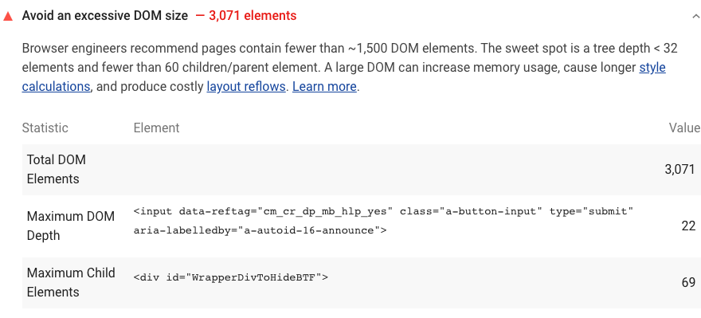

Duże drzewo DOM może spowolnić wydajność strony na wiele sposobów:

- **Wydajność sieci i wydajność obciążenia**

    Duże drzewo DOM często zawiera wiele węzłów, które nie są widoczne, gdy użytkownik po raz pierwszy ładuje stronę, co niepotrzebnie zwiększa koszty danych dla użytkowników i spowalnia czas ładowania.

- **Wydajność w czasie wykonywania**

    Gdy użytkownicy i skrypty wchodzą w interakcję z Twoją stroną, przeglądarka musi stale [przeliczać położenie i styl węzłów](https://developers.google.com/web/fundamentals/performance/rendering/reduce-the-scope-and-complexity-of-style-calculations?utm_source=lighthouse&utm_medium=cli) . Duże drzewo DOM w połączeniu ze skomplikowanymi regułami stylu może znacznie spowolnić renderowanie.

- **Wydajność pamięci**

    Jeśli Twój JavaScript używa ogólnych selektorów zapytań, takich jak `document.querySelectorAll('li')` , możesz nieświadomie przechowywać odniesienia do bardzo dużej liczby węzłów, co może przeciążać możliwości pamięci urządzeń użytkowników.

## Jak zawodzi audyt rozmiaru Lighthouse DOM

[Lighthouse](https://developers.google.com/web/tools/lighthouse/) raportuje całkowitą liczbę elementów DOM dla strony, maksymalną głębokość DOM strony i jej maksymalne elementy podrzędne:

<figure class="w-figure"></figure>

Lighthouse oznacza strony z drzewami DOM, które:

- Posiadaj łącznie ponad 1500 węzłów.
- Mają głębokość większą niż 32 węzły.
- Miej węzeł nadrzędny z więcej niż 60 węzłami podrzędnymi.



## Jak zoptymalizować rozmiar DOM

Ogólnie rzecz biorąc, szukaj sposobów tworzenia węzłów DOM tylko wtedy, gdy są potrzebne, i niszcz węzłów, gdy nie są już potrzebne.

Jeśli obecnie wysyłasz duże drzewo DOM, spróbuj załadować stronę i ręcznie zanotować, które węzły są wyświetlane. Być może uda Ci się usunąć niewidoczne węzły z pierwotnie załadowanego dokumentu i utworzyć je dopiero po odpowiedniej interakcji użytkownika, takiej jak przewijanie lub kliknięcie przycisku.

Jeśli tworzysz węzły DOM w czasie wykonywania, [modyfikacja poddrzewa DOM Change Breakpoints](https://developers.google.com/web/tools/chrome-devtools/javascript/breakpoints#dom) może pomóc Ci określić, kiedy węzły zostaną utworzone.

If you can't avoid a large DOM tree, another approach for improving rendering performance is simplifying your CSS selectors. See Google's [Reduce the Scope and Complexity of Style Calculations](https://developers.google.com/web/fundamentals/performance/rendering/reduce-the-scope-and-complexity-of-style-calculations) for more information.

## Zasoby

- [Source code for **Avoid an excessive DOM size** audit](https://github.com/GoogleChrome/lighthouse/blob/master/lighthouse-core/audits/dobetterweb/dom-size.js)
- [Zmniejsz zakres i złożoność obliczeń stylu](https://developers.google.com/web/fundamentals/performance/rendering/reduce-the-scope-and-complexity-of-style-calculations)
