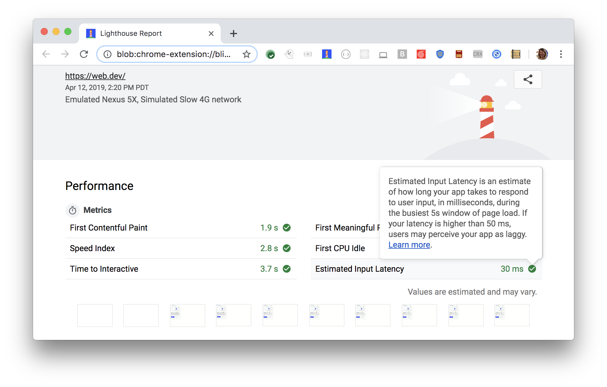

Szacowane opóźnienie wejścia jest jednym z sześciu wskaźników śledzonych w sekcji **Wydajność** raportu Lighthouse. Każdy wskaźnik obejmuje pewien aspekt szybkości ładowania strony.

Raporty Lighthouse wyświetlają szacowane opóźnienie wejścia w milisekundach:

<figure class="w-figure"></figure>



## Jakie środki mierzy szacowane opóźnienie wejścia

Szacowane opóźnienie wejścia to oszacowanie czasu, w którym Twoja aplikacja reaguje na dane wejściowe użytkownika podczas najbardziej zajętego 5-sekundowego okna ładowania strony. Audyt przebiega w czasie od [pierwszej znaczącej farby](/first-meaningful-paint) do końca śledzenia, czyli około 5 sekund po [Time to Interactive](/interactive) . Jeśli opóźnienie jest większe niż 50 ms, użytkownicy mogą postrzegać Twoją aplikację jako opóźnioną.

Model [wydajności RAIL](https://developers.google.com/web/fundamentals/performance/rail) zaleca, aby aplikacje reagowały na dane wejściowe użytkownika w ciągu 100 ms, podczas gdy docelowy wynik szacowanego opóźnienia wejścia Lighthouse wynosi 50 ms. Czemu? Lighthouse używa miernika proxy - dostępności głównego wątku - do mierzenia, jak dobrze Twoja aplikacja reaguje na dane wejściowe użytkownika.

Lighthouse zakłada, że Twoja aplikacja potrzebuje 50 ms, aby w pełni zareagować na dane wejściowe użytkownika (od wykonania dowolnego kodu JavaScript do fizycznego malowania nowych pikseli na ekranie). Jeśli główny wątek jest niedostępny przez 50 ms lub dłużej, nie pozostawia to wystarczająco dużo czasu na ukończenie odpowiedzi przez aplikację.

Około 90% użytkowników napotka zgłoszone przez Lighthouse opóźnienie wejścia lub mniejsze. 10% użytkowników może spodziewać się dłuższego opóźnienia.

## Jak poprawić swój szacowany wynik opóźnienia wejścia

Aby Twoja aplikacja szybciej reagowała na dane wejściowe użytkownika, zoptymalizuj sposób działania kodu w przeglądarce. Zapoznaj się z serią technik przedstawionych na stronie Google [Rendering Performance](https://developers.google.com/web/fundamentals/performance/rendering/) . Porady te obejmują odciążanie obliczeń i pracowników sieci Web w celu zwolnienia głównego wątku, refaktoryzację selektorów CSS w celu wykonania mniejszej liczby obliczeń, a także użycie właściwości CSS, które minimalizują ilość operacji intensywnie korzystających z przeglądarki.

 Audyt szacowanego opóźnienia wejściowego nie jest pełnym pomiarem opóźnienia wejściowego. Nie mierzy, jak długo Twoja aplikacja naprawdę reaguje na dane wejściowe użytkownika; nie mierzy też, czy reakcja aplikacji na dane wejściowe użytkownika jest wizualnie kompletna. 

## Jak ręcznie zmierzyć szacowane opóźnienie wejściowe

To measure Estimated Input Latency manually, make a recording with the Chrome DevTools Timeline. See [Do less main thread work](https://developers.google.com/web/tools/chrome-devtools/speed/get-started#main) for an example of the workflow. The basic idea is to start a recording, perform the user input that you want to measure, stop the recording, and then analyze the flame chart to ensure that [all stages of the pixel pipeline](https://developers.google.com/web/fundamentals/performance/rendering/#the_pixel_pipeline) are complete within 50&nbsp;ms.

## Zasoby

- [Kod źródłowy do audytu **szacowanego opóźnienia wejściowego**](https://github.com/GoogleChrome/lighthouse/blob/master/lighthouse-core/audits/metrics/estimated-input-latency.js)
- [Przewodnik po punktacji Lighthouse v3](https://developers.google.com/web/tools/lighthouse/v3/scoring)
- [Zmierz wydajność za pomocą modelu RAIL](https://developers.google.com/web/fundamentals/performance/rail)
- [Wydajność renderowania](https://developers.google.com/web/fundamentals/performance/rendering/)
- [Zoptymalizuj szybkość witryny dzięki Chrome DevTools](https://developers.google.com/web/tools/chrome-devtools/speed/get-started)
