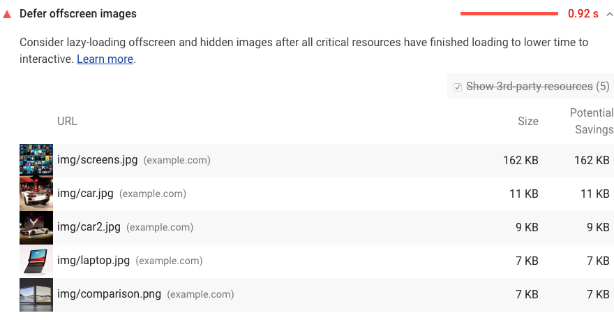

The Opportunities section of your Lighthouse report lists all offscreen or hidden images in your page along with the potential savings in [kibibytes (KiB)](https://en.wikipedia.org/wiki/Kibibyte). Consider lazy-loading these images after all critical resources have finished loading to lower [Time to Interactive](/interactive):

<figure class="w-figure"></figure>

Zobacz także [Leniwe ładowanie obrazów poza ekranem za pomocą lazysizes codelab](/codelab-use-lazysizes-to-lazyload-images) .

## Zasoby

- [Kod źródłowy do audytu **odroczonych obrazów poza ekranem**](https://github.com/GoogleChrome/lighthouse/blob/master/lighthouse-core/audits/byte-efficiency/offscreen-images.js)
