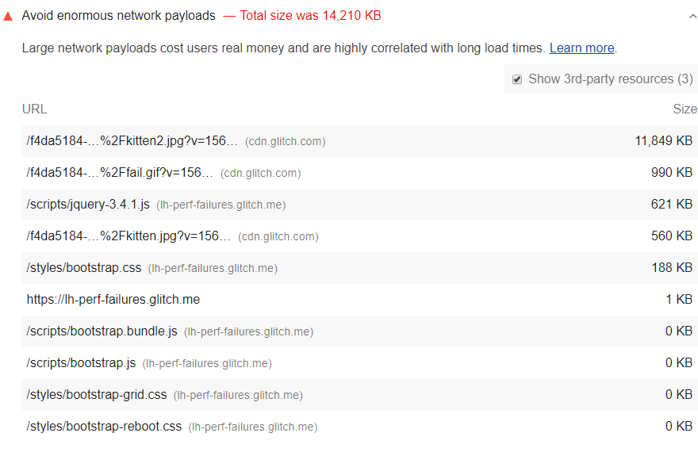

Duże obciążenia sieciowe są silnie skorelowane z długimi czasami ładowania. Kosztują również pieniądze użytkowników; na przykład użytkownicy mogą być zmuszeni do płacenia za większą ilość danych komórkowych. Tak więc zmniejszenie całkowitego rozmiaru żądań sieciowych Twojej strony jest dobre dla wygody użytkowników w Twojej witrynie *i* ich portfeli.

 Aby zobaczyć, ile kosztuje dostęp do Twojej witryny na całym świecie, sprawdź WebPageTest's [What Does My Site Cost?](https://whatdoesmysitecost.com/) Możesz dostosować wyniki, aby uwzględnić siłę nabywczą. 

## Jak nie udaje się audyt ładunku sieci Lighthouse

[Lighthouse](https://developers.google.com/web/tools/lighthouse/) pokazuje całkowity rozmiar w [kibibajtach (KiB)](https://en.wikipedia.org/wiki/Kibibyte) wszystkich zasobów żądanych przez Twoją stronę. Największe żądania są przedstawiane jako pierwsze:

<figure class="w-figure"></figure>

Na podstawie [danych z archiwum HTTP](https://httparchive.org/reports/state-of-the-web?start=latest#bytesTotal) mediana obciążenia sieci wynosi od 1700 do 1900 KiB. Aby pomóc wykryć największe obciążenia, Lighthouse oznacza strony, których łączna liczba żądań sieciowych przekracza 5000 KiB.



## Jak zmniejszyć rozmiar ładunku

Staraj się, aby całkowity rozmiar bajtów nie przekraczał 1600 KB. Ten cel jest oparty na ilości danych, które teoretycznie można pobrać za pośrednictwem połączenia 3G, przy jednoczesnym osiągnięciu [czasu do interakcji](/interactive) wynoszącego 10 sekund lub mniej.

Oto kilka sposobów na zmniejszenie rozmiaru ładunku:

- Odłóż żądania, dopóki nie będą potrzebne. Zobacz [wzór PRPL](/apply-instant-loading-with-prpl) dla jednego możliwego podejścia.
- Zoptymalizuj żądania, aby były jak najmniejsze. Możliwe techniki obejmują:
    - [Zminimalizuj i skompresuj ładunki sieciowe](/reduce-network-payloads-using-text-compression) .
    - [Użyj WebP zamiast JPEG lub PNG dla swoich obrazów](/serve-images-webp) .
    - [Ustaw poziom kompresji obrazów JPEG na 85](/use-imagemin-to-compress-images) .
- Żądania pamięci podręcznej, aby strona nie pobierała ponownie zasobów podczas kolejnych wizyt. (Zobacz [stronę docelową niezawodności sieci,](/reliable) aby dowiedzieć się, jak działa buforowanie i jak je wdrożyć).

## Zasoby

[Kod źródłowy dla audytu **Unikaj ogromnych ładunków sieciowych**](https://github.com/GoogleChrome/lighthouse/blob/master/lighthouse-core/audits/byte-efficiency/total-byte-weight.js)
