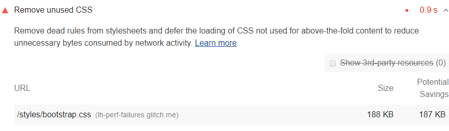

Sekcja Możliwości w raporcie Lighthouse zawiera listę wszystkich arkuszy stylów z nieużywanymi arkuszami CSS z potencjalnymi oszczędnościami 2 KiB lub więcej. Usuń nieużywany CSS, aby zredukować zbędne bajty zużywane przez aktywność sieciową:

<figure class="w-figure"></figure>

## Jak nieużywany CSS spowalnia wydajność

Używanie tagu `<link>` to typowy sposób dodawania stylów do strony:

```html
<!doctype html>
<html>
  <head>
    <link href="main.css" rel="stylesheet">
    ...
```

Plik `main.css` pobierany przez przeglądarkę jest nazywany zewnętrznym arkuszem stylów, ponieważ jest przechowywany oddzielnie od kodu HTML, który go używa.

Domyślnie przeglądarka musi pobrać, przeanalizować i przetworzyć wszystkie zewnętrzne arkusze stylów, które napotka, zanim będzie mogła wyświetlić lub wyrenderować jakąkolwiek zawartość na ekranie użytkownika. Nie ma sensu, aby przeglądarka próbowała wyświetlić zawartość przed przetworzeniem arkuszy stylów, ponieważ arkusze stylów mogą zawierać reguły, które wpływają na stylowanie strony.

Każdy zewnętrzny arkusz stylów należy pobrać z sieci. Te dodatkowe podróże do sieci mogą znacznie wydłużyć czas, jaki użytkownicy muszą czekać, zanim zobaczą jakiekolwiek treści na swoich ekranach.

Nieużywany CSS spowalnia również konstrukcję [drzewa renderowania w przeglądarce](https://developers.google.com/web/fundamentals/performance/critical-rendering-path/render-tree-construction) . Drzewo renderowania jest podobne do drzewa DOM, z tą różnicą, że zawiera również style dla każdego węzła. Aby zbudować drzewo renderowania, przeglądarka musi przejść przez całe drzewo DOM i sprawdzić, które reguły CSS mają zastosowanie do każdego węzła. Im więcej nieużywanych arkuszy CSS, tym więcej czasu przeglądarka może potrzebować na obliczenie stylów dla każdego węzła.

## Jak wykryć nieużywany CSS

Karta Pokrycie w Chrome DevTools może pomóc Ci odkryć krytyczne i bezkrytyczne CSS. Zobacz [Zobacz używane i nieużywane CSS na karcie Pokrycie](https://developers.google.com/web/tools/chrome-devtools/css/reference#coverage) .

<figure class="w-figure"><figcaption class="w-figcaption">Chrome DevTools: karta Pokrycie.</figcaption></figure>

Możesz również uzyskać te informacje od Puppeteer. Zobacz [page.coverage](https://github.com/GoogleChrome/puppeteer/blob/master/docs/api.md#pagecoverage) .

## Wbudowane krytyczne CSS i odroczone niekrytyczne CSS

Podobny do inline kodu w `<script>` tagu, style inline krytyczne wymagane do pierwszej farby wewnątrz `<style>` bloku w `head` strony HTML. Następnie wczytaj pozostałe style asynchronicznie, korzystając z łącza `preload` ładowania.

Rozważ zautomatyzowanie procesu wyodrębniania i wstawiania CSS „Above the Fold” za pomocą [narzędzia Critical](https://github.com/addyosmani/critical/blob/master/README.md) .

Dowiedz się więcej o [odroczeniu niekrytycznych CSS](/defer-non-critical-css) .

## Zasoby

- [Kod źródłowy dla audytu **Usuń nieużywany CSS**](https://github.com/GoogleChrome/lighthouse/blob/master/lighthouse-core/audits/byte-efficiency/unused-css-rules.js)
